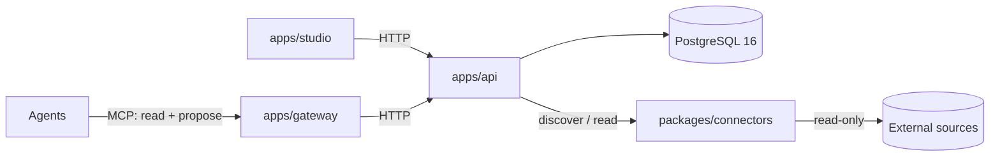

# Ontaix

A neutral control plane where a business describes itself as an ontology — owned, versioned
domain products — above every data, AI and agent platform, and governs the agents that use it.

- `reference/ontaix-studio-reference.html` — the approved Studio UI. Open it in a browser.
- `docs/ui-contract.md` — what "identical" means and how it is tested.
- `docs/provisioning.md` — Azure environment and the one-time bootstrap.
- `docs/team-and-timeline.md` — the agent team and the 15-day plan.
- `CLAUDE.md` — rules for the agents building this repository.

Start in VS Code with Claude Code from this folder; the orchestrator reads `CLAUDE.md` first.

## Repository Layout

```text
apps/
  api/          Python 3.12 FastAPI modular monolith (uv). Module boundaries for ontology,
                proposals, identity, bindings and audit are future work; see apps/api/README.md.
  gateway/      Python 3.12 FastAPI MCP gateway (uv): exposes the ontology to agents, read + propose, never write.
  studio/       React 19 + TypeScript + Vite; the Studio UI, ported verbatim from reference/.
packages/
  connectors/   Read-only connector SDK (Python, uv): discover and read only, enforced by test.
deploy/
  compose/      Local stack: postgres:16, api, gateway, studio.
infra/
  terraform/    Azure environment (France Central).
  scripts/      One-time bootstrap.
docs/           Contracts and decisions.
reference/      The Studio UI contract. Read-only.
.github/
  workflows/    ci.yml (apps and packages), infra.yml (Terraform).
```



## Run Locally

Prerequisites: Node 22 or later with pnpm 9 (`corepack enable`), and uv 0.12 or later. uv downloads Python 3.12 on first use.

```bash
# Studio
pnpm install
pnpm --filter studio dev          # http://localhost:5173
pnpm --filter studio test
pnpm --filter studio build

# API (http://localhost:8000/healthz)
cd apps/api && uv sync && uv run uvicorn app.main:app --reload --port 8000

# Gateway (http://localhost:8100/healthz)
cd apps/gateway && uv sync && uv run uvicorn app.main:app --reload --port 8100

# Connectors
cd packages/connectors && uv sync && uv run pytest
```

### Studio Against the Real API

`pnpm dev:stack` (from the repository root, after `pnpm install`; it runs `uv sync` in `apps/api` when the virtualenv is missing) starts the whole stack without Docker:

1. an embedded PostgreSQL 16 from the api's `pgserver` dev dependency, in a temporary directory deleted on exit (set `ONTAIX_DATABASE_URL` to use another server instead);
2. `python -m app.seed`: migrations, then the demo tenant with Northwind Industries and Aurora Valves;
3. the API under uvicorn on http://127.0.0.1:8000 with `ONTAIX_ENVIRONMENT=dev` (selector event loop on Windows);
4. the Studio's Vite dev server on http://127.0.0.1:5173 with `VITE_ONTAIX_API_URL=/api/v1`, proxying `/api` to the API.

In this dev build the Studio identifies itself with `X-Ontaix-User`: `VITE_ONTAIX_DEV_USER`, else the seed's Builder (`sam.okafor@northwind.com`), who can teach and propose; `?user=<email>` switches user per tab, for example the Governor (`hugo.brandt@northwind.com`) to approve. Production builds send no such header. Ports come from `ONTAIX_API_PORT` and `ONTAIX_STUDIO_PORT`; Ctrl+C stops everything, the database included.

`pnpm --filter studio test:e2e` boots the same stack on ports 8788 and 5788, checks both companies and their concept counts, teaches and approves one concept, and writes `tests/e2e/output/studio-both-companies.png`.

Each Python package runs `uv run pytest` and `uv run ruff check`; the root `pnpm lint`, `pnpm test` and `pnpm build` cover every workspace package.

Full stack with Docker: copy `deploy/compose/.env.example` to `deploy/compose/.env`, then `docker compose -f deploy/compose/compose.yaml up --build`. Secrets live only in ignored `.env` files and Azure Key Vault.
