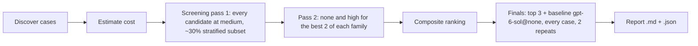

# Teach Bake-Off

Which model and reasoning effort turn typed text, speech and documents into the most detailed ontology with the fewest mistakes. Every case runs through the real teach pipeline: `POST /teach/parse` in process, against a scratch PostgreSQL, one tenant per case, with the model client swapped per configuration.

## How To Run

From `apps/api`, signed in with `az login` (all model calls are keyless), with `.env` holding `ONTAIX_FOUNDRY_ENDPOINT` (the resource of candidates that name no `endpoint` in `candidates.yaml`):

```bash
# 1. The cost of the plan, nothing runs
uv run python -m evals.teach_bakeoff --budget-eur 300 --estimate-only

# 2. The same plan with fake model and OCR clients (no network, no cost)
uv run python -m evals.teach_bakeoff --budget-eur 5 --dry-run --out results/dry.json

# 3. The real run: screening, then finals; stops cleanly when the budget is spent (exit code 3)
uv run python -m evals.teach_bakeoff --budget-eur 300 --out results/bakeoff.json

# 4. Speech comprehension only: every dataset case, one model
uv run python -m evals.teach_bakeoff --budget-eur 20 --plan grid --deployments claude-sonnet-5 \
  --efforts none --stage screening --screening-share 1 --origins dataset --out results/speech.json
```

The run writes `<out>.json` (every unit, draft, call, score) and `<out>.md` (the report). Useful narrowing options: `--deployments`, `--efforts`, `--origins dataset,documents,benchmarks,private`, `--only <case ids>`, `--stage screening|finals` (with `--finals deployment@effort,...`), `--document-modes sentences,whole`, `--concurrency`, `--timeout-seconds` (the API's 15 s and 45 s by default, so a model that is too slow for the product times out here too). Set `ONTAIX_EVAL_DATABASE_URL` to reuse a PostgreSQL instead of the embedded one.

## Stages And Score



The default `--plan smart` is shown above; each effort falls back to the closest one a model accepts (Claude Fable 5.1 and Sonnet 5.5 refuse `none`, so they run at `low`). `--plan grid` runs every candidate at every effort instead.

- Composite = 0.5 precision block (concept precision 50 %, parent accuracy 25 %, verb accuracy 25 %) + 0.3 recall block (recall against groundable concepts 50 %, mean per-level F1 50 %) + 0.2 efficiency (latency and cost per case, relative to the best; an unpriced model scores 0.5 on cost).
- Tree-aware scoring: label match after normalisation, any accepted parent, synonym-tolerant verbs, full-path correctness, invented and duplicated nodes, missing branches, depth reached, and precision/recall/F1 per level for every level present (no depth limit).
- Grounding ceiling: the share of expected labels found whole-word in the source; recall is reported against all expected concepts and against groundable ones only.
- Finals pair each configuration with the baseline case by case (concept F1 against groundable concepts, each case's mean over repeats): mean difference, 95 % CI, wins/ties/losses, sign test.

## Timing Breakdown

Each stage's report holds, per configuration, a Timing Breakdown table: for every stage of a parse (`view`, `source`, `grammar`, `model`, `drafts`, `turns`) and of the model step (`budget`, `candidates`, `examples`, `context`, `reserve`, `provider`, `provider_first_token` when streamed, `interpret`, `settle`), the number of parses that ran it and its milliseconds at the median, the 90th percentile and the slowest, with the input and output token counts per call; the `harness` clock's `gate` stage is the time a call waited for the harness's own concurrency gate (which narrows on a 429), included in the pipeline's `provider` stage and to be read net of it. The pipeline publishes the timings of every parse in process (`app/utilities/stage_clock.py`); the harness records them per case (`CaseResult.timings`) and the JSON record keeps them under each summary's `stage_timings`. A latency change is read off the stage that moved, not off the total alone.

## Cases

| Origin | Where | Notes |
|---|---|---|
| dataset | `evals/cases/*.yaml` | `cases:` list of `TeachCase` (kind `text`, `speech` or `document`) with `expected.concepts` (`label`, `parent` or list, `action` or list, `aliases`) and `expected.relations` (`from`, `to`, `action`, `inverse`), `existing`, `optional` |
| documents | `evals/documents/` | `<name>.<doc>` + gold file or `<name>.expected.yaml` |
| benchmarks | `evals/benchmarks/<name>/` | W3C ORG, GoodRelations, PROV-O, DCAT 3, SOSA/SSN, OWL-Time and ValueFlows, see `benchmarks/README.md` |
| private | `tests/private/` (git-ignored) | the owner's documents; optional ontology and `company:` companion; no gold means report-only |

Documents: txt, md, html, docx, pdf, scanned pdf (OCR when `candidates.yaml` names an `ocr:` deployment, measured separately; none is deployed, so a scanned PDF case records an error in a real run), pptx, xlsx. Gold trees: OWL (RDF/XML, Turtle, OWL/XML, JSON-LD, N-Triples), SKOS, OBO, CSV/Excel hierarchies (parent/child/verb, hierarchy IDs such as APQC PCF, level columns) and JSON (nested or node/edge). Modes: `typed`, `speech` (a recording: each finished sentence of the case's `input` list is one `speech` request, in order, in one session, with its drafts proposed before the next, as the Studio microphone sends them), `sentences` (the import path, one sentence with its neighbours at a time) and `whole` (whole-document teaching; reports itself unavailable until the endpoint exists).

## Candidates And Residency

`candidates.yaml` lists the deployments that exist, with the efforts each accepts and prices: `gpt-6-sol` (`azure_foundry`, EU DataZoneStandard in France Central, on `ONTAIX_FOUNDRY_ENDPOINT`) and `claude-sonnet-5`, `claude-sonnet-5-5` and `claude-fable-5-1` (`anthropic_foundry`, GlobalStandard in Sweden Central, on the resource named in the file). The harness calls them through the API's own clients, `FoundryLlmClient` and `AnthropicFoundryLlmClient`. A candidate without a price is refused, so the budget cap always holds; assumed prices are marked in the file. Claude is `residency: global`: cases from `tests/private/` never reach a global model unless `--allow-global-for-private` is passed.

## Speech Comprehension

Each stage of the report has a Speech Comprehension table, and the JSON record a `speechComprehension` list, with one row per speech case, configuration and repeat, scored on the recording's final drafts: parent correctness (expected concepts drafted under an accepted parent at a level one of its accepted paths gives it), verb accuracy (matched concepts with an accepted verb), relation accuracy (expected relations drafted with an accepted verb), attribute accuracy (expected taught attributes, `expected.attributes` with `concept` and accepted `value`s, drafted on the right concept with an accepted value), depth reached against the gold depth, and the invented and missed labels.

`evals/cases/speech_recordings.yaml` holds the speech tuning set: spoken narrations of sections of the org, ssn and valueflows benchmarks (TEST), and as LEARN the owner's own recording, narrations of the goodrelations, prov-o and dcat benchmarks and two recordings written for tuning. `app/ai/examples/split.json` assigns each case to LEARN or TEST.

The model clients retry a 429 or 503 up to twice within the call's timeout, honouring `retry-after` (capped at 4 s), as the API does. A call still refused with status 429 (the deployment's rate limit) is recorded and tried again after a pause, up to 4 times, so a small quota does not show as a comprehension failure; those refusals stay in each case's recorded calls. Each such refusal also halves the number of model calls the run makes at once (from `--concurrency` down to 1), so a run against a small quota such as `gpt-6-sol` in the dev resource slows to what it accepts; `--concurrency 1` starts there.

## Cost Of A Full Run

`--estimate-only` prices the plan before anything runs: one call per typed turn, per spoken sentence and per stored document sentence, with the growing candidate context of long documents and effort-dependent reasoning tokens. For the 104 cases present on 2026-09-29 and the smart plan:

| Stage | Configurations | Calls | EUR |
|---|---|---|---|
| Screening pass 1 (4 candidates at medium, 35 cases) | 4 | 12,904 | about 1,224 |
| Screening pass 2 (none or low, and high, best 2 per family) | up to 6 | 19,356 | up to about 2,344 |
| Finals (top 3 + baseline, 104 cases, 2 repeats) | 4 | 64,688 | up to about 10,972 |
| Total | | | up to about 14,540 |

Pass 2 and the finals are unknown until pass 1 ranks the models, so they are priced with the most expensive configurations (Claude Fable 5.1 at high): upper bounds. If cheaper models win, they cost a fraction. Long documents dominate: narrow with `--origins` or `--only`, and always pass a `--budget-eur` cap you accept losing.
