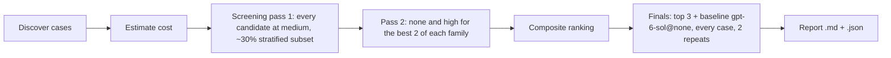

# Teach Bake-Off

Which model and reasoning effort turn typed text, speech and documents into the most detailed ontology with the fewest mistakes. Every case runs through the real teach pipeline: `POST /teach/parse` in process, against a scratch PostgreSQL, one tenant per case, with the model client swapped per configuration.

## How To Run

From `apps/api`, signed in with `az login` (all model calls are keyless), with `.env` holding `ONTAIX_FOUNDRY_ENDPOINT`:

```bash
# 1. The cost of the plan, nothing runs
uv run python -m evals.teach_bakeoff --budget-eur 300 --estimate-only

# 2. The same plan with fake model and OCR clients (no network, no cost)
uv run python -m evals.teach_bakeoff --budget-eur 5 --dry-run --out results/dry.json

# 3. The real run: screening, then finals; stops cleanly when the budget is spent (exit code 3)
ONTAIX_EVAL_CLAUDE_ENDPOINT=https://<claude eval resource>.cognitiveservices.azure.com \
uv run python -m evals.teach_bakeoff --budget-eur 300 --out results/bakeoff.json
```

The run writes `<out>.json` (every unit, draft, call, score) and `<out>.md` (the report). Useful narrowing options: `--deployments`, `--efforts`, `--origins dataset,documents,benchmarks,private`, `--only <case ids>`, `--stage screening|finals` (with `--finals deployment@effort,...`), `--document-modes sentences,whole`, `--concurrency`, `--timeout-seconds` (the API's 15 s and 45 s by default, so a model that is too slow for the product times out here too). Set `ONTAIX_EVAL_DATABASE_URL` to reuse a PostgreSQL instead of the embedded one.

## Stages And Score



The default `--plan smart` is shown above; each effort falls back to the closest one a model accepts (Claude Haiku 4.5 takes none, so it runs at its default). `--plan grid` runs every candidate at every effort instead.

- Composite = 0.5 precision block (concept precision 50 %, parent accuracy 25 %, verb accuracy 25 %) + 0.3 recall block (recall against groundable concepts 50 %, mean per-level F1 50 %) + 0.2 efficiency (latency and cost per case, relative to the best; an unpriced model scores 0.5 on cost).
- Tree-aware scoring: label match after normalisation, any accepted parent, synonym-tolerant verbs, full-path correctness, invented and duplicated nodes, missing branches, depth reached, and precision/recall/F1 per level for every level present (no depth limit).
- Grounding ceiling: the share of expected labels found whole-word in the source; recall is reported against all expected concepts and against groundable ones only.
- Finals pair each configuration with the baseline case by case (concept F1 against groundable concepts, each case's mean over repeats): mean difference, 95 % CI, wins/ties/losses, sign test.

## Cases

| Origin | Where | Notes |
|---|---|---|
| dataset | `evals/cases/*.yaml` | `cases:` list of `TeachCase` (kind `text`, `speech` or `document`) with `expected.concepts` (`label`, `parent` or list, `action` or list, `aliases`) and `expected.relations` (`from`, `to`, `action`, `inverse`), `existing`, `optional` |
| documents | `evals/documents/` | `<name>.<doc>` + gold file or `<name>.expected.yaml` |
| benchmarks | `evals/benchmarks/<name>/` | W3C ORG and GoodRelations, see `benchmarks/README.md` |
| private | `tests/private/` (git-ignored) | the owner's documents; optional ontology and `company:` companion; no gold means report-only |

Documents: txt, md, html, docx, pdf, scanned pdf (OCR with `mistral-ocr-4-0`, DataZone EU, measured separately), pptx, xlsx. Gold trees: OWL (RDF/XML, Turtle, OWL/XML, JSON-LD, N-Triples), SKOS, OBO, CSV/Excel hierarchies (parent/child/verb, hierarchy IDs such as APQC PCF, level columns) and JSON (nested or node/edge). Modes: `typed`, `speech`, `sentences` (the import path, one sentence with its neighbours at a time) and `whole` (whole-document teaching; reports itself unavailable until the endpoint exists).

## Candidates And Residency

`candidates.yaml` lists the candidates, GPT and Claude only: GPT-6 Sol and Luna, GPT-5.6 Sol, Terra and Luna, GPT-5.5, GPT-5.4 and o3 on EU DataZoneStandard in France Central, and Claude Fable 5.1, Opus 5.5, Sonnet 5.5 and Haiku 4.5 on an eval-only Sweden Central resource, with the efforts each accepts and prices. The `mistral-ocr-4-0` deployment only reads scanned PDFs before the candidates run; it is not a candidate. Claude is GlobalStandard only (`residency: global`): cases from `tests/private/` never reach a global model unless `--allow-global-for-private` is passed. Claude on Foundry needs the subscription to accept Anthropic's Azure Marketplace terms, and sponsorship subscriptions may not be eligible.

Deployments without strict JSON schema support fall back to `json_object`, then prompt-only JSON; the report's output-mode column shows what each model used. The API validates every answer against the full contract whatever the mode.

## Cost Of A Full Run

`--estimate-only` prices the plan before anything runs: one call per typed turn, per transcript and per stored document sentence, with the growing candidate context of long documents and effort-dependent reasoning tokens. For the 96 cases present on 2026-09-29 and the smart plan:

| Stage | Configurations | Calls | EUR |
|---|---|---|---|
| Screening pass 1 (12 candidates at medium, 32 cases) | 12 | 13,100 | about 664 |
| Screening pass 2 (none and high, best 2 per family) | up to 8 | 8,700 | up to about 1,101 |
| Finals (top 3 + baseline, 96 cases, 2 repeats) | 4 | 29,500 | up to about 5,171 |
| Total | | | up to about 6,936 |

Pass 2 and the finals are unknown until pass 1 ranks the models, so they are priced with the most expensive candidates (Claude Fable 5.1 and GPT-5.5 at high): upper bounds. If cheaper models win, they cost a fraction. Long documents dominate. Always pass a `--budget-eur` cap you accept losing.
