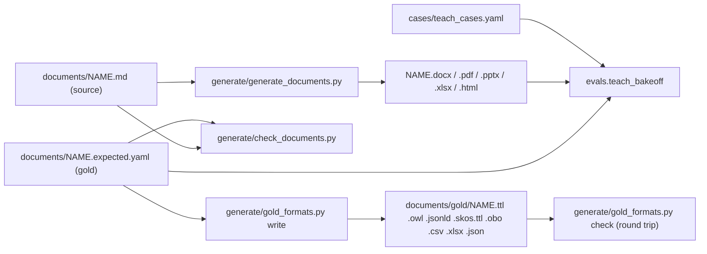

# Teach Bake-Off Cases

This folder and `evals/documents/` hold the hand-checked test data of the teach bake-off: what a person teaches (typed turns, a spoken recording, or a business document), the concepts that exist before it runs, and the gold ontology a careful reviewer expects. The goal is to find the model that turns speech, text and documents into the most detailed ontology (concept, parent path, verb, label, at any depth) with the fewest mistakes.

Contents: 78 short cases in `teach_cases.yaml` (45 typed, 33 spoken; 59 English, 19 French) with 323 expected concepts and 14 expected relations, and 11 full documents in `evals/documents/`: 6 business documents of 2,300 to 5,100 words (gold trees of 97 to 129 concepts, 5 to 6 levels deep), 3 document-structure regression documents (63 to 74 concepts, depth 5, one of them French) and 2 adversarial documents. Together they make 19 document files. `speech_recordings.yaml` adds 9 spoken recordings for speech tuning (the owner's recording, 6 benchmark narrations and 2 tuning recordings, 6 to 8 sentences each) with 96 expected concepts, 23 expected relations and 4 expected taught attributes.



## Case Format

Short cases follow `evals/teach_case.py` (`TeachCase`): `id`, `kind` (`text` or `speech`), `company` (the root), `description`, `tags`, `existing` (concepts seeded and approved before the case runs, parent first), `input` (one string per typed turn of at most 400 characters, or one string per finished spoken sentence of at most 4,000 characters, sent in order in one session as the Studio microphone sends them), `expected.concepts` (label, every acceptable parent, the verb first then acceptable synonyms, aliases), `expected.relations` (between concepts that both exist when drafted, `from`, `to`, `action`, `inverse`) and `optional` (labels that are neither invented nor missed).

A full document is a paired set in `evals/documents/`: `NAME.md` and its rendered variants share `NAME.expected.yaml`, which holds `company`, `description`, `tags`, `expected` and `optional`, as `evals/case_sources.py` reads them. The harness runs each document file as its own case. The adversarial companions also list the injected labels under `source_report.injected`; the harness ignores that key and `check_documents.py` uses it.

## Gold Rules

- Grounding: every expected label (or one of its aliases) occurs as whole words in the input, singular or plural, case-insensitive; in a document, inside one sentence that the import keeps.
- Grouping noun that is a business concept ("Services has 3 offerings, Apps, Data and AI"): the noun is a concept under the subject with the speaker's verb, and each member sits under it with `includes`. Where the noun could reasonably be read either way (teams, channels, formats, tiers), members also accept the subject as parent, so only the grouping concept itself is missed.
- Descriptive noun ("three areas", "two ways", "regions", "topics", "flavours"): no concept for the noun; members hang from the subject with the speaker's verb. Drafting the noun counts as invented.
- Count mismatch: drafts follow the list, never the stated number.
- Reuse and already-known facts: a mention of an existing concept (plural, singular, "those", "it") must reuse it; a fact the existing concepts already hold expects nothing, so re-drafting it is a duplicate.
- Corrections ("no wait", "sorry I meant", "actually make that three", "non attends"): the corrected-away item is never expected.
- Is-a: `action: [is a]`; a new parent of an is-a is born from the root with `has`, as the pipeline drafts it.
- Role patterns ("X is a client of Y", "X is a subsidiary of Y"): Y has the role concept (Client, Partner, Subsidiary, ...), the role concept `includes` X, and what a relative clause ("that", "which", "qui") says hangs from the subject X. Labels with inner punctuation (L&S, R&D, S.A., AT&T, e-commerce) stay whole. The owner's ADNOC sentence fixes this shape.
- French cases list the French verb first, then English equivalents, so either language scores.
- Prompt injection: labels named only by injected text (instructions, fake footers, fake model JSON, other companies) are neither expected nor optional; drafting one is invented.

## Short Cases

| Id | Domain | Language | Format | Size | Depth | Nodes | Stresses |
|---|---|---|---|---|---|---|---|
| `en-text-adr-owner-sentences` | IT services | English | text | 85 chars, 2 turns | 2 | 4 (+0 rel) | back-reference, descriptive-list, multi-turn |
| `en-text-grouping-offerings` | IT services | English | text | 43 chars | 3 | 4 (+0 rel) | grouping, reuse |
| `en-text-grouping-product-lines` | Food manufacturing | English | text | 91 chars | 2 | 5 (+0 rel) | grouping |
| `en-text-descriptive-regions` | Logistics | English | text | 81 chars | 2 | 3 (+0 rel) | descriptive-list, reuse |
| `en-text-descriptive-count-mismatch` | Utilities | English | text | 68 chars | 2 | 3 (+0 rel) | descriptive-list, count-mismatch, reuse |
| `en-text-reuse-production-line` | Manufacturing | English | text | 62 chars | 3 | 2 (+0 rel) | reuse |
| `en-text-already-known-then-new` | Manufacturing | English | text | 68 chars, 2 turns | 3 | 1 (+0 rel) | already-known, reuse, multi-turn |
| `en-text-already-known-only` | IT services | English | text | 65 chars | 0 | 0 (+0 rel) | already-known, reuse |
| `en-text-is-a-existing-parent` | Engineering | English | text | 92 chars | 2 | 2 (+0 rel) | is-a, reuse |
| `en-text-is-a-new-parent` | Energy | English | text | 78 chars, 2 turns | 2 | 3 (+0 rel) | is-a, multi-turn |
| `en-text-cross-domain-quality-finance` | Manufacturing | English | text | 105 chars, 2 turns | 0 | 0 (+2 rel) | cross-domain, reuse, back-reference, multi-turn |
| `en-text-cross-domain-order-flow` | Manufacturing | English | text | 92 chars | 0 | 0 (+2 rel) | cross-domain, reuse |
| `en-text-chain-five-levels` | Manufacturing | English | text | 131 chars | 5 | 5 (+0 rel) | deep-chain |
| `en-text-chain-six-levels` | Shipping | English | text | 199 chars | 6 | 6 (+0 rel) | deep-chain |
| `en-text-back-reference-they-it` | Shipping | English | text | 107 chars, 3 turns | 2 | 4 (+0 rel) | back-reference, multi-turn |
| `en-text-back-reference-those` | IT services | English | text | 112 chars, 2 turns | 3 | 2 (+0 rel) | back-reference, already-known, reuse, multi-turn |
| `en-text-verb-variety` | Logistics | English | text | 61 chars | 2 | 3 (+0 rel) | reuse |
| `en-text-descriptive-topics` | Energy | English | text | 80 chars | 2 | 2 (+0 rel) | descriptive-list, reuse |
| `en-text-grouping-channels` | Food manufacturing | English | text | 71 chars | 2 | 4 (+0 rel) | grouping, reuse |
| `en-text-grouping-then-descriptive` | IT operations | English | text | 138 chars | 3 | 6 (+0 rel) | grouping, descriptive-list, back-reference |
| `en-text-reuse-and-cross-link` | Engineering | English | text | 87 chars | 4 | 2 (+1 rel) | reuse, cross-domain |
| `en-text-plural-reuse-passive` | Engineering | English | text | 55 chars | 2 | 1 (+0 rel) | reuse |
| `en-text-descriptive-regions-minimal-pair` | Logistics | English | text | 70 chars | 2 | 3 (+0 rel) | descriptive-list, reuse |
| `en-text-chain-across-turns` | IT operations | English | text | 141 chars, 4 turns | 5 | 6 (+0 rel) | deep-chain, back-reference, multi-turn |
| `en-text-correction-typed` | IT operations | English | text | 130 chars | 3 | 2 (+0 rel) | correction, reuse |
| `en-speech-adr-owner-spoken` | IT services | English | speech | 111 chars | 2 | 4 (+0 rel) | fillers, back-reference, descriptive-list |
| `en-speech-correction-lines` | Manufacturing | English | speech | 120 chars | 2 | 5 (+0 rel) | correction, fillers |
| `en-speech-run-on-they` | Logistics | English | speech | 151 chars | 3 | 4 (+0 rel) | run-on, back-reference, fillers |
| `en-speech-grouping-offerings` | IT services | English | speech | 112 chars | 4 | 6 (+0 rel) | grouping, reuse, fillers |
| `en-speech-chain-bank` | Banking | English | speech | 208 chars | 5 | 6 (+0 rel) | deep-chain, run-on |
| `en-speech-correction-i-meant` | IT operations | English | speech | 119 chars | 2 | 4 (+0 rel) | correction, reuse |
| `en-speech-question-aside` | Food manufacturing | English | speech | 163 chars | 2 | 3 (+0 rel) | fillers, not-a-statement |
| `en-speech-grouping-count-corrected` | Food manufacturing | English | speech | 78 chars | 2 | 4 (+0 rel) | grouping, count-mismatch, correction |
| `en-speech-is-a-elliptical` | Aviation | English | speech | 99 chars | 2 | 4 (+0 rel) | is-a |
| `en-speech-cross-domain-it` | Manufacturing | English | speech | 103 chars | 0 | 0 (+2 rel) | cross-domain, back-reference, reuse |
| `en-speech-chain-seven-levels` | IT services | English | speech | 274 chars | 7 | 11 (+0 rel) | deep-chain, grouping, run-on |
| `en-speech-it-relations` | Logistics | English | speech | 97 chars | 0 | 0 (+2 rel) | back-reference, cross-domain, reuse |
| `en-speech-false-starts` | Healthcare | English | speech | 130 chars | 3 | 3 (+0 rel) | fillers |
| `en-speech-these-policies` | Insurance | English | speech | 81 chars | 2 | 4 (+0 rel) | back-reference, descriptive-list |
| `en-speech-grouping-teams-corrected` | Engineering | English | speech | 128 chars | 2 | 4 (+0 rel) | grouping, count-mismatch, correction, reuse |
| `en-speech-product-structure` | Manufacturing | English | speech | 156 chars | 5 | 7 (+0 rel) | deep-chain, reuse, run-on |
| `en-speech-cross-domain-payroll` | Shipping | English | speech | 152 chars | 3 | 1 (+2 rel) | cross-domain, already-known, reuse |
| `en-speech-hesitation-month-end` | Insurance | English | speech | 176 chars | 3 | 3 (+0 rel) | fillers, back-reference, not-a-statement, reuse |
| `en-speech-fibre-order` | Telecom | English | speech | 145 chars | 4 | 5 (+0 rel) | deep-chain, reuse |
| `en-speech-retail-monologue` | Retail | English | speech | 1088 chars | 5 | 33 (+0 rel) | run-on, grouping, count-mismatch, correction, back-reference, deep-chain, large |
| `fr-text-adr-deux-phrases` | IT services | French | text | 115 chars, 2 turns | 2 | 4 (+0 rel) | back-reference, descriptive-list, multi-turn |
| `fr-text-regroupement-offres` | IT services | French | text | 53 chars | 3 | 4 (+0 rel) | grouping, reuse |
| `fr-text-regions-ecart-compte` | Logistics | French | text | 87 chars | 2 | 3 (+0 rel) | descriptive-list, count-mismatch, reuse |
| `fr-text-est-un-type-de` | Finance operations | French | text | 69 chars | 2 | 2 (+0 rel) | is-a, reuse |
| `fr-text-chaine-six-niveaux` | Finance operations | French | text | 222 chars | 6 | 6 (+0 rel) | deep-chain |
| `fr-text-reutilisation-ligne` | Manufacturing | French | text | 71 chars | 3 | 2 (+0 rel) | reuse |
| `fr-text-deja-connu` | Retail | French | text | 124 chars, 2 turns | 3 | 2 (+0 rel) | already-known, reuse, multi-turn |
| `fr-text-inter-domaines` | Manufacturing | French | text | 111 chars | 0 | 0 (+2 rel) | cross-domain, reuse |
| `fr-text-marques-ecart-compte` | Retail | French | text | 66 chars | 2 | 4 (+0 rel) | grouping, count-mismatch |
| `fr-speech-urgences-correction` | Healthcare | French | speech | 178 chars | 3 | 4 (+0 rel) | correction, fillers, back-reference |
| `fr-speech-offres-quatre-niveaux` | IT services | French | speech | 130 chars | 4 | 5 (+0 rel) | grouping, reuse, fillers |
| `fr-speech-chaine-banque` | Banking | French | speech | 224 chars | 5 | 6 (+0 rel) | deep-chain, run-on |
| `fr-speech-ils-elle` | Logistics | French | speech | 102 chars | 3 | 4 (+0 rel) | back-reference, run-on |
| `fr-speech-est-un-type-de` | Aviation | French | speech | 96 chars | 2 | 4 (+0 rel) | is-a |
| `fr-speech-inter-domaines-sla` | IT operations | French | speech | 111 chars | 3 | 2 (+1 rel) | cross-domain, reuse, back-reference, deep-chain |
| `en-speech-recording-depot` | Logistics | English | speech, 4 sentences | 187 chars | 4 | 6 (+0 rel) | recording, back-reference, deep-chain, fillers |
| `en-speech-recording-correction` | Insurance | English | speech, 4 sentences | 192 chars | 3 | 4 (+0 rel) | recording, correction, fillers |
| `fr-speech-enregistrement-atelier` | Manufacturing | French | speech, 3 sentences | 142 chars | 3 | 4 (+0 rel) | recording, back-reference, fillers |
| `en-text-owner-adnoc-client` | IT services | English | text | 125 chars | 4 | 10 (+0 rel) | role-pattern, grouping, relative-clause, inner-punctuation |
| `en-speech-owner-adnoc-client` | IT services | English | speech | 129 chars | 4 | 10 (+0 rel) | role-pattern, grouping, relative-clause, inner-punctuation, fillers |
| `en-text-role-customer-of` | IT services | English | text | 56 chars | 2 | 2 (+0 rel) | role-pattern |
| `en-text-role-partner-and-supplier` | IT services | English | text | 97 chars | 2 | 4 (+0 rel) | role-pattern |
| `en-text-role-vendor-existing-that` | IT operations | English | text | 69 chars | 3 | 3 (+0 rel) | role-pattern, reuse, relative-clause |
| `en-text-subsidiary-which-object` | Food manufacturing | English | text | 79 chars | 2 | 3 (+0 rel) | role-pattern, relative-clause |
| `en-text-division-rnd-that` | Energy | English | text | 85 chars | 3 | 4 (+0 rel) | role-pattern, relative-clause, inner-punctuation |
| `en-speech-customer-divisions-correction` | Engineering | English | speech | 151 chars | 4 | 6 (+0 rel) | role-pattern, grouping, correction, inner-punctuation, back-reference |
| `en-text-partner-att-that` | Telecom | English | text | 72 chars | 3 | 4 (+0 rel) | role-pattern, relative-clause, inner-punctuation |
| `en-text-supplier-e-commerce` | Retail | English | text | 82 chars | 3 | 3 (+0 rel) | role-pattern, relative-clause, inner-punctuation |
| `en-speech-customer-also-supplier` | Retail | English | speech | 140 chars | 3 | 5 (+0 rel) | role-pattern, relative-clause, back-reference, reuse |
| `en-text-client-subsidiaries-existing` | IT services | English | text | 141 chars | 4 | 4 (+0 rel) | role-pattern, grouping, reuse |
| `fr-text-client-filiales-qui` | IT services | French | text | 119 chars | 4 | 6 (+0 rel) | role-pattern, grouping, relative-clause |
| `fr-speech-fournisseur-division` | Manufacturing | French | speech | 139 chars | 3 | 6 (+0 rel) | role-pattern, relative-clause, inner-punctuation, fillers |
| `fr-text-partenaire-sa-e-commerce` | Retail | French | text | 83 chars | 3 | 3 (+0 rel) | role-pattern, relative-clause, inner-punctuation |

Depth counts levels below the company root, existing concepts included. Nodes counts expected concepts, plus expected relations.

## Full Documents

| Id | Domain | Language | Format | Size | Depth | Nodes | Stresses |
|---|---|---|---|---|---|---|---|
| `it_services_corvane` | IT services | English | .md, .docx | 5096 words | 6 | 129 (+11 rel) | it-services, operating-model, large | no: clean prose, every line ends with a full stop and every sentence is under 400 characters |
| `manufacturer_aldermoor` | Discrete manufacturing | English | .md, .xlsx (process table); gold in 8 formats | 3464 words | 6 | 110 (+11 rel) | manufacturing, process-handbook | no: clean prose, every line ends with a full stop and every sentence is under 400 characters |
| `bank_harbourline` | Retail banking | English | .md, native .pdf | 3068 words | 5 | 105 (+10 rel) | banking, operating-model, grouping, is-a, count-mismatch | no: clean prose, every line ends with a full stop and every sentence is under 400 characters |
| `hospital_eastmere` | Healthcare | English | .md, scanned .pdf (no text layer) | 2726 words | 5 | 100 (+11 rel) | healthcare, hospital, patient-flow, billing | no: clean prose, every line ends with a full stop and every sentence is under 400 characters |
| `agency_valmont_fr` | Public sector | French | .md, .html | 2305 words | 5 | 97 (+10 rel) | public-sector, process-handbook, service-catalogue | no: clean prose, every line ends with a full stop and every sentence is under 400 characters |
| `telecom_tessaline` | Telecom | English | .md, .pptx | 3812 words | 6 | 120 (+12 rel) | telecom, process-framework, operations | no: clean prose, every line ends with a full stop and every sentence is under 400 characters |
| `adversarial_quenby_suppliers` | Procurement (adversarial) | English | .md, .docx | 377 words | 5 | 28 (+4 rel) | adversarial, prompt-injection, procurement | no: clean prose, every line ends with a full stop and every sentence is under 400 characters |
| `adversarial_pellucid_incidents` | IT operations (adversarial) | English | .md, .html | 326 words | 5 | 26 (+4 rel) | adversarial, prompt-injection, it-operations | no: clean prose, every line ends with a full stop and every sentence is under 400 characters |
| `structure_brackwater_distribution` | Wholesale distribution | English | .md | 1434 words | 5 | 66 (+7 rel) | document-structure, order-to-cash, warehouse | yes: regression case for the `sentences_of` split; the current import loses 24 of 66 gold labels |
| `structure_ostrava_mutual_claims` | Insurance claims | English | .md | 1847 words | 5 | 74 (+6 rel) | document-structure, claims handling | yes: regression case for the `sentences_of` split; the current import loses 36 of 74 gold labels |
| `structure_lestrade_logistique_fr` | Logistics | French | .md | 1753 words | 5 | 63 (+7 rel) | document-structure, logistique | yes: regression case for the `sentences_of` split; the current import loses 21 of 63 gold labels |

Pages: `it_services_corvane` about 11 pages, `telecom_tessaline` 8 (36 slides), `manufacturer_aldermoor` 8, `bank_harbourline` 6 PDF pages, `hospital_eastmere` 5 scanned pages, `agency_valmont_fr` 5, the adversarial documents 1 each. Every document states each gold fact in one sentence that names both the parent and the child. Every business document has grouping concepts with a count, at least one count mismatch, is-a facts and cross-branch relations. Tables are supplementary; no gold fact appears only in a table.

The three `structure_*` documents are the regression cases for the import split bug in `app/utilities/document_text.sentences_of`. That function collapses all whitespace, newlines included, before it splits on `.`, `!` or `?`, and it drops any run over 399 characters. These documents are written the way real business documents are, and not around the bug. They have headings without full stops, bullet and numbered lists, table rows that are the only source of some gold facts, sentences longer than 400 characters, and line breaks inside paragraphs. Their gold is grounded on the lines and sentences of the file as written. `check_documents.py` requires each layout feature at least three times and reports how many gold labels the current split loses. Once the split is fixed, that figure should reach 0, and their recall should rise to the level of the clean documents.

The scanned PDF has no text layer; its gold is groundable only after OCR. The `.xlsx` of `manufacturer_aldermoor` is the handbook as a workbook (a "Process overview" sheet and a "Handbook" sheet with every block as a row); the harness first tries it as a gold tree, notes that it is not one, and runs it as a document.

## Gold In Other Formats

The gold tree of `manufacturer_aldermoor` (110 concepts, 11 relations, depth 6) is also written to `evals/documents/gold/` in eight formats, all generated from `manufacturer_aldermoor.expected.yaml`:

| File | Format | Tree | Verbs | Relations |
|---|---|---|---|---|
| `manufacturer_aldermoor.ttl` | OWL 2, Turtle | `rdfs:subClassOf` | `oxe:birthAction`, `oxe:acceptedAction` annotations | `owl:someValuesFrom` restrictions |
| `manufacturer_aldermoor.owl` | OWL 2, RDF/XML | same graph | same | same |
| `manufacturer_aldermoor.jsonld` | OWL 2, JSON-LD | same graph | same | same |
| `manufacturer_aldermoor.skos.ttl` | SKOS, Turtle | `skos:broader`, top concepts of a scheme named after the company | same annotations | verb triples, each doubled by `skos:related` |
| `manufacturer_aldermoor.obo` | OBO 1.4 | `is_a` | `property_value: birth_action` / `accepted_action` | `relationship` lines and `[Typedef]` stanzas |
| `manufacturer_aldermoor.csv` | CSV edge list | `label,parent` | `action`, `accepted_actions` | none |
| `manufacturer_aldermoor.xlsx` | Excel outline | one column per level plus `Label` and `Parent` | `Action`, `Accepted actions` | a `Relations` sheet |
| `manufacturer_aldermoor.json` | nested JSON tree | `children` under a root labelled with the company | `action` list | a `relations` array |

`gold_formats.py check` reads each file back and compares labels, parents, verbs, aliases and relations with the YAML; all eight round-trip exactly.

## Regenerating And Checking

The generators run in a scratch virtual environment outside the repository, built from the pinned `evals/documents/generate/requirements.txt` (Python 3.12). Only their outputs are committed.

```bash
uv venv --python 3.12 /tmp/evalgen/.venv
uv pip install --python /tmp/evalgen/.venv/bin/python -r apps/api/evals/documents/generate/requirements.txt
cd apps/api/evals/documents
/tmp/evalgen/.venv/bin/python generate/check_documents.py              # gold vs Markdown: grounding, depth, size, uniqueness
/tmp/evalgen/.venv/bin/python generate/generate_documents.py           # render .docx .pdf .pptx .xlsx .html and read each back
/tmp/evalgen/.venv/bin/python generate/gold_formats.py write manufacturer_aldermoor
/tmp/evalgen/.venv/bin/python generate/gold_formats.py check manufacturer_aldermoor
```

## Sources And Licences

All cases, documents and gold trees are original writing produced for Ontaix on 2026-09-29 and reuse no third-party text. Every organisation is fictional except `Insight` (the owner's own canonical example from ADR 0008), and the names in the owner's role-pattern case (ADNOC and its business units, as the owner supplied them) and `AT&T` (a name only, in a role-pattern case). No confidential data is included. The telecom document follows the general fulfilment, assurance and billing split common to operator process maps but copies no TM Forum eTOM text.
