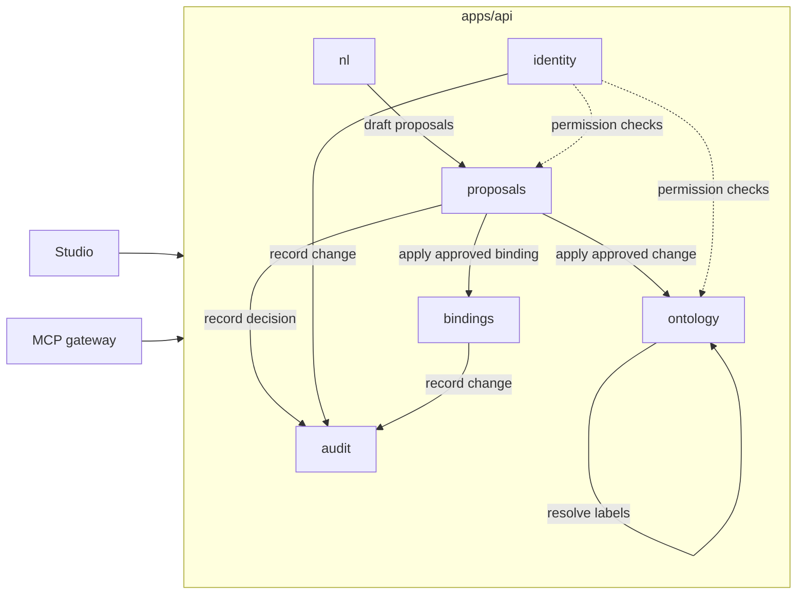

# ADR 0001: Modular Monolith Boundaries

Status: Proposed. Pending owner approval at checkpoint 1.

## Context

`apps/api` is one Python 3.12 FastAPI process and one PostgreSQL database. Six builder agents work on it in parallel, each in its own folder, and every folder is reviewed by QA and security. The demo reference keeps the whole model in a handful of in-memory arrays; the product needs the same behaviour split into parts that can be built, tested and reviewed independently without turning into six network services.

## Decision

The API is a modular monolith with six modules under `apps/api/app/`. Each module owns its tables, its routers, its services and its repositories. A module reads another module's data only through that module's public service functions, never through its tables or repositories.

| Module | Owns | Tables |
|---|---|---|
| `ontology` | companies, domain products, concepts, relations, equivalences, lineage, the scene snapshot, view state | `company`, `domain_product`, `concept`, `relation`, `tenant_view_state` |
| `proposals` | proposal creation, readiness, approval state machine, cascade rejection, approve-all, finalise-all, conflict detection | `proposal`, `proposal_approval` |
| `identity` | OIDC login, tenant resolution, users, groups, roles, scopes, permission checks, WebSocket tickets, tenant settings, appearance, agents and cost | `tenant`, `tenant_identity_provider`, `tenant_settings`, `app_user`, `user_group`, `group_member`, `group_role`, `agent`, `agent_month_usage`, `cost_allocation` |
| `bindings` | connector catalogue, sources, discovery, bindings, attributes, coverage, refresh | `connector_type`, `source`, `binding`, `attribute` |
| `audit` | append-only audit log, outbox publishing | `audit_entry`, `outbox` |
| `nl` | rule-based teach parser, sentence import, suggest-action, LLM extraction adapter | none |

Rules that follow from the split:

- Only `proposals` changes the `pending` flag of a concept, relation, binding or attribute, and only inside an approval or rejection transaction.
- `ontology` and `bindings` expose `create_pending_*` and `apply_*` service functions that `proposals` calls. They expose no public function that writes an approved row directly.
- `audit` is write-only for the other modules (`record(...)`) and read-only for the router that serves the Audit log page.
- `nl` is pure: it returns drafts and never touches the database. The LLM adapter sits behind the same draft contract as the rule parser.
- The MCP gateway (`apps/gateway`) is a separate deployable that calls the API over HTTP with an agent identity. It reuses no module code.

## Consequences

- Each builder agent owns one folder and one set of tables; PRs rarely overlap.
- Cross-module calls are Python function calls in one transaction, so approval, version bump, audit entry and outbox row commit atomically.
- Splitting a module into its own service later means replacing its public service functions with an HTTP client; the database split follows the table ownership above.
