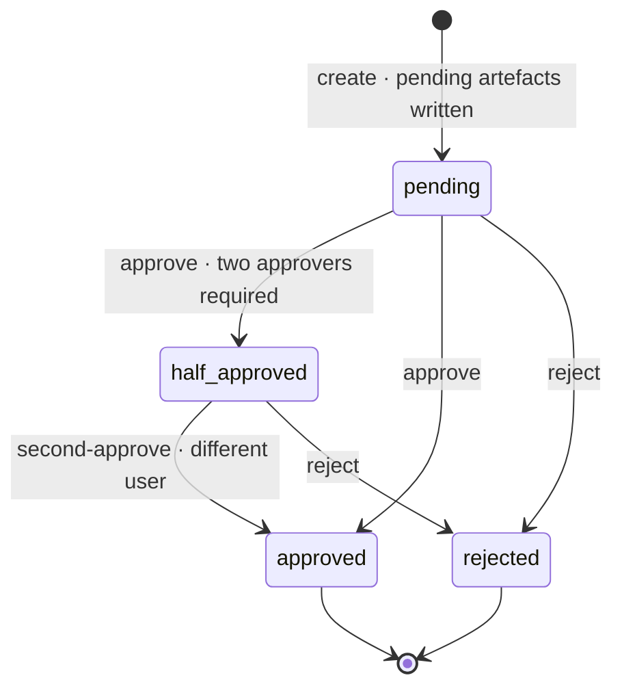

# ADR 0002: Proposal-Only Writes And The Approval State Machine

Status: Proposed. Pending owner approval at checkpoint 1.

## Context

Nothing enters the ontology without approval. The reference implements this with `propose()`, `approve()` and `reject()` over in-memory arrays and does not persist proposals, which leaves orphaned "awaiting approval" cells after a reload. The product needs the same visible behaviour, persisted server-side, shared between users and agents, with a second-approver mode and a cascade on rejection.

## Decision

Every ontology mutation endpoint (`POST /concepts`, `PATCH /concepts/{id}`, `DELETE /relations/{id}`, `POST /bindings`, and so on) creates a proposal and returns `202 Accepted` with the proposal. No endpoint writes an approved ontology row. The generic `POST /proposals` and `POST /proposals/batch` accept typed drafts from the teach parser and the MCP gateway. Content reaches the teach parser from three paths only: text typed in the teach bar, speech from the teach bar microphone (transcribed on the client and sent as text), and documents (`POST /import/sentences` extracts sentences server-side). All three produce drafts; none writes. There is no scripted story and no endpoint that plays one (decision row 62).

Provenance trust boundary: every proposal records `origin`. `text` and `speech` are declared by the client (`InputOrigin`, default `text`) and are a display and audit label, never a trust signal; any caller, including an agent, can declare either, so the `voice` check on `speech` stops only honest clients and the Studio also hides the microphone when `voice` is off. `document` is set by the server only. `POST /import/sentences` extracts the file and stores one `document_import` row (tenant, actor, file name, media type, SHA-256 of the file, created and expiry times one hour apart) with its sentences and positions in `document_import_sentence`, and returns the `importId` and the sentences. A client cites a sentence with `importRef` (`importId`, `sentenceIndex`); the server checks that the import belongs to the caller's tenant and to the same actor, answers `404` otherwise and `410 import_expired` past the expiry, reads the sentence text and position from the stored row (the teach parse never takes text from the client for a cited sentence), and records `document` with an `originDetail` copied from the row (file name, media type, sentence index, position), whatever `origin` the client sends. A client cannot send `originDetail`. `document` attests that a draft was submitted citing that stored sentence of that file; the labels of the draft remain what the client sent. Each cited sentence may be parsed at most three times and drafted by one successful proposal call (`409 import_sentence_used`). Both limits are claimed inside the calling transaction with a conditional update whose affected rows are checked: `UPDATE document_import_sentence SET parse_count = parse_count + 1 WHERE <key> AND parse_count < 3 RETURNING text` for a parse, and `UPDATE document_import_sentence SET drafted_at = now() WHERE <key> AND drafted_at IS NULL RETURNING sentence_index` for a proposal call; zero rows returned means the claim failed and the call is refused, so two concurrent calls can never both succeed. Never read-then-write. Charging: the import spends one unit of the import budget before the upload is read (`429` when empty, spent even when no sentence is found) and one parse unit per extracted sentence; parse calls citing an import spend nothing more; drafts citing an import spend one proposal unit per draft when they are created, like every other draft, so an import never buys proposals. Settings gate the channels with `409 channel_disabled`: `liveTeaching` gates teach parse of typed or spoken text, `voice` gates declared `speech`, and `importDocs` gates the import and every draft citing one. The dialogs (new concept, relationship) are not gated by `liveTeaching`, as in the reference. `suggestion` is also set by the server only (ADR 0009): `POST /expansions/{expansionId}/proposals` builds each proposal from the draft the server stored when the language model's expansion answer validated, the client sends indexes and never draft content, and no client can declare `suggestion`. It attests that the proposal holds exactly what the model suggested for that expanded concept and a user selected; like every proposal it needs a human approval. `ontology_import` (ADR 0012) is set by the server only in the same way, for proposals built by `POST /ontology-imports/{ontologyImportId}/proposals` from the tree the server mapped deterministically from an uploaded file. Whole-document extraction (ADR 0010) records `document`, with the `originDetail` of each draft's grounding sentence.

Proposals are persisted in the `proposal` table. Creating one creates its pending artefacts at once (a pending concept, relation, source, binding or attribute) so that the canvas draws them lighter immediately. Approvals are recorded in `proposal_approval`, one row per approver.

Rules:

- `ready` is derived at read time, never stored: every string dependency must resolve to a concept in the same company that is approved and not dying; function dependencies of the reference become named predicates (`both_ends_approved`, `source_and_targets_approved`, `two_definitions_approved`). A proposal that is not ready cannot be approved (`409 proposal_not_ready`); the response carries `waitFor`.
- Two approvers are required when `twoApprovers` is on and the type is `change`. The second approver must be a different user from the first (`409 same_approver`). The first approval appends `1 of 2 approvals · a Governor must approve too` to `why`. Calling `approve` on a `half_approved` proposal behaves as `second-approve` under the same rules.
- A `rename` or `rename_source` proposal re-checks label uniqueness in the company at approval time and is refused with `409 duplicate_label` when the label was taken in the meantime; the unique index never surfaces as an unexplained failure.
- Renaming a source is a `change` proposal (`rename_source`) exactly like renaming a concept, because the label is drawn on the canvas. Reconfiguring how a source is reached (host, scope, authentication method, credential reference, refresh) is immediate and audited, because it changes nothing the model says.
- Proposal `html` is built by the server only: every interpolated user-supplied string (labels, actions, captions and a document's `originDetail.fileName`) is HTML-escaped and only `<b>`, `<i>` and `` appear. The Studio renders it with those three tags allow-listed and everything else as text, so a label typed by a user or sent by an agent can never run in another user's browser.
- Approval, in one transaction: clear `pending` on the artefacts, run the type-specific apply, increment the domain product revision when the proposal carries one, write the audit entry, write the outbox rows.
- Rejection, in one transaction: mark the proposal rejected, mark its concept dying (`dying_at` set; the client animates 0.7 s and the row is deleted by the same transaction after cascading), remove pending relations and bindings, remove the proposed attribute, then reject every other pending proposal whose concept descends from the rejected one (walk `isa` child to parent and `rel` parent to child, at most 50 hops) and every pending proposal whose relation touches it.
- Approve-all repeats "approve every ready proposal" until none is ready, at most 200 rounds. Reject-all rejects every pending proposal. There is no finalise-all; approve-all is the only bulk approval.
- Conflict detection runs after every approval: two approved `isa` children of one parent with the same label become `conflict` and receive a `clash` relation. The `clash` relation is one of the two ontology writes that happen without a proposal, because it records a fact the model noticed rather than a change somebody asked for; the other is adding a company, which writes the root cell and the nine domain products directly as the reference does. Both are recorded in `docs/decisions.md` (row 43) together with the bulk removal approved by the typed `disable` confirmation.
- Refusals are Problem+JSON with stable codes: `cross_company_disabled`, `duplicate_label`, `duplicate_relation`, `duplicate_attribute`, `structural_relation`, `proposal_not_ready`, `same_approver`.
- Every concept stores how it was born (`birth_action`, `birth_reverse`) next to `parent_id` and `born_at`, so the lineage drawer can still say `<parent> <action> <child>` after the birth relation itself has been removed by a later proposal.
- The typed "disable" confirmation on the companies-may-interact switch creates one bulk `change` proposal (`remove_cross_company_links`) and approves it in the same request; the confirmation text is the approval. Every pending cross-company proposal is rejected in the same transaction.

## Consequences

- The Studio never shows a pending cell without a panel row that can approve it, on any device, after any reload.
- Agents propose through the gateway and land in the same queue as humans; the audit log shows who proposed and who approved.
- Every approval is one transaction, so the version bump, the audit entry and the live update can never disagree.
