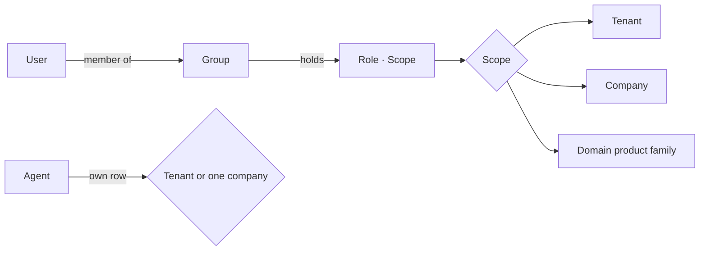

# ADR 0003: Native Authorisation Model

Status: Proposed. Pending owner approval at checkpoint 1.

## Context

The owner rejected any dependency on Microsoft or Entra groups for what a user may do. The reference already has native groups with `{role, scope}` assignments, a role catalogue and a scope list (Tenant, each company, each domain product) but enforces nothing. The product needs the same portal pages backed by real checks, for users and for agents.

## Decision

OIDC is for authentication only. Any OIDC provider signs the user in; the API validates the token, finds the tenant through `tenant_identity_provider` by the token's `(issuer, audience)`, then looks the user up in `app_user` by `(issuer, subject)`. On first login the user is provisioned into that tenant with name and email from the token and no group. A user with no group can read nothing.

Agents authenticate with a bearer token of their own (client credentials or a workload identity token). The token's `(issuer, subject)` must match an `agent` row whose `access` is true in a tenant whose `agentAccess` setting is on; otherwise the gateway and the API answer `403`. An administrator registers an agent with `POST /agents` (name, platform, issuer, subject, optional company scope); issuer and subject are returned only to holders of `agent.manage`. Agents never hold roles through groups: an agent's scope is its own row, tenant-wide when `company_id` is null, one company otherwise. Every agent read is logged.

A user is unique per `(issuer, subject)` across the whole deployment, so one person signing into two tenants through two audiences of the same issuer is refused on the second sign-in. This holds for the single-tenant dev environment; a multi-tenant deployment scopes that uniqueness by tenant.

The connector egress allowlist (`Settings.egressAllowlist`) is written under `settings.write` and audited like every other setting.

Authorisation is a pure function over the tenant's own tables: `permission(actor, permission, scope) -> bool`, where a user's roles reach them only through `group_member` and `group_role`.

Scopes:

- Tenant contains every company. A company contains its domain products.
- A domain scope names a domain product family by template key (`Production`, `Sales`, ...) and covers that domain product in every company of the tenant, exactly as the reference's scope list offers it. `Scope{kind: domain}` therefore carries `domainKey` and no `companyId`; the API rejects a domain scope with a company (`422`) and the database refuses it by CHECK.
- A proposal's scope is its domain product when it has one, otherwise its company, otherwise the tenant. A domain-scoped role matches a proposal when the proposal's domain product has that template key.

Roles and what they allow:

| Role | Scope kinds | Allows |
|---|---|---|
| Owner | company, domain | read; propose in scope; approve, second-approve and reject proposals in scope |
| Builder | tenant, company, domain | read; propose in scope; bind and connect sources; never approve |
| Governor | tenant, company | read; approve, second-approve and reject `change` proposals in scope; resolve conflicts; finalise-all at tenant scope |
| Member | tenant, company | read; teach when `everyoneTeaches` is on (proposes) |
| Administrator | tenant only | tenant settings, appearance, sources, companies, groups, roles, agents, cost, demo controls |
| Auditor | tenant, company | read the model, the directory and the audit log; time-boxed by `valid_until` on the group |
| Agent | own row | read the certified model through the gateway; propose in its own scope |

Permissions are a fixed vocabulary. Every operation in `contracts/openapi.yaml` declares the one it needs as `x-ontaix-permission`, and every channel in `contracts/events.yaml` declares the one that makes its events visible as `x-ontaix-visibility`, so QA contract tests assert both.

| Permission | Who holds it |
|---|---|
| `none` | nobody is checked: the operation needs no token (the liveness probe only) |
| `authenticated` | any valid user or agent token, no role required (`GET /me` only) |
| `model.read` | any role in the company's scope; Auditor; Agent in scope |
| `view.write` | any role with `model.read` in the company (positions, coverage flag, scene index, domain visibility) |
| `proposal.create` | Owner, Builder or Agent in the proposal's scope; Member when `everyoneTeaches` is on |
| `proposal.approve`, `proposal.reject` | Owner in the proposal's scope, or Governor in an enclosing scope |
| `proposal.second_approve` | Governor or Owner in scope, and a different user from the first approver |
| `proposal.finalise` | Governor at tenant scope |
| `settings.write`, `appearance.write`, `company.create`, `source.manage`, `group.manage`, `agent.manage`, `demo.run` | Administrator at tenant scope |
| `directory.read` | Administrator, Governor, Auditor |
| `audit.read` | Administrator, Governor, Auditor |

Permission check points, each enforced in the router layer and returning `403 forbidden`:

1. `proposal.create` requires Owner or Builder in the proposal's scope, an Agent whose scope contains the proposal's scope, or Member when `everyoneTeaches` is on. The teach parser and the import endpoint create drafts under the same permission.
2. `proposal.approve` requires Owner in the proposal's scope or Governor in an enclosing scope. Builders never approve, even their own proposals. Agents never approve; `proposal_approval.user_id` is not nullable.
3. `proposal.second_approve` requires Governor or Owner in scope and a different user from the first approver.
4. `proposal.reject` follows the same rule as approve.
5. `settings.write`, `appearance.write`, `company.create`, `source.manage`, `group.manage`, `agent.manage` require Administrator at tenant scope. Connector discovery runs under `source.manage`: it opens outbound connections and is refused for every other role, including Agent.
6. `audit.read` requires Administrator, Governor or Auditor.
7. `model.read` requires any role in scope; the scene snapshot, the lists and the WebSocket return only the companies the caller can read.
8. Locked settings (`approvalRequired`, `readOnlyConnectors`) reject every write with `409 locked_setting`, whatever the role.
9. Bulk decisions act only on proposals the caller may decide under check points 2 to 4. `approve-all` approves every ready proposal in the caller's scope and skips the rest; `reject-all` rejects every open proposal in the caller's scope and skips the rest; skipped proposals are counted in `remaining`. A scoped Owner can never approve another company's, another domain's or a cross-company proposal through a bulk call.
10. `finalise-all` requires `proposal.finalise` (Governor at tenant scope) because it creates proposals for every company and approves everything.
11. `directory.read` guards the Users, Groups and Roles pages and every list that exposes email addresses. `model.read` alone never enumerates the directory.
12. `view.write` guards the shared layout: positions, coverage flag, scene index and domain visibility are tenant-wide state that any reader of the company may change, and every change is audited as `list`.

Two writes bypass check points 1 to 4 by design and are recorded in `docs/decisions.md`:

- Disabling companies-may-interact (`settings.write`) creates one bulk `change` proposal and approves it in the same transaction. The typed confirmation is the approval; `twoApprovers` does not apply. The audit entry names the administrator.
- Adding a company with the starter vocabulary (`company.create`) creates thirteen proposals proposed by `system`; approving them still follows check points 2 to 4.

Group, membership and role changes are immediate and audited (kind `groups` or `roles`); they are not proposals because they change who may act, not what the model says.

## Consequences

- The Users, Groups and Roles pages read straight from the identity tables; effective roles per user are a join, not a cache.
- Swapping the identity provider changes nothing in authorisation; adding one is a row in `tenant_identity_provider`.
- The gateway maps a token to an agent row before it forwards anything, so an unknown or disabled agent never reaches the ontology.
- The demo seed keeps the seven default groups so that the first Owner approval and the Governor second approval work out of the box.
