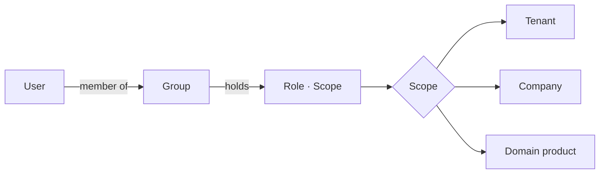

# ADR 0003: Native Authorisation Model

Status: Proposed. Pending owner approval at checkpoint 1.

## Context

The owner rejected any dependency on Microsoft or Entra groups for what a user may do. The reference already has native groups with `{role, scope}` assignments, a role catalogue and a scope list (Tenant, each company, each domain product) but enforces nothing. The product needs the same portal pages backed by real checks.

## Decision

OIDC is for authentication only. Any OIDC provider signs the user in; the API validates the ID token, then looks the user up in `app_user` by `(issuer, subject)`. On first login the user is provisioned into the directory with name and email from the token and no group. A user with no group can read nothing.

Authorisation is a pure function over the tenant's own tables: `permission(user, action, scope) -> bool`, where roles reach a user only through group membership (`group_member`) and group role assignments (`group_role`).

Roles and what they allow:

| Role | Scope kinds | Allows |
|---|---|---|
| Owner | company, domain | read; propose in scope; approve and second-approve proposals whose domain product or company is in scope |
| Builder | tenant, company, domain | read; propose in scope; bind and connect sources; never approve |
| Governor | tenant, company | read; approve and second-approve `change` proposals in scope; resolve conflicts |
| Member | tenant, company | read; teach when `everyoneTeaches` is on (proposes) |
| Administrator | tenant only | tenant settings, appearance, sources enable/disable/reconfigure, companies, groups, roles, agents |
| Auditor | tenant, company | read the model and the audit log; time-boxed by `valid_until` on the group |
| Agent | tenant | read through the gateway; propose; every read is logged |

A scope contains everything below it: Tenant contains every company; a company contains its domain products. A proposal's scope is its domain product when it has one, otherwise its company, otherwise the tenant.

Permission check points, each enforced in the router layer and returning `403 forbidden`:

1. `proposal.create` requires Owner, Builder or Agent in the proposal's scope, or Member when `everyoneTeaches` is on.
2. `proposal.approve` requires Owner in the proposal's scope or Governor in an enclosing scope. Builders never approve, even their own proposals.
3. `proposal.second_approve` requires Governor or Owner in scope and a different user from the first approver.
4. `proposal.reject` follows the same rule as approve.
5. `settings.write`, `appearance.write`, `company.create`, `source.manage`, `group.manage`, `agent.manage` require Administrator at tenant scope.
6. `audit.read` requires Administrator, Governor or Auditor.
7. `model.read` requires any role in scope; the scene snapshot returns only the companies the user can read.
8. Locked settings (`approvalRequired`, `readOnlyConnectors`) reject every write with `409 locked_setting`, whatever the role.

Group, membership and role changes are immediate and audited (kind `groups` or `roles`); they are not proposals because they change who may act, not what the model says.

## Consequences

- The Users, Groups and Roles pages read straight from the identity tables; effective roles per user are a join, not a cache.
- Swapping the identity provider changes nothing in authorisation.
- The demo seed keeps the seven default groups so that the first Owner approval and the Governor second approval work out of the box.
