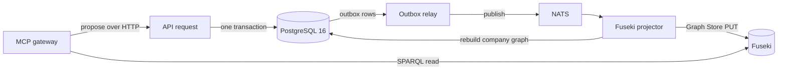

# ADR 0004: Persistence With PostgreSQL As System Of Record And Fuseki As A Projection

Status: Proposed. Pending owner approval at checkpoint 1.

## Context

The reference persists a JSON blob in `localStorage` for 12 hours. The product must persist everything server-side with no expiry, serve thousands of agents and users, answer SPARQL questions from agents about the approved ontology, and stay neutral (the same chart on Azure and on plain Kubernetes). Decision 5 already picks managed PostgreSQL plus in-cluster Fuseki.

## Decision

PostgreSQL 16 is the only system of record. Every table in `contracts/schema.sql` lives there: ontology, proposals, identity, bindings, audit, outbox, view state and positions. Transactions span modules (ADR 0001) so that an approval commits atomically.

Apache Jena Fuseki holds a read-side projection of the approved ontology only. It is never written by a request handler and never read to answer a Studio request.

How Fuseki is fed:

- The projector subscribes to `proposal.approved`, `proposal.rejected`, `concept.*`, `relation.*`, `binding.*`, `company.*` and `domain_product.*` events (ADR 0005).
- For every event it reads the affected company from PostgreSQL and rebuilds that company's whole named graph (`urn:ontaix:tenant:{tenantId}:company:{companyId}`) from approved rows only: concepts, `isa`, `rel`, `same` and `clash` relations, bindings and approved attributes. Pending and dying rows are never projected.
- The graph is replaced with one HTTP `PUT` through the Graph Store Protocol, so a replayed or duplicated event produces the same graph. The projector stores the last processed outbox id per company in `projection_cursor` and skips older events.
- A full rebuild of every graph is one management command; it runs at deploy time and after any Fuseki data loss.

Other persistence rules:

- Identifiers are UUIDs generated by the database; the reference's integer indices exist only inside the Studio's in-memory arrays.
- Domain product versions are integer revisions (`revision`), rendered as `v1.<revision>`.
- Positions (`x`, `y`, `pinned`) are stored per concept and per source so that "everything persists" holds across devices; the camera, focus and panel visibility stay client-side.
- Audit is append-only, enforced by a trigger that rejects `UPDATE` and `DELETE`.
- The demo state has no expiry; the 12-hour rule of the reference is not carried over.

## Consequences

- The Studio and the admin portal always read PostgreSQL, so they never see a stale projection.
- Agents query a graph that only holds what humans approved, which is what "reads the certified model" means.
- Losing Fuseki loses nothing; a rebuild restores it from PostgreSQL.
