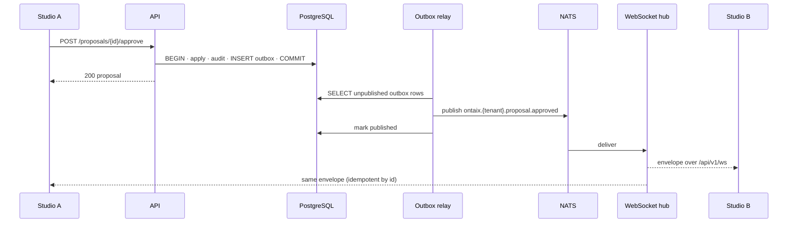

# ADR 0005: Events And Live Updates

Status: Proposed. Pending owner approval at checkpoint 1.

## Context

The reference redraws every frame from shared arrays, so one browser always sees its own changes. With two users, or a human and an agent, a second user's approval must show the green rim and the version bump without a reload. Decision 5 places NATS in the cluster. The Fuseki projector (ADR 0004) and any future consumer need the same stream.

## Decision

Every state change that other clients or services must see is published as an event described in `contracts/events.yaml` (AsyncAPI 3.0). Events are written with the outbox pattern and flow to NATS internally and to the Studio over WebSocket.

Rules:

- Outbox: the request handler inserts one `outbox` row per event inside the business transaction. A relay polls unpublished rows in id order, publishes them to NATS JetStream and marks them published. An event never exists without its state change and a state change never exists without its event.
- Subjects: `ontaix.{tenantId}.{aggregate}.{action}`, for example `ontaix.7f1c….proposal.approved`, `ontaix.7f1c….concept.born`. Consumers subscribe with wildcards (`ontaix.*.proposal.>`).
- WebSocket: one endpoint, `GET /api/v1/ws`, authenticated with the same bearer token. The server sends every event of the tenant that the user may read, in one envelope shape: `{ id, type, occurredAt, tenantId, sequence, actor, payload }`. `sequence` is the tenant-wide outbox id; a client reconnects with `?since=<sequence>` and receives what it missed, or a `snapshot.required` message when the gap is too old, in which case it reloads `GET /api/v1/scene`.
- Ordering: events of one tenant are delivered in outbox id order. Clients ignore an event whose `sequence` is not greater than the last one applied.
- Payloads carry the full new state of the affected artefact (the proposal with its `ready` and `waitFor`, the concept with `pending`, the domain product with its `revision`), not a diff, so a client can apply an event without a fetch. Bulk operations (`approve-all`, `finalise-all`, the companies-may-interact disable) set `bulk: true` on every event they emit so that the Studio softens the flash and skips the toast, as the reference does.
- Immediate changes (settings, appearance, groups, roles, source enable/disable, agent access) also emit events, so a second admin window updates live.

## Consequences

- The Studio keeps its "redraw from arrays" model: the arrays are filled by `GET /scene` and kept current by the WebSocket.
- The Fuseki projector, the audit exporter and any future integration consume the same NATS stream.
- The relay is the only component that publishes, so a NATS outage delays events but never loses them.
