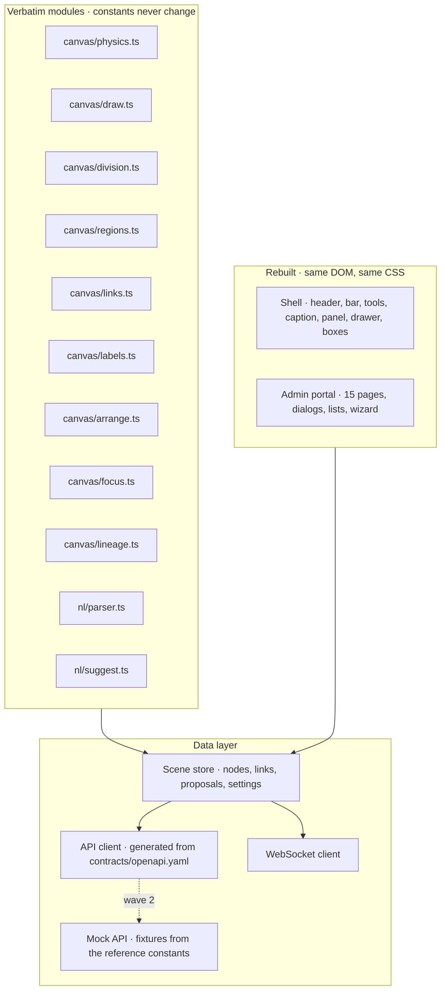

# ADR 0007: Studio Port Strategy

Status: Proposed. Pending owner approval at checkpoint 1.

## Context

`reference/ontaix-studio-reference.html` is a single 1101-line file: CSS, markup and about 850 lines of script that mix the canvas renderer, the physics, the story, the parser, the admin portal and persistence. The Studio must be pixel-identical to it, must run against the real API, and is built by two agents (Studio front end, Admin portal front end) starting on day 2, before the API exists.

## Decision

The Studio is React 19 + TypeScript + Vite. The renderer is ported verbatim; the shell and the admin portal are rebuilt as components that produce the same DOM and the same CSS.

Rules:

- Verbatim modules copy the reference functions line for line into TypeScript with types added and `Math.random`, `Date.now` and `performance.now` replaced by the injected `rng` and `clock` (ADR 0006). Renaming a local variable or splitting a function is allowed; changing a constant, an easing, a colour, a threshold or an order of operations is a bug. Each module header names the reference line range it was ported from.
- The dead `ghosts` / `drawGhosts` code and the unused `VERBS` array are not ported.
- CSS is copied from the reference into one stylesheet with the same selectors; the design tokens in `contracts/design-tokens.json` generate the `:root` custom properties and the canvas theme object, so a token change lands in both places at once.
- The scene store holds the same arrays the reference has (`nodes`, `links`, `proposals`, `companies`, settings) so that the verbatim modules run unchanged. `GET /api/v1/scene` fills it; WebSocket events update it; every user action calls the API and applies the returned artefacts.
- Wave 2 runs against a mock API in the browser (MSW) that implements `contracts/openapi.yaml` over an in-memory store seeded from the reference constants (`DOMAIN_TEMPLATES`, `SEED`, `RECORDS`, `ATTR`, `CATALOG`, `DISCOVER`, the 180 users, the 2400 agents). The mock is the same code path the QA scene tests use, and the real API replaces it by changing one base URL in wave 3.
- The scripted story is not ported (decision row 62): no `scenes` array, scene counter or scene name, no Next button, no Finalise all button, no story captions, no interception of teach sentences by a scene, no Space, ArrowRight or R shortcut, and `Space next` and `R restart` are dropped from the hint line. `teach` keeps only the import path of the reference (`teach(sentence, true)`): every sentence is parsed, and an empty submission does nothing. Everything else in the shell is ported unchanged.
- Content enters the Studio from the teach bar as text, from the microphone as a speech transcript sent as text, and from document import through `POST /import/sentences`; each ends in `POST /teach/parse` and proposal drafts.
- Screenshot regression runs from day 4: each scene is rendered from the reference file and from the Studio with the same seed and clock, at 1440 by 900 and 1920 by 1080, dark and light. The reference still contains the story and is never edited; the harness injects a stylesheet into both pages that hides the story-only elements, and reaches every scene through teach, import, the add-company dialog, the data-source wizard and the changes panel instead of playing scenes. `docs/ui-contract.md` (Acceptance) lists the hidden elements and the scenes.

## Consequences

- Two agents work in parallel: canvas and shell in `apps/studio/src`, admin portal in `apps/studio/src/admin`, sharing the store and the generated client.
- The canvas is testable in isolation with the mock API before the backend exists.
- Any visible difference traces to either a non-verbatim edit or a data difference, never to both at once.
