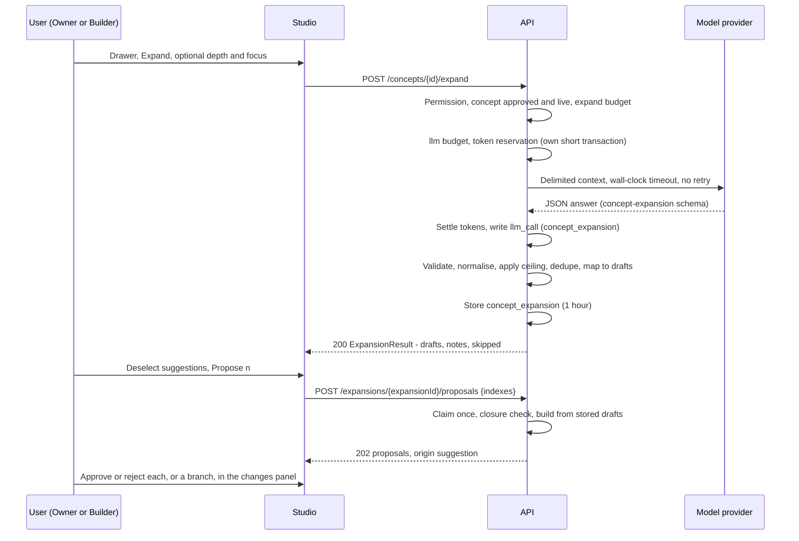

# ADR 0009: Concept Expansion

Status: Accepted. The feature is an owner decision, final (decision row 99); the removal of every depth limit is an owner decision, final (row 105); the derived choices (rows 100 to 104) are approved under owner delegation (2026-09-29).

## Context

Teaching (ADR 0008) turns the caller's own words into drafts and is deliberately strict: every new label must be grounded in what the caller said (decision row 92). The owner also wants the opposite tool: click a cell, choose Expand, and have the model grow that concept into a detailed mind map, as many levels deep as the business needs, which the owner then prunes and approves. This is creative by design, so grounding cannot apply. It needs its own safety instead, and nothing it suggests may enter the model without a human approval.

## Decision

### Flow

### Endpoints

`POST /concepts/{conceptId}/expand` takes an optional `depth` and `maxChildren` (steering from the caller, at least 1, no maximum), an optional `focus` (the caller's steering words, at most 200 characters, refusing markup, control characters and every Unicode format character, `422` otherwise) and an optional `sessionId`. It answers `200 ExpansionResult`: `expansionId` and `expiresAt`, `llmOutcome`, `degraded`, `drafts`, `notes` and `skipped`. It writes no ontology row and no proposal. When at least one draft survives validation it stores them in one `concept_expansion` row, usable for one hour by the same user in the same tenant; otherwise nothing is stored and `expansionId` is null.

`POST /expansions/{expansionId}/proposals` takes `indexes` (distinct draft indexes) and creates one proposal per selected draft in draft order, in one all-or-nothing transaction, from the drafts the server stored. The client never sends draft content, so a proposal with origin `suggestion` always holds what the model suggested and the API validated. An expansion is submitted by one successful call only: `submitted_at` is claimed with `UPDATE ... WHERE submitted_at IS NULL AND expires_at > now() RETURNING` in the calling transaction (`409 expansion_submitted`, `410 expansion_expired`, `404` for another user or tenant, or once purged 24 hours after expiry). The selection must be closed under `ExpansionNote.requires` (a selected draft's parent and link ends are selected too), otherwise `422`. Each draft then meets every check of `POST /proposals/batch`; a refusal such as `409 duplicate_label` rolls back the claim too, so the user can submit a smaller selection or expand again. One proposal unit is charged per proposal. Drafts from an expansion are never accepted by `POST /proposals/batch`, which keeps `InputOrigin` free of `suggestion`.

A dedicated submit endpoint was chosen over a reference field on batch drafts: it avoids a draft field that is mutually exclusive with `importRef`, and it makes edited suggestions impossible to pass off as model output. A user who wants a changed label proposes it by hand, with origin `text`.

### Origin

`suggestion` joins `text`, `speech` and `document` in `Origin` (OpenAPI), in the `Proposal` and `AuditEntry` payloads (AsyncAPI) and in the SQL enum `proposal_origin`, so `proposal.origin` and `audit_entry.origin` carry it. Like `document`, it is set by the server only; `InputOrigin` stays `text` or `speech`. `originDetail` stays null for it (`proposal_origin_detail_iff_document` is unchanged). The suggestion's confidence and rationale live in the proposal's server-built `why`: `Suggested by the model · <confidence>% · <rationale>`. The proposal's `heading` ends with ` · suggested`.

### No Depth Limit

By owner decision (row 105) there is no depth limit. A suggestion may sit at any depth below the expanded concept; its parent is the expanded concept or any earlier suggestion of the same answer. `depth` and `maxChildren` in the request are the caller's preferences, passed to the model and enforced only when set, never capped. The only ceilings exist for cost protection and are configuration:

- Total drafts per run, concepts and relations together: `ONTAIX_EXPAND_MAX_NODES`, default 200, at most 2,000.
- The token budget: the per-run output bound below, the caller's hourly `llm` budget and the tenant's `llmMonthlyTokenCap`.

### What The Model Receives

Everything below travels in delimited data fields, marked as data and never as instructions; only the API's fixed instructions are instructions. The prompt text lives in `apps/api/app/ai/prompts/`.

- The expanded concept's label and domain, as the only handle, `e0`.
- Its ancestors up to the company root, its siblings and its existing live and pending descendants at every depth, so the model does not suggest what exists.
- The labels of the company's other live and pending concepts in the expanded concept's domain, most recently born first; for the root, the labels of the company's depth-1 concepts.
- The company name and the nine domain templates (key and name).
- The caller's `focus`, `depth` and `maxChildren`, when given.
- Action guidance as in ADR 0008: lower-case present-tense verb phrases read parent to child, the reference lexicon's canonical predicates preferred, `is a` and `equivalent to` not available.

The label lists hold at most 1,000 labels in all (`ONTAIX_EXPAND_CONTEXT_LABELS`), nearest to the expanded concept first: ancestors, then descendants breadth-first, then siblings, then the domain's labels. This bounds the input's cost; it limits no depth, and the server's dedupe below checks every label of the company, sent or not.

Nothing of another company is sent, even with `crossCompany` on: no label, name or relation. The ADR 0008 never-sent list applies unchanged (no user names, emails or ids, no tenant id or name, no concept or proposal ids, no sources, bindings, attributes, settings, audit entries or credentials). `sessionId` and session turns are not sent.

### Output Contract

The model returns JSON only, validated against `contracts/concept-expansion.schema.json`: `suggestions` (`key` `s1`, `s2` and so on, `parent` `e0` or an earlier key, `label`, `action`, optional `domainKey`, `confidence`, `rationale` of at most 120 characters) and `links` (`from`, `to`, `action`, `confidence`, `rationale`, both ends `e0` or keys of the answer). The schema's `maxItems` (2,000 each) are the absolute contract bound; the API applies the configured ceiling. The API sends the provider a strict-compatible form of this schema, as for teach extraction, and always validates against the full schema.

Checks that make the whole answer invalid (`llmOutcome` `invalid_output`, no drafts, nothing stored): the schema, including the character rules; unique keys; every parent is `e0` or an earlier key; a link's ends differ; every normalised action (NFKC, whitespace collapsed, trimmed, lower-cased) is neither `is a` nor `equivalent to`; every label holds at least one letter after NFKC; every Cf character outside the Basic Multilingual Plane is refused as in ADR 0008.

Checks that drop a suggestion from a valid answer, each listed in `skipped` together with its descendants and its links (`parent_skipped`):

| Reason | Rule |
|---|---|
| `over_cap` | Deeper than the request's `depth` or beyond its `maxChildren` for one parent, when the request sets them; beyond `ONTAIX_EXPAND_MAX_NODES` drafts in answer order |
| `low_confidence` | Confidence below 0.4 |
| `duplicate_in_response` | Same normalised label as an earlier suggestion of the answer (case-insensitive, singular or plural) |
| `existing_label` | Same normalised label as a live or pending concept of the company, case-insensitive, singular or plural. The concept is reused, not proposed again, and nothing is attached to it |
| `duplicate_relation` | A link that repeats a birth relation of the answer in either direction |

Mapping: each kept suggestion becomes a `ConceptDraft` in breadth-first order, born from the expanded concept (`parentId`) or from an earlier draft (`parentLabel`) at any depth, with the suggestion's action, `reverse` false, labels through the label casing rule. Its domain is its parent's; a child of the company root takes the suggestion's `domainKey`, else `production`. Kept links follow as `RelationDraft`s by `aId` or `aLabel` and `bLabel`. There are no `SpecDraft`s: a specialisation (`is a`) carries inheritance, and an ungrounded model is not trusted with taxonomy; a user who agrees with a kind-of suggestion re-proposes it through the teach bar. `ExpansionNote` gives each draft its confidence, rationale, depth (unbounded) and `requires` (the parent's index, or the ends' indexes for a link).

### Safety

Expansion is exempt from grounding by owner decision (row 99). Its safety comes from these rules instead:

- Nothing is written: suggestions become drafts, a user selects them, and each selected one becomes a pending proposal a human approves or rejects. Approve all and branch approval (ADR 0010) apply, as for any proposal, and the `suggested` marking makes the source visible to the approver.
- Bounded size, not depth: at most `ONTAIX_EXPAND_MAX_NODES` drafts per run and the token budget; labels at most 60 characters, rationales at most 120.
- Bounded reach: every draft is in the expanded concept's company, born under the expanded concept or under another draft of the same response; links join only the expanded concept and drafts of the same response. The model is given no handle for any other concept, so its output cannot name, relate to, rename or delete one.
- Prompt injection: labels written by other users or agents (pending ones included) and the caller's `focus` are untrusted data in delimited fields. An injected label can at worst steer which suggestions come back; whatever comes back is still only drafts under the expanded concept, bounded as above, marked `suggested`, and approved by a human.
- Characters: labels, actions and rationales refuse markup, control characters, U+00A0, U+2028, U+2029 and every Unicode format character, bidirectional and zero-width controls included, so no suggestion can spoof `is a` or `equivalent to` or hide text. Rationales are plain text, HTML-escaped wherever the server interpolates them, and rendered as text.
- Content filter or refusal: when the provider's content filter blocks the request or the answer, or the model declines, the result is `200` with `llmOutcome` `refused`, `degraded` true and no drafts; the `llm_call` row records outcome `refused`.
- Permission: only users holding `proposal.create` in the concept's scope through Owner or Builder (ADR 0003 check point 13); agents and `everyoneTeaches` Members get `403`. The expanded concept must be approved and live, or the company root: a pending concept is `409 concept_pending`; a source, a dying or deleted concept, or one the caller may not read is `404`.

### Costs And Budgets

- One unit of the caller's hourly `expand` budget (`rate_budget_window`, default 30 runs per user per hour, `ONTAIX_EXPAND_CALLS_PER_HOUR`) is charged before anything else; when it is empty the call is `429 rate_limited` with `Retry-After`.
- Then the same budgets as teach extraction: one unit of the hourly `llm` budget and a reservation against the tenant's `llmMonthlyTokenCap` in `llm_month_usage`, with the ADR 0008 method (input estimate the larger of code points / 2 and UTF-8 bytes / 3 of the assembled request, plus the output bound, reserved in its own short transaction, settled after the call on the reserved month). Either being exhausted gives `200`, no drafts, `llmOutcome` `rate_limited` or `budget_exhausted`. Cap 0 turns expansion off with teach extraction.
- Output bound: 128 tokens per allowed draft (25,600 at the default ceiling), at most `ONTAIX_EXPAND_MAX_OUTPUT_TOKENS` (default 32,768), plus `ONTAIX_EXPAND_REASONING_ALLOWANCE_TOKENS` (default 8,192, because the default effort is `medium`); the sum is set as the provider's maximum output tokens and reserved. A suggestion in compact JSON with a 120-character rationale takes about 80 tokens. At the defaults with 1,000 context labels a run reserves at most about 100,000 tokens; a typical run settles far less.
- Every provider call, failed ones included, writes one `llm_call` row with purpose `concept_expansion` and outcome `used`, `invalid_output`, `timeout`, `provider_error` or `refused`. `GET /cost` reports it in `LlmUsage.byPurpose`.
- Submitting charges one proposal unit per created proposal.
- No event is published for an expansion; the proposals it creates publish `proposal.created` as usual, with origin `suggestion`.

### Model, Effort And Timeout

Expansion uses the teach adapter in `apps/api/app/clients/` and the configured provider (`ONTAIX_LLM_PROVIDER`), with its own settings:

| Variable | Default | Meaning |
|---|---|---|
| `ONTAIX_EXPAND_DEPLOYMENT` | the value of `ONTAIX_FOUNDRY_DEPLOYMENT` | `azure_foundry`: the model deployment expansion calls |
| `ONTAIX_EXPAND_MODEL` | the value of `ONTAIX_LLM_MODEL` | The model name written to `llm_call.model` and looked up in `ONTAIX_LLM_PRICE_TABLE`; with `anthropic`, the model id sent. The API does not start when a configured provider's expansion model has no price |
| `ONTAIX_EXPAND_REASONING_EFFORT` | `medium` | `azure_foundry`: the reasoning effort sent with each expansion call; any value `ONTAIX_FOUNDRY_REASONING_EFFORT` accepts |
| `ONTAIX_EXPAND_REASONING_ALLOWANCE_TOKENS` | 8192 | Extra output tokens for reasoning, added to the maximum output tokens and to the reservation |
| `ONTAIX_EXPAND_MAX_NODES` | 200 | Total drafts per run, concepts and relations together; 1 to 2,000, anything else stops the API at start-up |
| `ONTAIX_EXPAND_MAX_OUTPUT_TOKENS` | 32768 | Upper bound of the answer's output tokens, before the reasoning allowance |
| `ONTAIX_EXPAND_CONTEXT_LABELS` | 1000 | Most existing labels sent as context |
| `ONTAIX_EXPAND_TIMEOUT_SECONDS` | 120 | Wall clock from the start of the adapter call to the last byte read, DNS, connect, TLS and token acquisition included, SDK retries 0; above 300 or at most 0 stops the API at start-up |
| `ONTAIX_EXPAND_CALLS_PER_HOUR` | 30 | The per-user hourly `expand` budget |

The timeout is 120 seconds rather than the 45 seconds first considered, because a 200-draft answer at effort `medium` does not finish in 45 seconds; `llm_call.latency_ms` accepts up to 300,000. Structured output is required as in ADR 0008 (`json_schema` with `strict` true on Foundry). Prompts and answers are not logged and never stored by the provider on Ontaix's request.

### Data Residency

What leaves Azure France Central per expansion call: the expanded concept's label and domain, the labels listed above of the same company, the company name, the domain templates, the action guidance and the caller's `focus`. It goes to the same provider as teach extraction, under ADR 0008 Data Residency unchanged (by default Azure AI Foundry inference within the EU data zone). A tenant administrator stops it, together with teach extraction, with `llmMonthlyTokenCap` 0.

### Studio

Recorded deviation from the reference (row 103, like row 98). The cell drawer gets `Expand` (`#drExpand`) immediately before `Delete`, in the drawer's existing `.drawer .actions button` style, for approved live concepts and the company root, never for a pending cell or a source. It opens a dialog built with the reference's own dialog, `.form` and `.chk` markup; the chosen suggestions become pending proposals marked `suggested` in the changes panel with the existing `.prop .top` and `.prop .why` lines. The exact texts, and how the screenshot suite hides `#drExpand`, are in `docs/ui-contract.md`.

## Consequences

- A user can grow a concept into a mind map of any depth in one action and keep only what fits; every kept suggestion is a normal pending proposal, visibly marked `suggested`, and needs approval.
- Teaching stays strict: ADR 0008 and its grounding rule are unchanged, and model output from expansion can never be declared as `text`, `speech` or `document`.
- Expansion adds model spend, bounded by the per-run draft ceiling and output bound, the per-user `expand` budget, the shared `llm` budget and the tenant's monthly token cap, and visible per purpose in `GET /cost`.
- One new table (`concept_expansion`), one new origin value, one new budget, new `llm_call` purposes and outcome, and three new Problem codes (`concept_pending`, `expansion_submitted`, `expansion_expired`). Adding an enum value is a breaking change for strict consumers, approved by the owner through row 99.
- The Studio differs from the reference by one drawer button and one dialog, both kept out of every screenshot scene.
