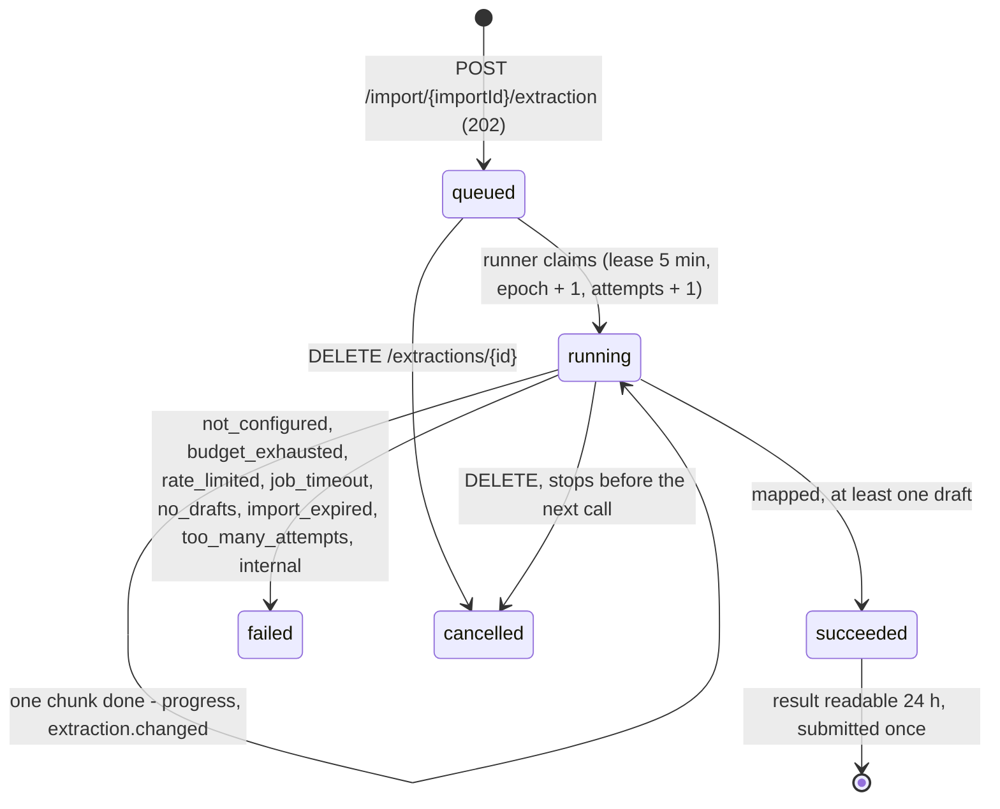
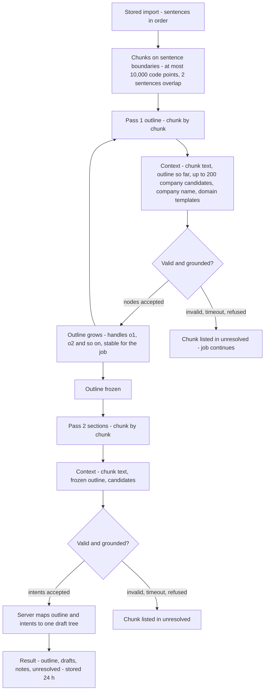

# ADR 0010: Whole-Document Extraction

Status: Accepted. The feature is an owner decision, final (decision row 106); the removal of every depth limit is an owner decision, final (row 105); the derived choices (rows 107 to 109, and rows 116, 117 and 119 from the PR #21 review) are approved under owner delegation (2026-09-29).

## Context

Document import (ADR 0008, row 88) teaches a document sentence by sentence: each sentence goes through `POST /teach/parse` with at most two neighbours each side as context. That finds facts but cannot build a hierarchy that spans pages - a process named on page 2 whose sub-processes are described on pages 5 to 9 and whose steps sit in a table on page 12. The owner wants a whole business document mapped into one coherent ontology tree: areas, processes, sub-processes, steps and entities, each with the right parent path, action and name, as many levels deep as the document goes.

This is a new ADR rather than an amendment of ADR 0008 because it adds an asynchronous job, a second model pass, a review operation and its own configuration. ADR 0008 stays the rule for teaching, and its grounding rule is reused here unchanged.

## Decision

### Job Lifecycle

The job is asynchronous: `POST /import/{importId}/extraction` answers `202` with a `DocumentExtraction` at once. The client follows it through the `extraction.changed` event (AsyncAPI channel `ontaix.{tenantId}.extraction.changed`, visibility `model.read`, audience `recipient`: delivered only to the user who started the job, as `GET /extractions/{extractionId}` is; no administrator receives it, since none can read the job; payload counts and states only, no labels and no document text) or by polling `GET /extractions/{extractionId}` every 5 seconds. `GET /extractions/{extractionId}/result` returns the outline and the draft tree of a `succeeded` job; `POST /extractions/{extractionId}/proposals` turns a selection of it into proposals; `DELETE /extractions/{extractionId}` cancels.

A runner in `apps/api` claims queued or orphaned jobs from `document_extraction_job` with `FOR UPDATE SKIP LOCKED`, and in the same transaction sets `lease_owner` to its own id, increments `lease_epoch` and `attempts`, and sets a 5-minute `lease_until`. A job whose `attempts` would pass `ONTAIX_DOCUMENT_EXTRACTION_MAX_ATTEMPTS` (default 3) is failed instead, with `too_many_attempts`, so a job that keeps crashing its runner stops spending tokens. Fencing: every later write of the runner - lease renewal, progress, outline, token count, result, final state and the `extraction.changed` outbox row - is one `UPDATE ... WHERE id = $job AND lease_owner = $runner AND lease_epoch = $epoch AND lease_until > clock_timestamp()` (the statement time, not the transaction start), in a short transaction; zero rows means the lease is lost, and the runner stops at once without writing anything more, settling only its own token reservation. The lease is renewed after every chunk, every 60 seconds while a model call is in flight, and during mapping. A job whose runner dies resumes at its next unfinished chunk under a new epoch; outline handles are assigned only by fenced writes, so they stay stable. Final states clear the lease. The job's `outline` column holds the outline nodes in acceptance order and, once pass 2 has read a chunk, that chunk's accepted section intents, tagged as intents, which mapping reads; `GET /extractions/{extractionId}/result` returns the nodes only. Progress, the outline so far and the settled token count are written after every chunk in a short fenced transaction that also writes the `extraction.changed` outbox row. No transaction is open during a model call. The job reads the import's sentences while it runs; its result copies each draft's grounding sentence index, position, file name and media type, so it survives the import purge (`import_id` is set null). The result is readable and submittable for 24 hours after the job finished.

Rules at start: the import belongs to the caller's tenant and user (`404`), is not expired (`410 import_expired`) and holds at most `ONTAIX_DOCUMENT_EXTRACTION_MAX_CHARS` extracted characters (default 400,000, `413 payload_too_large` above); one job per import (`409 extraction_exists`); one queued or running job per user (`409 extraction_running`); `importDocs` on (`409 channel_disabled`); permission `proposal.create` in the company's scope through Owner or Builder (ADR 0003 check point 13; agents and `everyoneTeaches` Members get `403`); one unit of the hourly `extraction` budget (default 5 jobs per user per hour, `429` when empty). A model that is not configured or a tenant cap of 0 is not an error at start: the job ends `failed` with `not_configured` or `budget_exhausted`, and the Studio falls back to sentence-by-sentence teaching.

### Passes

Chunking: the import's sentences in order, cut into chunks of at most `ONTAIX_DOCUMENT_EXTRACTION_CHUNK_CHARS` code points (default 10,000) on sentence boundaries, each chunk repeating the last 2 sentences of the previous one. A sentence longer than a chunk is its own chunk. The overlap lets a structure that crosses a chunk edge be read whole; a node found in both copies is merged by label.

Pass 1, outline. For each chunk in order the model receives the chunk's sentences with their indexes, the outline built so far, up to 200 existing concepts of the company as handles `c0` to `c199` (ranked as in ADR 0008, the root first), the company name and the domain templates. It returns new outline nodes, parents before children (`contracts/document-extraction.schema.json`, `outlineAnswer`): a key, a parent, a label, the birth action, an advisory role (`domain_area`, `process`, `subprocess`, `step`, `entity`, `group`), an optional domain key, a confidence, and the sentence index and quote the label comes from. Accepted nodes get outline handles `o1`, `o2` and so on, stable for the whole job.

Pass 2, sections. For each chunk in order the model receives the chunk, the frozen outline and the candidates, and returns intents as in teach extraction (`sectionAnswer`: `rel` with a required action, or `spec` without one, subject and object each an outline node, a candidate, a path or a new grounded label, an action, a confidence, a sentence index and a quote). These add the steps, entities and relations the outline did not hold, and the relations across branches.

Mapping. The server turns outline nodes into `ConceptDraft`s in outline order (born from their parent node, candidate or root, with the node's action) and section intents into drafts with the grammar's mapping table (ADR 0008, Output Contract), then orders the tree parents first, relations last. A label that matches an existing concept of the company (the grammar's `resolve`) reuses it; a label that repeats an outline node is that node; a restated fact produces no draft (row 97). Each draft's `DocumentDraftNote` carries the pass, confidence, explanation, role, depth, `requires` and the grounding sentence and span.

### No Depth Limit, Carry-Forward And Ceilings

By owner decision (row 105) there is no depth limit. A node may attach under any node of the outline at any depth, three ways: by handle (`oN` or `cN`), by the key of a node earlier in the same answer, or by a path of labels from the company root down to the parent, of any length. The server resolves a path against the whole outline and the company's concepts, one normalised label per level; a path that does not resolve drops the node and its dependants (`unknown_parent`).

The outline is carried forward in full as compact lines (handle, parent handle, label). When it holds more than `ONTAIX_DOCUMENT_EXTRACTION_OUTLINE_CONTEXT_NODES` (default 600), the server sends the nodes whose labels occur in the chunk with every ancestor of each, then the upper levels breadth-first, then the most recently added, up to that number. Because a path resolves against the whole outline, a node can attach to any existing ancestor path, including one that was not sent.

The only ceilings exist for cost protection and are configuration:

- Total drafts per job: `ONTAIX_DOCUMENT_EXTRACTION_MAX_NODES`, default 2,000, at most 5,000. When mapping reaches it, the remaining intents are listed in `unresolved` with reason `node_ceiling` and the job is `degraded`.
- Tokens per job: `ONTAIX_DOCUMENT_EXTRACTION_MAX_TOKENS`, default 1,000,000 settled tokens, always within the tenant's `llmMonthlyTokenCap`. When a call's reservation would pass either, the job stops calling, maps what it has and is `degraded`, the unread chunks listed with reason `budget_exhausted`.
- Document size: `ONTAIX_DOCUMENT_EXTRACTION_MAX_CHARS`, default 400,000 characters (about 40 chunks, 80 calls).

### Grounding

Grounding stays, exactly as ADR 0008 defines it (rows 92 and 94): every new label - an outline node's label and every `newLabel` of an intent - must equal, after normalisation, a run of whole words of the sentence its `sentenceIndex` names, allowing singular or plural; the drafted label is sliced from the document text, never the model's string. The cited sentence must lie in the chunk sent, overlap included. The outline is grounded the same way: every node's label is grounded in its own cited sentence when the node is accepted, and a node that fails is dropped with every node and intent that depends on it (`ungrounded_label`). The model chooses structure - parents, paths, actions, roles, domains - and never a label: a heading the document does not contain cannot become a concept. Existing concepts cited by handle are exempt, since they exist.

### Containment Of Untrusted Text

The document is untrusted input. Its sentences travel in delimited data fields with their indexes, never as instructions; so do candidate labels written by other users or agents and the outline the model itself built from earlier chunks. The same rules as ADR 0008 then bound what an injected instruction can do:

- The model's only power is to return nodes and intents; the schema, the handle table, grounding and the draft validation bound them like any client's drafts.
- Every draft is in the job's company; no other company's concept is sent or can be cited, whatever `crossCompany` says.
- Handles are per job; a guessed id cannot validate, and no concept id leaves the API.
- Labels, actions, rules, explanations and quotes refuse markup, control characters, U+00A0, U+2028, U+2029 and every Unicode format character; actions are normalised and never `is a` or `equivalent to` (a `spec` intent follows the grammar's four `spec` rows, in the job's company only).
- Invalid answers invalidate their chunk only; the chunk is listed in `unresolved` with reason `model_invalid_output`, and nothing is written.
- Every draft becomes a pending proposal under the user's name and needs a human approval.

### Costs, Budgets And Timeouts

- Starting a job spends one unit of the hourly `extraction` budget (`ONTAIX_DOCUMENT_EXTRACTION_JOBS_PER_HOUR`, default 5). A job's model calls do not spend the per-call hourly `llm` budget (a job makes up to about 80 calls, more than a whole hour's default of 200 would allow alongside teaching); they are bounded instead by the job's token ceiling and the tenant's monthly cap, with the ADR 0008 reservation and settlement per call.
- Every call writes one `llm_call` row with purpose `document_extraction`, outcome `used`, `invalid_output`, `timeout`, `provider_error` or `refused`. `GET /cost` reports it in `LlmUsage.byPurpose`.
- Output bounds: 16,384 tokens for an outline answer and 24,576 for a section answer, plus `ONTAIX_DOCUMENT_EXTRACTION_REASONING_ALLOWANCE_TOKENS` (default 16,384), set as the provider's maximum output tokens and reserved per call.
- Timeouts: each call has `ONTAIX_DOCUMENT_EXTRACTION_TIMEOUT_SECONDS` (default 180, above 300 or at most 0 stops start-up), wall clock with DNS, connect, TLS and token acquisition, SDK retries 0; a timed-out call leaves its chunk unresolved (`timeout`) and the job continues. The whole job has `ONTAIX_DOCUMENT_EXTRACTION_JOB_TIMEOUT_MINUTES` (default 60): past it the job maps what it has, or fails with `job_timeout` when that is nothing.
- Submitting the tree charges one proposal unit per proposal; 2,000 proposals fit the default proposal budget of 5,000 per hour.

### Model And Effort

| Variable | Default | Meaning |
|---|---|---|
| `ONTAIX_DOCUMENT_EXTRACTION_DEPLOYMENT` | the value of `ONTAIX_FOUNDRY_DEPLOYMENT` | `azure_foundry`: the deployment both passes call |
| `ONTAIX_DOCUMENT_EXTRACTION_MODEL` | the value of `ONTAIX_LLM_MODEL` | Written to `llm_call.model` and looked up in the price table; with `anthropic`, the model id |
| `ONTAIX_DOCUMENT_EXTRACTION_REASONING_EFFORT` | `medium` | Reasoning effort per call, `medium` or higher; the owner's model bake-off sets the final default |
| `ONTAIX_DOCUMENT_EXTRACTION_REASONING_ALLOWANCE_TOKENS` | 16384 | Extra output tokens for reasoning |
| `ONTAIX_DOCUMENT_EXTRACTION_CHUNK_CHARS` | 10000 | Chunk size in code points; overlap is 2 sentences |
| `ONTAIX_DOCUMENT_EXTRACTION_OUTLINE_CONTEXT_NODES` | 600 | Most outline nodes sent with one chunk |
| `ONTAIX_DOCUMENT_EXTRACTION_MAX_NODES` | 2000 | Total drafts per job, 1 to 5,000 |
| `ONTAIX_DOCUMENT_EXTRACTION_MAX_TOKENS` | 1000000 | Settled tokens per job |
| `ONTAIX_DOCUMENT_EXTRACTION_MAX_CHARS` | 400000 | Largest document a job accepts |
| `ONTAIX_DOCUMENT_EXTRACTION_TIMEOUT_SECONDS` | 180 | Per call, at most 300 |
| `ONTAIX_DOCUMENT_EXTRACTION_JOB_TIMEOUT_MINUTES` | 60 | Per job |
| `ONTAIX_DOCUMENT_EXTRACTION_JOBS_PER_HOUR` | 5 | The per-user hourly `extraction` budget |
| `ONTAIX_DOCUMENT_EXTRACTION_MAX_ATTEMPTS` | 3 | Claims of one job before it fails with `too_many_attempts`, 1 to 10 |
| `ONTAIX_BRANCH_APPROVE_BATCH` | 200 | Proposals per branch-approval transaction |
| `ONTAIX_BRANCH_APPROVE_MAX_ROUNDS` | 50 | Batches per branch-approval call |

The adapter, structured output, keyless authentication and price-table rule are those of ADR 0008.

### Review

The result arrives as one proposal tree:

1. When the job succeeds, the Studio reads the result and submits every draft with `POST /extractions/{extractionId}/proposals` (one all-or-nothing call, drafts built by the server from what it stored, origin `document` with each draft's grounding sentence as `originDetail`). The endpoint accepts a subset closed under `requires`, for clients that preselect; the Studio does not.
2. The proposals appear in the changes panel as today. Children wait for their parents through the existing `deps` and `after <waitFor>` rule, so the tree is approved top-down.
3. Approve by branch: `POST /proposals/{proposalId}/approve-branch` takes a `concept` or `spec` root only (`409 branch_root_invalid` otherwise). The branch is the open proposals that depend on a `concept` or `spec` root through proposal dependencies, transitively, plus relation proposals whose ends are all in the branch or approved; never `change`, `source`, `bind` or `attr` proposals, so no rename, deletion or edit of an existing concept is ever approved through it. Dependencies resolve by id, within the root's company only: a pending concept of the branch is identified by its concept id, a proposal enters the branch when its `deps` or `waitFor` label resolves, among the open proposals and live concepts of the root's company (and, when the root has one, its domain product within that company), to a concept of the branch, and a relation proposal enters only when both its ends resolve that way to concepts of the branch or approved concepts of that company. A proposal of another company never enters a branch, even when its labels match. Each batch re-reads the branch and selects its ready proposals under its own decision lock, so a rejection or cascade committed between batches is seen: nothing is approved under a parent that has since been rejected or is no longer ready. Each proposal is approved only if the caller may approve it alone. Work is committed in batches of at most 200 proposals (`ONTAIX_BRANCH_APPROVE_BATCH`), parents first, each batch in its own transaction under the tenant decision lock, at most 50 batches per call (`ONTAIX_BRANCH_APPROVE_MAX_ROUNDS`). The result, `BranchResult`, reports `approved`, `skipped`, `remaining`, `batches` and `complete`; with `complete` false the client calls again on the same root, and committed batches stay committed. `Proposal.openBelow` tells a client how many open proposals sit in a branch.
4. Reject by branch needs nothing new: rejecting a proposal already cascades to its descendants, as in the reference.
5. Approve all and Reject all keep their meaning over everything open.

Studio (recorded deviation, row 109): the panel's `.prop .act` row gets a third button, `Approve branch (<n>)`, after `Reject`, in the existing `.prop .act button` style, shown only when `openBelow` is above 0 and the proposal is ready; the import dialog gets a choice between `Sentence by sentence` (default, today's path) and `Whole document` as two `.chk` radio rows (`#imMode`); while a job runs, the existing `.caption` shows its progress. Exact texts and screenshot handling are in `docs/ui-contract.md`.

### Data Residency

What leaves Azure France Central per job: the document's text, chunk by chunk, the outline built from it, up to 200 labels of the company's concepts per call, the company name and the domain templates, to the same provider and under the same terms as teach extraction (ADR 0008, Data Residency). A tenant administrator stops it with `llmMonthlyTokenCap` 0.

## Consequences

- A whole document becomes one tree of proposals with parent paths of any depth, grounded in the document's words, reviewed branch by branch.
- Sentence-by-sentence import is unchanged and stays the default and the fallback.
- One new table (`document_extraction_job`), one new event (`extraction.changed`), one new budget (`extraction`), a new `llm_call` purpose, a branch-approval operation, `Proposal.openBelow`, five new Problem codes (`extraction_exists`, `extraction_running`, `extraction_not_ready`, `extraction_expired`, `extraction_submitted`) and `contracts/document-extraction.schema.json`.
- A job is the largest single model spend in Ontaix; it is bounded by the per-job token and draft ceilings, the hourly job budget and the tenant's monthly cap, and visible per purpose in `GET /cost`.
- The Studio differs from the reference by the import mode choice, the progress caption text and the `Approve branch` button, all kept out of every screenshot scene.
