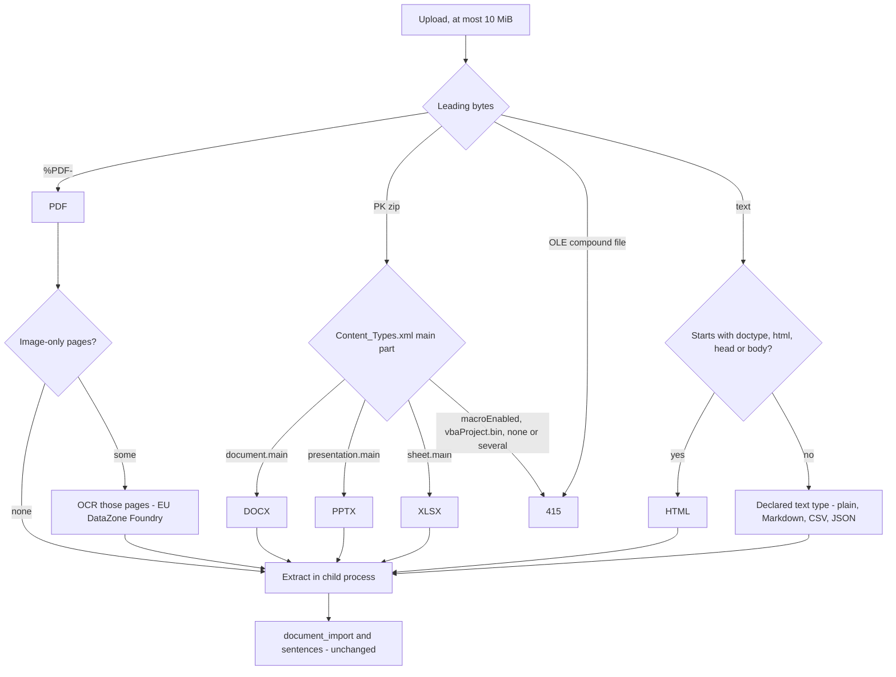

# ADR 0011: Import Formats And OCR

Status: Accepted. The feature is an owner decision, final (decision row 110); the derived choices (rows 111 and 112, and rows 118 and 119 from the PR #21 review) are approved under owner delegation (2026-09-29).

## Context

`POST /import/sentences` reads six types: plain text, Markdown, CSV, JSON, DOCX and PDF with a text layer. Business documents also come as slide decks, spreadsheets, web pages and scanned PDFs. The owner wants all common types accepted, with scanned PDFs read by OCR on an EU DataZone deployment, and everything else unchanged: stored imports, grounding in the extracted text, and limits that refuse a whole import.

## Decision

### Types And Sniffing

The server decides the type from the bytes; the declared media type must agree with the sniffed one (`415 unsupported_media_type` otherwise), and `document_import.media_type` records the sniffed type. Accepted types are the six of today plus `application/vnd.openxmlformats-officedocument.presentationml.presentation` (PPTX), `application/vnd.openxmlformats-officedocument.spreadsheetml.sheet` (XLSX) and `text/html`; a scanned PDF stays `application/pdf`. The media-type lists change everywhere they appear: `OriginDetail.mediaType` and the import response in OpenAPI, the `Proposal.originDetail` payload in AsyncAPI, and both SQL CHECKs (`document_import_media_type`, `proposal_origin_detail_shape`).

Refused with `415`: macro-enabled OOXML (`docm`, `pptm`, `xlsm`, any `macroEnabled` content type, or any `vbaProject.bin` part, whatever the declared type), legacy binary Office files and encrypted OOXML (both OLE compound files), an archive with no or several OOXML main parts, and anything else.

### Limits Per Type

| Type | Limits and reading rules |
|---|---|
| Every type | At most 10 MiB uploaded, 2,000,000 extracted characters, 2,000 sentences of 13 to 399 characters; extraction in a child process with a wall-clock limit and a memory cap; past any limit `413` for the whole import, nothing stored |
| DOCX, PPTX, XLSX | Every XML part read with no DTD and no entity expansion; at most 1,000 archive members; decompression bounded in bytes, counted while streaming whatever the declared sizes say - each member at most 50 MiB uncompressed, the archive at most 200 MiB, and no member with a compression ratio above 100 - and also stopped at the extracted-text limit; the same bounds apply to XLSX hierarchies in ontology import (ADR 0012); embedded objects and images not read |
| PDF | At most 2,000 pages; text layer per page; pages with fewer than 20 non-space characters are image-only and go to OCR; attachments and scripts never read or run |
| PPTX | At most 500 slides; shape text and speaker notes in slide order; position `slide` |
| XLSX | At most 50 sheets and 200,000 non-empty cells; each non-empty row is one sentence of its cell values joined by `, ` in sheet and row order; cached values only, formulas never evaluated, external links never followed; position `sheet` with `row` |
| HTML | At most 5 MiB and nesting depth 512; parsed without executing anything; the contents of `script`, `style`, `template`, `noscript`, `iframe`, `object`, `embed`, `svg` and `math` are dropped; no external resource is fetched (images, stylesheets, frames, fonts, base URLs, links); block elements end sentences; position `paragraph` |

`DocumentPosition.unit` gains `slide` and `sheet`, and `sheet` carries an optional 1-based `row` (OpenAPI, AsyncAPI, `document_import_sentence.position_unit` and `position_row`, and the `origin_detail` CHECK).

### OCR For Scanned PDFs

Image-only pages are sent to an OCR client in `apps/api/app/clients/`, behind a provider-neutral interface like the teach adapter: it takes PDF bytes and a page list and returns text per page (Markdown), or a timeout or error. The default provider is a Mistral document model (`mistral-document-ai` or `mistral-ocr-4-0`, set by configuration) deployed on Azure AI Foundry as DataZoneStandard (EU), authenticated keyless with the API's workload identity like the teach deployment. The recognised text joins the text-layer pages in page order, is split into sentences like any extracted text, and is the text every later step grounds in: teach parse, whole-document extraction and the proposals' `originDetail`. It is untrusted text like any document.

- At most `ONTAIX_OCR_MAX_PAGES` image-only pages per import (default 100; more is `413`). One call per import with the page list, within `ONTAIX_OCR_TIMEOUT_SECONDS` (default 120, at most 300) wall clock, SDK retries 0.
- Budget: one unit of the per-user or per-agent hourly `ocr` page budget per image-only page (`ONTAIX_OCR_PAGES_PER_HOUR`, default 600), charged before the call (`429 rate_limited`). `llmMonthlyTokenCap` 0 turns OCR off with every other model call, so a tenant's opt-out stops all egress.
- Tenant ceiling: the setting `ocrMonthlyPageCap` (default 1,000 pages per UTC month, 0 to 1,000,000, `0` turns OCR off; `PATCH /settings`, audited) bounds OCR spend for the whole tenant, users and agents together, since page-priced calls barely touch the token cap. Before the call the import reserves its image-only page count in `llm_month_usage.ocr_pages` with the same conditional upsert as the token reservation, in its own short transaction; zero rows refuses the import with `503 unavailable`. After the call the reservation settles to the pages processed, on the reserved month. `LlmUsage.ocrPagesUsed` and `ocrPageCap` report it in `GET /cost`.
- Cost: each call writes one `llm_call` row with purpose `document_ocr`, `pages` set (the new column, required for this purpose only), the provider's token counts (often 0), and `cost_eur` from the price table, whose entry for the OCR model is `{"eurPerPage": <number>}`. `LlmUsage.byPurpose` reports the pages.
- Failure: when a PDF needs OCR and OCR is not configured, turned off, timed out or failing, the import is refused as a whole with `503 unavailable` and nothing is stored; an import never stores a document with pages silently missing.
- `document_import.ocr_pages` records how many pages came from OCR (PDF only).

| Variable | Default | Meaning |
|---|---|---|
| `ONTAIX_OCR_ENDPOINT` | the value of `ONTAIX_FOUNDRY_ENDPOINT` | The Foundry endpoint serving the OCR deployment; unset gives OCR not configured |
| `ONTAIX_OCR_DEPLOYMENT` | `mistral-document-ai` | The OCR deployment, DataZoneStandard (EU) |
| `ONTAIX_OCR_MODEL` | the value of `ONTAIX_OCR_DEPLOYMENT` | Written to `llm_call.model`; its price-table entry is per page and required when OCR is configured |
| `ONTAIX_OCR_MAX_PAGES` | 100 | Image-only pages per import |
| `ONTAIX_OCR_TIMEOUT_SECONDS` | 120 | Per call, at most 300 |
| `ONTAIX_OCR_PAGES_PER_HOUR` | 600 | The per-actor hourly `ocr` budget |

Data residency: the image-only pages of a PDF leave Azure France Central for the EU DataZone OCR deployment, within the EU data zone, under the same Azure terms as the teach deployment (ADR 0008, Data Residency). Nothing else of the import is sent. The Foundry deployment of the OCR model and its role assignment are an infrastructure change in `infra/terraform/azure`, not part of this contract change.

### Unchanged

Stored imports (`document_import`, one hour, the same actor), `importRef`, the parse and draft claims, grounding in the extracted text, the per-sentence and whole-document paths, the import and parse budgets, and the rule that every limit refuses the whole import.

## Consequences

- Slide decks, spreadsheets, web pages and scanned PDFs can be taught or mapped like any document.
- Scanned pages cost money per page and leave Azure France Central for the EU data zone; both are bounded and visible in `GET /cost`.
- Macro-enabled and legacy Office files are refused, so no import can carry an executable payload into the extractor's path.
- Enum changes (media types, position units, `llm_call` purpose, a new budget) and one new column each on `document_import`, `document_import_sentence` and `llm_call`.
