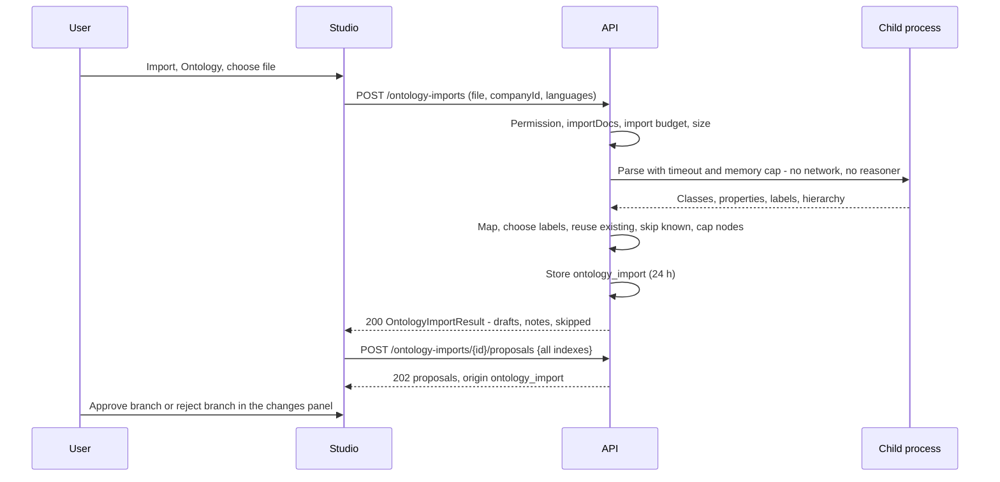

# ADR 0012: Ontology Import

Status: Accepted. The feature is an owner decision, final (decision row 113); the derived choices (rows 114 and 115, and row 119 from the PR #21 review) are approved under owner delegation (2026-09-29).

## Context

Many businesses already hold a model of themselves: an OWL ontology, a SKOS thesaurus, an OBO vocabulary, or a hierarchy kept in a spreadsheet. The owner wants these imported into a chosen company as a proposal tree, reviewed branch by branch like a whole-document tree (ADR 0010). The mapping is deterministic: no language model is involved.

## Decision

### Flow

`POST /ontology-imports` (multipart: `file`, `companyId`, optional `parentConceptId`, `languages`, `individuals`, `domainKey`) parses, maps and stores the tree, and answers `200 OntologyImportResult` (drafts, `OntologyImportNote`s, `skipped`). `GET /ontology-imports/{ontologyImportId}` returns it again. `POST /ontology-imports/{ontologyImportId}/proposals` takes indexes, builds the proposals from the stored drafts in one all-or-nothing transaction, once (`409 ontology_import_submitted`, `410 ontology_import_expired` after 24 hours), requires a selection closed under `requires`, and records origin `ontology_import`. The stored-result-and-indexes pattern is the one of ADR 0009 and ADR 0010, so no client can present hand-made drafts as imported.

Synchronous rather than a job: parsing and mapping are deterministic and bounded by the parse timeout, so the result is ready in the response.

### Formats

| Format | Detected by | Read as |
|---|---|---|
| RDF/XML (`application/rdf+xml`) | XML root `rdf:RDF` | RDF graph |
| Turtle (`text/turtle`) | Turtle syntax | RDF graph |
| OWL/XML (`application/owl+xml`) | XML root `Ontology` in the OWL namespace | OWL axioms |
| JSON-LD (`application/ld+json`) | JSON with `@context` or `@graph` | RDF graph; a remote `@context` is refused (`422`), never fetched |
| N-Triples (`application/n-triples`) | Line syntax | RDF graph |
| OBO (`.obo`) | `format-version:` header and `[Term]` stanzas | OBO terms |
| CSV (`text/csv`) | Header row | Hierarchy table |
| XLSX | OOXML sniffing of ADR 0011 | Hierarchy table, first sheet |

SKOS vocabularies arrive in any RDF syntax. The detected format must agree with the declared media type or file extension (`415`). XML is read with no DTD and no entity expansion.

### Mapping

Deterministic, in file order after a stable sort by source identifier, so the same file gives the same tree.

| Source | Draft |
|---|---|
| Named class (`owl:Class`, `rdfs:Class`), SKOS concept, OBO term | A concept |
| `rdfs:subClassOf` a named class, OBO `is_a` | Parent path: a `SpecDraft` under the parent (the first parent in label order); further named parents become `RelationDraft`s with action `is a` |
| `skos:broader` (and inverse `skos:narrower`) | A `ConceptDraft` born from the broader concept with action `includes` |
| A class with no named parent in the file | Born under `parentConceptId` (default the company root) with action `includes` |
| Object property with `rdfs:domain` and `rdfs:range` (named classes) | `RelationDraft` domain `<verb>` range |
| `C rdfs:subClassOf [owl:someValuesFrom or owl:allValuesFrom D; owl:onProperty P]` | `RelationDraft` C `<verb of P>` D |
| OBO `relationship: P D` | `RelationDraft` term `<verb of P>` D |
| Individual (`owl:NamedIndividual`, or a typed resource of a named class) | With `individuals` `as_concepts`, a concept under its class with action `has instance`; with `skip` (default), reported `individual_skipped` |
| CSV or XLSX with `label` and `parent` columns (optional `id`, `action`, `domain`) | A concept per row under its parent row; `parent` matches an `id` or a `label`; `action` default `includes` |
| CSV or XLSX with level columns `Level 1`, `Level 2`, ... | A concept per non-empty cell under the cell to its left; as many levels as the file has |
| `owl:equivalentClass`, `owl:sameAs`, `skos:exactMatch` | Skipped, `equivalence_not_imported` |
| Datatype properties, annotations other than labels | Skipped, `datatype_property` or not reported |
| Unions, intersections, cardinalities, property chains, other axioms | Skipped, `unsupported_axiom` |

Verbs: the property's chosen label, or its local name split at camel case and underscores, lower-cased, whitespace collapsed, at most 60 characters, normalised as every action (NFKC); a verb that normalises to `is a` or `equivalent to` is skipped (`forbidden_action`). The `action` column of a CSV or XLSX hierarchy goes through the same normalisation and check: a forbidden value is reported `forbidden_action` and the row is born with `includes`, so specialisation comes only from `subClassOf` or `is_a`. XLSX hierarchies are read with the OOXML sniffing and byte-bounded decompression of ADR 0011. Domains: `domainKey` when given, else the parent's domain, else `production`; a hierarchy row's `domain` column, when it names a template key, wins. Cycles in the class hierarchy are broken at the first repeated class (`cycle`).

There is no depth limit (row 105 applies here too): paths are as deep as the file.

### Labels By Language

Per item, the first non-empty candidate of: `skos:prefLabel`, `rdfs:label`, `skos:altLabel`, the OBO `name`, the local name of the IRI split into words. Within a property, the first tag of `languages` (default `en`, at most 10 BCP 47 tags) is preferred, a tag matching by primary subtag counts (`fr` matches `fr-CA`), then an untagged literal, then any other tag in tag order. The chosen label passes every label rule of the API (1 to 120 characters, no markup, control characters or Unicode format characters, no surrounding space) and the label casing rule, or the item is skipped (`invalid_label`). Two items with the same chosen label: the first wins, the second is skipped (`duplicate_label`), since labels are unique in a company.

### Reuse And Known Items

- An item whose chosen label matches a live or pending concept of the company (case-insensitive, singular or plural, the grammar's `resolve`) reuses that concept: no draft, reported `reused_existing`, and the item's children attach to it.
- An item already in place - same label under the same parent - and a relation that already exists with the same normalised action are skipped as `already_known`.
- Everything skipped is listed in `skipped` with its source (IRI, OBO id or `row <n>`) and reason. Sources come from the file and may hold any character an IRI or escape allows, so every `source` - in `skipped`, in `OntologyImportNote` and in the proposal's `why` - has its Cf, control, bidirectional and line-separator characters percent-encoded as UTF-8 before it is stored. A skipped item carries its `label` only when the label passed the label rules; an `invalid_label` skip never echoes the refused text.

### Limits And Isolation

- File at most `ONTAIX_ONTOLOGY_IMPORT_MAX_BYTES` (default 20 MiB); at most 1,000,000 triples or 200,000 rows.
- At most `ONTAIX_ONTOLOGY_IMPORT_MAX_NODES` drafts (default 5,000, at most 20,000): a generous cost and review guard, not a depth limit. Above it the import is refused as a whole with `413`.
- Parsing and mapping run in a child process, as document extraction does, with `ONTAIX_ONTOLOGY_IMPORT_PARSE_TIMEOUT_SECONDS` (default 60) wall clock and a memory cap; past either, `413`.
- No network: `owl:imports` is never fetched (each is reported `remote_import_not_fetched`), no remote JSON-LD context, no dereferencing of any IRI.
- No reasoner: only asserted statements are read; nothing is inferred.
- Every limit refuses the whole import; nothing is stored.

### Rules, Budgets And Origin

- Permission `proposal.create` in the scope of the company (and of `parentConceptId`, which must be an approved live concept of that company: `404`, or `409 concept_pending`). Agents with that permission may import.
- `409 channel_disabled` while `importDocs` is off; one unit of the import budget per call; one proposal unit per proposal at submit. At the default node ceiling a whole tree fits the default proposal budget of 5,000 per hour.
- Origin `ontology_import` joins the enum everywhere (OpenAPI `Origin`, AsyncAPI `Proposal` and `AuditEntry`, SQL `proposal_origin`); set by the server only, `originDetail` null. Each proposal's `why` is `Imported from <file name> · <source>`, as text.
- `languages` is stored one BCP 47 tag per array element (at most 10); the SQL CHECK refuses an element holding several tags.
- Table `ontology_import` keeps the file's name, detected format and SHA-256 (not the file), the options, the drafts, notes and skipped items for 24 hours.

### Review And Studio

The Studio submits every draft, and the tree is reviewed with branch approval and the cascading reject of ADR 0010. Recorded deviation (row 115): the import dialog's `#imMode` gains a third `.chk` radio row, `Ontology`; the label languages come from the browser's language list, individuals are skipped and the tree goes under the taught company's root, with no new field; progress and outcome use the existing `.caption`. Exact texts are in `docs/ui-contract.md`.

## Consequences

- An existing ontology or hierarchy becomes a reviewable proposal tree in one step, with provenance per proposal, and without any model call or egress.
- Semantics beyond classes, hierarchy, labels and object relations are reported, not silently lost, and never reasoned over.
- One new table, one new origin value, three new endpoints and two new Problem codes (`ontology_import_expired`, `ontology_import_submitted`).
