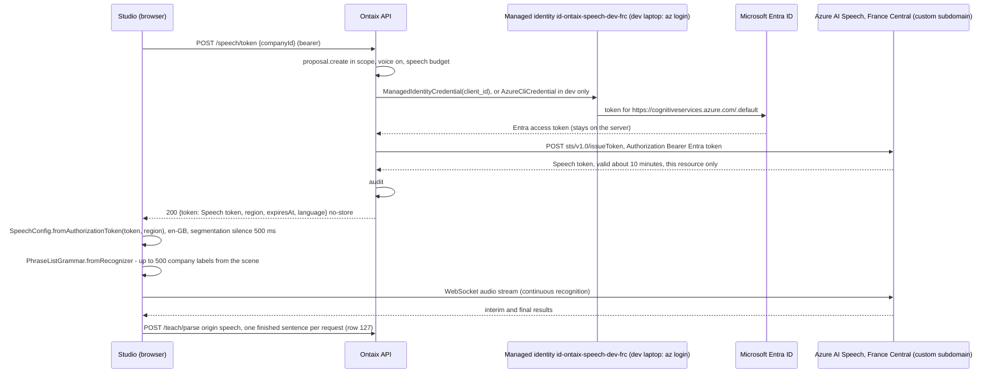

# ADR 0013: Speech Recognition

Status: Accepted. Owner decision, final (decision row 128). Token exchange and segmentation timing: decision row 135.

## Context

The teach bar microphone uses the browser's built-in `SpeechRecognition`. Its quality varies by browser, it is not available in every browser, it sends audio to whatever service the browser vendor chose (outside the Ontaix environment and with no residency statement), and it cannot be told the company's own vocabulary, so names such as `ADNOC` or `L&S` come back misspelt. The owner decided that voice recognition moves to Azure AI Speech in France Central, English only, primed with the company's concept labels, keyless, with no visible UI change and the browser recogniser as the fallback.

## Decision

### Architecture

- The Speech resource is a dedicated Azure AI Speech (or AI Services) resource `spch-ontaix-<env>-frc` in France Central with a custom subdomain and local (key) authentication disabled. Microsoft Entra authentication with the Speech SDK requires the custom subdomain, and the subdomain cannot be changed once set.
- `POST /speech/token` returns a Speech token issued by the Speech resource itself. The API takes a Microsoft Entra access token for the scope `https://cognitiveservices.azure.com/.default` and exchanges it server-side at the resource's `https://<custom subdomain>.cognitiveservices.azure.com/sts/v1.0/issueToken` endpoint (`POST`, `Authorization: Bearer <Entra token>`). The answer is a Speech token valid for about 10 minutes, on this one Speech resource only; the Studio passes it unchanged to `SpeechConfig.fromAuthorizationToken(token, region)`.
- The Entra token never leaves the API. A token for `cognitiveservices.azure.com` is valid on every Azure AI services resource where its identity holds a role, including, for a developer's `az login`, the Foundry model deployments. The browser only ever receives the Speech token, which does nothing but speech on this resource until it expires.
- The Entra token comes from one credential:
  - `ManagedIdentityCredential` with `ONTAIX_SPEECH_CLIENT_ID`: the dedicated user-assigned managed identity `id-ontaix-speech-<env>-frc`, never the API's workload identity. In the cluster it is reached through the pod's workload identity federation. It holds Cognitive Services Speech User and Cognitive Services User on the Speech resource, and nothing else.
  - Otherwise `AzureCliCredential`, the developer's `az login`, only when `ONTAIX_ENVIRONMENT` is `dev` and only when `AZURE_FEDERATED_TOKEN_FILE` is unset, so a pod never falls back to it. Terraform gives the owner the same two roles on the Speech resource.
  - With neither, `POST /speech/token` answers `503` and the Studio uses the browser recogniser.
- The `issueToken` operation needs Cognitive Services User: Cognitive Services Speech User does not grant it. Verified on 2026-09-29 against `spch-ontaix-dev-frc`: with the owner's Entra token and only Speech User, Speech REST reads answer `200` and `issueToken` answers `401 PermissionDenied` ("Principal does not have access to API/Operation"). Cognitive Services User is assigned on the Speech resource only, never on the resource group or the Foundry resource, so it reaches no other Azure AI services resource.
- A failed exchange (a credential error, a non-`200` answer, a timeout of 10 seconds, or an answer that is not a token) gives `503`; the log keeps only the exception type or the HTTP status, never a token.
- No key exists (local auth off) and no key or managed-identity secret reaches the browser. The token grants nothing in Ontaix.

### Recognition

- English only. `speechRecognitionLanguage` is `en-GB` by default (`ONTAIX_SPEECH_LANGUAGE`, `en-GB` or `en-US`). `en-GB` is kept as the default because the owner and the first tenants work in British and international English in Europe and the Middle East; `en-US` is the better choice only for a tenant whose speakers are mostly North American, and it is one setting away. No automatic language detection.
- Continuous recognition with interim results, exactly as the browser path today: interim text only shows in the input, and each final result becomes one `speech` request to `POST /teach/parse` in the recording's `sessionId` (row 127). The visible UI is unchanged.
- Timing: the Studio sets `Speech_SegmentationSilenceTimeoutMs` to 500 ms (`SpeechConfig.setProperty`), below the service default, so 500 ms of silence ends a sentence and it is taught sooner. This changes only when a final result arrives; nothing visible changes.
- Phrase list: when the microphone starts, the Studio builds a phrase list from the scene it already holds (`GET /scene`, no new call): the company name, then the labels of the active company's live and pending concepts, ranked - concepts in the focused domain or cell's neighbourhood first, then the most recently born - up to 500 labels, each at most 120 characters, deduplicated case-insensitively. It is applied with `PhraseListGrammar.fromRecognizer(recognizer)` and `addPhrase`, at the default weight. 500 stays well under the service's guidance of at most 2,000 phrases, beyond which quality and latency suffer. Characters the service does not accept are removed by the service. Only labels of the company being taught are sent; no other company's labels.

### Token Lifetime And Refresh

- `expiresAt` is the Speech token's expiry, read from its `exp` claim, about 10 minutes after it is issued. When the claim cannot be read the API reports 9 minutes from issue, so the Studio only refreshes sooner.
- The Studio requests a fresh token at every microphone start and, while recording, at least 5 minutes before `expiresAt`, setting it on the running recogniser (`recognizer.authorizationToken`), so a long recording never drops. Tokens are held in memory only.
- The managed identity's credential caches its Entra token server-side; every `POST /speech/token` performs a fresh exchange. Neither token is ever logged; responses carry `Cache-Control: no-store`.

### Fallback

The Studio falls back to the browser's `SpeechRecognition`, as today, when `POST /speech/token` answers `503` (no Speech resource or credential configured, or the Entra token or the exchange fails), when the SDK fails to connect or cancels with an error, or when the browser blocks the WebSocket. `403`, `409 channel_disabled` and `429` do not fall back: they show the refusal toast (row 86), since the caller may not teach by voice at that moment. The fallback is per recording; the next microphone start tries Azure Speech again.

### Data Residency

The audio stream goes from the browser straight to the Speech resource in France Central; it never passes through the Ontaix API. For real-time speech to text the service processes audio in memory only and stores no data at rest; Microsoft does not retain or store it. Audio and transcription logging is a Speech SDK option that is off by default; Ontaix never enables it (`enableAudioLogging` is never called) and uses no batch transcription or custom model. The phrase list (company labels) goes to the same resource. Transcribed text then enters Ontaix through `POST /teach/parse`, under ADR 0008. Unlike the browser recogniser, the audio no longer leaves the EU for a browser vendor's service.

### Cost

Real-time speech to text is billed per hour of audio streamed (standard pay-as-you-go, per second), on the Insight Azure subscription. Phrase lists cost nothing extra. The cost is bounded by recording time: recording stops after 1.5 seconds of silence (row 127), or 8 seconds after the microphone starts when nothing is heard, and the `speech` budget bounds how often a caller can start. Speech cost is Azure consumption on the subscription and does not appear in `GET /cost`, which reports Ontaix's own model calls.

### Rate Limit And Audit

- Each `POST /speech/token` spends one unit of the caller's hourly `speech` budget in `rate_budget_window` (new budget value, default 60 per user or agent per hour, `ONTAIX_SPEECH_TOKENS_PER_HOUR`); `429 rate_limited` with `Retry-After` when spent.
- Each successful call writes one audit entry through the existing audit mechanism: kind `speech`, what `Speech recognition token issued`, `ok` true, `companyIds` the company being taught, no proposal. The token itself is never in the audit entry, a log line or an event. No new table and no new event.

### Permission

The same as teaching: `proposal.create` in the scope of the company being taught (Owner, Builder, Agent in scope, or Member while `everyoneTeaches` is on, ADR 0003 check point 1), and the `voice` setting on (`409 channel_disabled` otherwise, as `speech` teach requests). A proposing role scoped to a domain product family (Owner, Builder or Agent on a domain, or Member there while `everyoneTeaches` is on) spans that domain in every company, so such a caller may mint a token for any company of the tenant it can read. The token grants nothing in Ontaix, and the audit entry names the company the caller chose.

### Configuration

| Variable | Default | Meaning |
|---|---|---|
| `ONTAIX_SPEECH_RESOURCE_ID` | none | The Speech resource's full Azure resource id; unset gives `503` and the browser fallback |
| `ONTAIX_SPEECH_REGION` | `francecentral` | The resource's region, returned to the Studio |
| `ONTAIX_SPEECH_ENDPOINT` | none | The Speech resource's endpoint on its custom subdomain; unset gives `503` and the browser fallback |
| `ONTAIX_SPEECH_CLIENT_ID` | none | Client id of the managed identity `id-ontaix-speech-<env>-frc` whose Entra token the API exchanges (`ManagedIdentityCredential`, through the pod's workload identity federation); unset, `dev` without `AZURE_FEDERATED_TOKEN_FILE` uses the developer's `az login`, and every other case gives `503` and the browser fallback |
| `AZURE_FEDERATED_TOKEN_FILE` | none | Set by Kubernetes workload identity in a pod; when set, the `az login` fallback is never used |
| `ONTAIX_SPEECH_LANGUAGE` | `en-GB` | `en-GB` or `en-US`; anything else stops the API at start-up |
| `ONTAIX_SPEECH_TOKENS_PER_HOUR` | 60 | The per-caller hourly `speech` budget |

The Speech resource, its custom subdomain, the managed identity, its role assignments (Cognitive Services Speech User and Cognitive Services User on the Speech resource, for the identity and the owner) and the federated credential that lets the API pod use it are an infrastructure change in `infra/terraform/azure`, not part of this contract change. The Content Security Policy of the Studio must allow `wss://<custom subdomain>.cognitiveservices.azure.com` (or the regional `wss://francecentral.stt.speech.microsoft.com` endpoint the SDK uses with `fromAuthorizationToken`).

## Consequences

- Recognition quality no longer depends on the browser, works in every browser the Speech SDK supports, and knows the company's names.
- Audio stays in France Central and is not stored; voice teaching is English only.
- One new endpoint, one new budget value, one new audit kind; no new table, no new event.
- A leaked token allows speech recognition on one resource for about 10 minutes, billed to Ontaix, and nothing else; the Entra token never reaches the browser, and the `speech` budget bounds how many Speech tokens a caller obtains.
- Voice teaching by Azure Speech works on the owner's laptop too (`dev`, `az login`), once the owner holds Cognitive Services User on the Speech resource.

## References

- Microsoft Learn, [How to configure Microsoft Entra authentication](https://learn.microsoft.com/en-us/azure/ai-services/speech-service/how-to-configure-azure-ad-auth): a custom subdomain is required and cannot be changed; the roles Cognitive Services Speech User or Contributor; the scope `https://cognitiveservices.azure.com/.default`; the `aad#<resourceId>#<token>` authorization token for SDK paths that take a token.
- Microsoft Learn, [SpeechConfig class (JavaScript)](https://learn.microsoft.com/en-us/javascript/api/microsoft-cognitiveservices-speech-sdk/speechconfig): `fromAuthorizationToken(authorizationToken, region)`, the `authorizationToken` property for refresh, and `setProperty`.
- Microsoft Learn, [Speech to text REST API for short audio, authentication](https://learn.microsoft.com/en-us/azure/ai-services/speech-service/rest-speech-to-text-short): the `sts/v1.0/issueToken` endpoint and its tokens, valid for 10 minutes.
- Microsoft Learn, [PropertyId enum (JavaScript)](https://learn.microsoft.com/en-us/javascript/api/microsoft-cognitiveservices-speech-sdk/propertyid): `Speech_SegmentationSilenceTimeoutMs`, the silence that ends a phrase in continuous recognition.
- Microsoft Learn, [Improve recognition accuracy with phrase list](https://learn.microsoft.com/en-us/azure/ai-services/speech-service/improve-accuracy-phrase-list): phrase lists apply at runtime to real-time transcription through the Speech SDK, `PhraseListGrammar.fromRecognizer` and `addPhrase` in JavaScript, at most 2,000 phrases, weight 0.0 to 2.0.
- Microsoft Learn, [Data, privacy, and security for speech to text](https://learn.microsoft.com/en-us/azure/foundry/responsible-ai/speech-service/speech-to-text/data-privacy-security): real-time audio is processed in server memory only, no data is stored at rest, and Microsoft does not retain real-time data.
- Microsoft Learn, [How to log audio and transcriptions for speech recognition](https://learn.microsoft.com/en-us/azure/ai-services/speech-service/logging-audio-transcription): logging is opt-in through `enableAudioLogging`.
- Microsoft Learn, [Access tokens in the Microsoft identity platform](https://learn.microsoft.com/en-us/entra/identity-platform/access-tokens): token lifetime.
