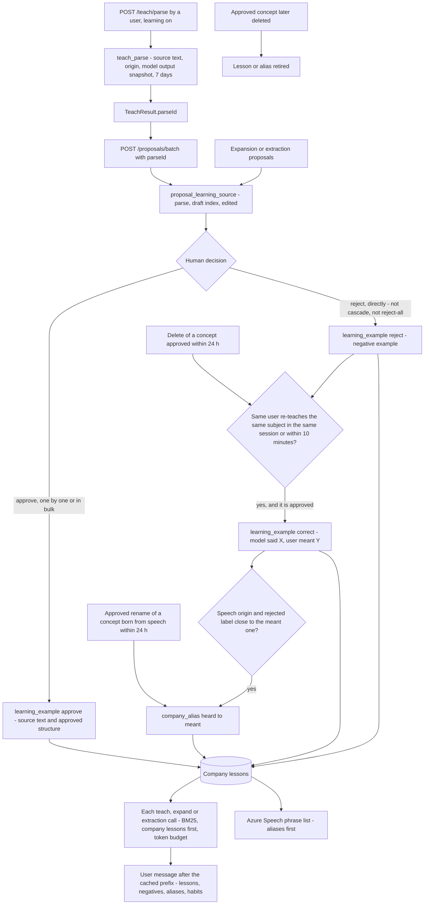

# ADR 0014: Usage Learning

Status: Accepted. Learning per company, from everyone's actions, silently, is an owner decision, final (decision row 131); the mechanism is approved under owner delegation (2026-09-30, same row).

## Context

The model cannot be fine-tuned; it learns by example in the prompt (ADR 0008, Worked Examples, row 125). Those examples are a static library shared by every tenant. Each company's people, however, correct the model every day: they approve what fits, reject what does not, re-teach what the model got wrong, and fix names the recogniser misheard. The owner decided that Ontaix learns from this usage, per company, from everyone's actions, silently.

## Decision

### Flow

### Signals

Only human decisions teach. The model's output alone, agents and the evaluation harness never create a lesson.

| Signal | Captured when | Stored |
|---|---|---|
| `approve` | A user approves a proposal linked to a model output (teach parse, expansion or extraction). Approvals through Approve all or branch approval are kept with `bulk` true and ranked after individual ones | The source text and the approved structure (the drafts of that source now approved: labels, parents, actions, domains, attributes) |
| `reject` | A user rejects such a proposal directly. Cascaded rejections and Reject all teach nothing | The source text and the rejected model output: a negative example, "do not produce this for this kind of sentence" |
| `correct` | A reject (or the delete of a concept approved in the last 24 hours) followed by a teach by the same user, in the same `sessionId` or within 10 minutes, whose approved drafts touch the same subject concept or label; also a batch whose drafts the user edited before submitting (`edited` true) once approved | What the model produced and what the person meant, `corrects_id` linking the reject lesson when there is one. The most valuable signal, ranked first |
| Speech alias | A correction of `speech` origin whose rejected label and approved label are close in spelling (normalised edit distance at most a third of the length) or in sound (the same Double Metaphone key); or an approved rename of a concept born from speech in the last 24 hours | `company_alias` heard to meant, linked to the concept |
| Habits | Not stored: derived on read from the company's approved relations and concepts | The 20 most used actions and up to 5 naming patterns (singular or plural nouns, casing, acronyms) |

Linking a proposal to its model output: `POST /teach/parse` records a `teach_parse` row (user callers only, learning on, at least one draft) and returns `TeachResult.parseId`; the Studio sends it back as the optional batch-level `parseId` of `POST /proposals/batch`, and the server writes `proposal_learning_source` for each created proposal, matching each submitted draft to the stored drafts (an unmatched draft is `edited`). `parseId` is advisory: a foreign or expired one is ignored, never an error, and it never changes what is created. Proposals created from an expansion or an extraction job are linked from their stored results.

### Retrieval

At every teach extraction, expansion and whole-document extraction call for a company with learning on, the API adds to the user message, after the byte-stable cached prefix (system prompt and static examples, ADR 0008) and in delimited data fields:

- Lessons: the company's active `approve` and `correct` lessons ranked by the same BM25 utility as the static library against the call's text, company lessons ranked before static examples, `correct` before individual `approve` before `bulk`, taken while their estimated tokens fit `ONTAIX_LEARNING_CONTEXT_TOKENS` (default 1,500).
- Negatives: up to 3 `reject` lessons with the highest BM25 score, within the same budget.
- Aliases: every active alias whose `heard` form occurs in the call's text (whole words, case-insensitive), at most 50.
- Habits: the summary, at most 300 characters.

The input estimate of the call's token reservation counts all of it. Only the company's own rows are read (tenant and company in every query); nothing of another company or tenant is ever retrieved. BM25 runs in the API over the company's active lessons, at most 5,000.

Aliases also head the Azure AI Speech phrase list (ADR 0013): the `meant` labels of active aliases come first, within the 500 phrases.

Grounding stays as ADR 0008 defines it. Lessons never ground a label: they are other people's words. One narrow exception makes aliases useful: a new label equal to an active alias's `meant` is grounded where the alias's `heard` form is grounded in the caller's input (after normalisation, as whole words), and the draft takes the `meant` label. This is safe because the alias came from a person's approved correction in the same company, and the caller's own words must still contain the heard form.

### Guardrails

- Only human-decided cases teach, as above.
- Strict isolation: every table carries `tenant_id` and `company_id` with composite foreign keys; retrieval, listing and reset are per company.
- The evaluation harness runs with learning off (`ONTAIX_LEARNING_ENABLED` false), so no lesson is captured from, or added to, a TEST-split input; the TEST split stays honest (ADR 0008, Learn/test split).
- Prompt injection: lessons hold text people typed or said and model outputs people decided on; they travel as data, never as instructions, and they cannot mint a label (grounding). A person could plant misleading lessons in their own company only, through decisions that are themselves audited proposals.
- Contradiction: when the deletion of a concept is approved, every active lesson whose `concept_ids` hold it is retired (`contradicted`) and every alias linked to it is retired. A new `correct` lesson retires the `approve` lessons it contradicts for the same source (`superseded`). Beyond 5,000 active lessons or 1,000 active aliases per company, the oldest are retired (`cap`).
- Retention: `teach_parse` 7 days; retired lessons and aliases 30 days after retirement; active lessons while the company and the user exist. Deleting the company, or the user who made the decision, deletes their rows at once (cascade). A reset deletes all of a company's lessons, aliases and teach parse records.

### API

All Administrator at tenant scope (`settings.write`), audited as kind `learning`:

- `GET /companies/{companyId}/learning` - the switch, lessons (paginated, filter `signal`, `task`), aliases and the habits summary.
- `PATCH /companies/{companyId}/learning` - `{enabled}`; the company setting `company.learning`, default on. Off stops capture and retrieval for the company; lessons are kept until reset.
- `DELETE /companies/{companyId}/learning/{lessonId}` - one lesson or alias.
- `POST /companies/{companyId}/learning/reset` - everything, with the confirmation `reset`.

There is no Studio UI for any of this now: nothing visible changes, learning happens silently, and these endpoints serve administrators and support tools. A Studio screen needs a UI contract decision first.

`TeachResult.parseId` and the batch `parseId` are the only changes to existing operations. No event is published: lessons change nothing another client draws.

### Configuration

| Variable | Default | Meaning |
|---|---|---|
| `ONTAIX_LEARNING_ENABLED` | true | Deployment switch; false stops all capture and retrieval (the eval harness sets it false) |
| `ONTAIX_LEARNING_CONTEXT_TOKENS` | 1500 | Token budget for lessons and negatives per call |
| `ONTAIX_LEARNING_CORRECTION_WINDOW_MINUTES` | 10 | How long after a reject a re-teach links as a correction, outside the same session |

### Data Residency

Lessons stay in the Ontaix database in France Central. The retrieved part - the company's own earlier sentences, structures, aliases and habits - is sent with each model call to the configured provider under ADR 0008, Data Residency, like the rest of the context. `llmMonthlyTokenCap` 0 stops it with every other model call.

## Consequences

- Each company's model gets better at that company's words and structures without training, and misheard names stop recurring.
- Tables `teach_parse`, `proposal_learning_source`, `learning_example`, `company_alias` and the column `company.learning`; four endpoints; `parseId` in two places; audit kind `learning`.
- Model calls carry up to about 1,500 more tokens of context, counted in the reservation.
- Company content is kept longer (lessons live until deleted, reset or retired); administrators can list, delete and reset it per company.
