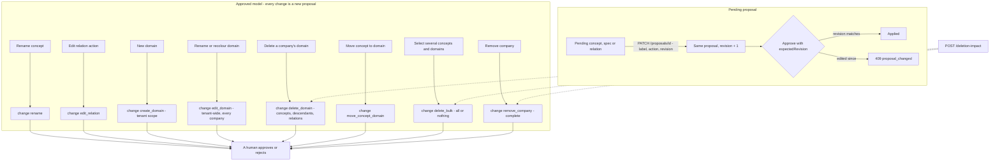

# ADR 0015: Ontology Editing And Domains

Status: Accepted. The features are owner decisions, final (decision rows 135 to 140); the derived choices named in those rows are approved under owner delegation (2026-09-30).

## Context

The owner wants to edit the model after teaching it: rename entities and relationships, remove a company completely, create and manage domains, move entities between domains, delete several things at once, do all of this from the admin portal too, and let an administrator stop new companies being created. The non-negotiable holds throughout: every change to the ontology is a proposal a human approves.

Three facts of the current model shape the design:

- Domains are the nine fixed templates. Every company has one domain product per template, the key is an enum in every contract, and the name, owner and colour come from the template.
- A domain's colour is tenant-wide: the UI contract's do-not rule says a domain's colour is identical for every cell and the same across companies, and Appearance sets it immediately (the reference's colour pickers).
- Renaming after approval already exists (`rename` for concepts, `edit_relation` for relation actions); editing a pending proposal does not.

## Decision

### Overview

### Renaming

- A pending (not yet decided) `concept`, `spec` or `relation` proposal can be edited in place: `PATCH /proposals/{proposalId}` with `label` (concept and spec) and/or `action` (concept birth action, relation). It needs no approval of its own, because it changes the proposal itself, which is still approved or rejected as a whole. The proposal's new `revision` column increments on each edit; the body carries the revision the editor saw (`409 proposal_changed` otherwise). A `half_approved` proposal cannot be edited (`409 proposal_not_editable`), since one approval was given to its content.
- Approvals carry the revision the approver reviewed (`expectedRevision`, sent always by the Studio); an edit since then is `409 proposal_changed`, so nobody approves text they did not see. Edits and decisions take the tenant decision lock, so they never interleave.
- An edit re-runs every creation check (label rules and uniqueness, action normalisation, never `is a` or `equivalent to` for a relation), rebuilds the title, the panel text and the pending artefacts, and rewrites the `deps` and `waitFor` of the company's open proposals that named the old label. Events `proposal.changed` (new) and `concept.changed` or `relation.changed`; audit kind `edit` with the old and new text.
- Who may edit: the proposer, or anyone holding `proposal.create` in the proposal's scope.
- After approval nothing changes in place: a rename is the existing `rename` change, a relation's action the existing `edit_relation`, each a proposal a human approves.

### Company Removal

`DELETE /companies/{companyId}` (change `remove_company`) exists; the implementation marks the company dying and names only its cell count, and its proposal text mentions equivalences only. It is completed:

- The proposal names what goes from `POST /deletion-impact` with `wholeCompany`: concepts, relations with cross-company relations counted separately, sources, bindings and attributes; the Studio's confirmation reads the same numbers, in the style of concept deletion (decision row 98).
- Approval rejects by cascade every open proposal touching the company, removes every cross-company relation and equivalence to it, marks the company dying (the canvas fades it) and then purges it with its concepts, relations, domain products, sources, bindings, attributes, document imports, expansions and extraction jobs. Audit entries stay (they are append-only and list the company id).
- The home company cannot be removed (`409 home_company`). Proposed with `proposal.create` in the company's scope, approved by an Owner of the company or a Governor.

### Domains

A domain is tenant-wide. The table `tenant_domain` holds the tenant's domains: the nine templates, copied at tenant creation, and custom domains, at most 64. `DomainKey` becomes a pattern (`^[a-z][a-z0-9_]{1,39}$`) instead of an enum, in OpenAPI and in the three model-output schemas, where the key must be one the API sent. A company's domain product for a domain is created when its first concept joins it.

| Operation | Change kind | Scope and effect |
|---|---|---|
| Create a domain | `create_domain` (`POST /domains`) | Tenant scope: proposed by a tenant-scoped Builder or Agent, approved by a tenant-scoped Governor. Adds the domain (name, owner, colour; key derived from the name) for every company |
| Rename, recolour, change owner | `edit_domain` (`PATCH /domains/{domainKey}`) | The domain's scope, in every company: approved by an Owner of that domain or a Governor. Approval renames it everywhere and writes the colour into the tenant's appearance colours, so every concept of the domain takes the new colour; revision recorded in `tenant_domain_revision`; events `domain.changed`, `appearance.changed` |
| Delete a domain | `delete_domain` (`DELETE /domain-products/{domainProductId}`, new method) | One company's domain product: its concepts with their descendants (any domain) and every relation touching them, named like concept deletion; the domain itself stays available |
| Move a concept | `move_concept_domain` (`POST /concepts/{conceptId}/move`) | The concept joins the target domain product and its colour and cluster; children, relations and bindings unchanged; rights needed in both domains |

Recolouring keeps the do-not rule, since a domain has one colour everywhere. Appearance keeps its immediate colour pickers for administrators, as the reference has them: both paths write the same value, the proposal path for Owners and Builders who are not administrators. A per-company domain colour is not offered, because the owner explicitly rejected any nuance of a domain's colour across companies.

### Multi-Select Deletion

`POST /proposals/bulk-delete` creates one `delete_bulk` proposal for up to 200 concepts and up to 20 domain products of one company. Approval applies all or nothing, with the semantics of `delete_concept` and `delete_domain` for each item, and needs approval rights over every item. The proposal and the Studio confirmation name what goes from `POST /deletion-impact`. The Studio offers selection in the admin portal's Entities and Domain products tables (a checkbox column and `Delete selected`); selection on the canvas is not part of this decision.

### Admin Portal

The reference's Entities page already renames, deletes and shows relationship counts, and its Relationships page edits and deletes relationships; both keep their markup and send the proposals above. Additions, each a recorded deviation hidden from the screenshot suite by the injected stylesheet (`[data-ox-new] { display: none }` in both pages, header and cells together, so table layout is the reference's):

- Entities: a checkbox column, `Delete selected`, and a `Move` row button opening a domain choice (`.form` select).
- Domain products: `New domain`, and per row `Edit` (name, owner, colour with the Appearance colour input) and `Delete`, plus the checkbox column.
- Tenant settings: the `companyCreation` row, `Company creation`, `Allow adding companies.`, in the reference's `setRow` markup.

Exact texts are in `docs/ui-contract.md` when the Studio work starts.

### Company Creation Setting

`companyCreation` (Settings, `tenant_settings.company_creation`, default true, Administrator only, audited). While false, `POST /companies` is refused with `409 company_creation_disabled` for every caller and the Studio hides Add company. It is distinct from `multiCompany`, which only shows or hides the Company button and is not enforced by the API.

## Contract Gaps Named

1. Domains were fixed: the `DomainKey` enum in OpenAPI and the three model schemas, and `domain_product.template_key` referencing `domain_template`. Fixed here by `tenant_domain` and the pattern; a migration copies the nine templates into `tenant_domain` for every existing tenant before the new foreign key applies.
2. Domain colour is tenant-wide by the UI contract; per-company recolouring would break an owner do-not rule. Resolved as tenant-wide editing.
3. There was no way to edit a pending proposal and no guard against approving text that changed; added `revision`, `expectedRevision` and `proposal.changed`.
4. `deps` and `waitFor` hold labels, so a pending rename must rewrite dependants' texts.
5. Company removal named only cells and equivalences and did not define the purge of sources, bindings, attributes, imports, expansions and jobs; defined above.
6. `multiCompany` hides a button but was never enforced; the new setting is enforced by the API.
7. Only `delete_concept` could delete; there was no domain, bulk or move change kind, and no server-side deletion impact (the Studio computed descendants itself).
8. Tenant-scoped proposals: an Owner has no tenant scope, so `create_domain` is a `change` approved by a tenant Governor.
9. Canvas multi-select is not decided; only the admin tables select.

## Consequences

- Every edit remains a proposal a human approves; the only in-place edit is of a proposal not yet decided, guarded by its revision.
- Five new change kinds, `tenant_domain` and its revision history, `proposal.revision`, the `companyCreation` setting, two new events, four new Problem codes.
- The model schemas accept tenant domain keys, so custom domains reach teaching and extraction.
