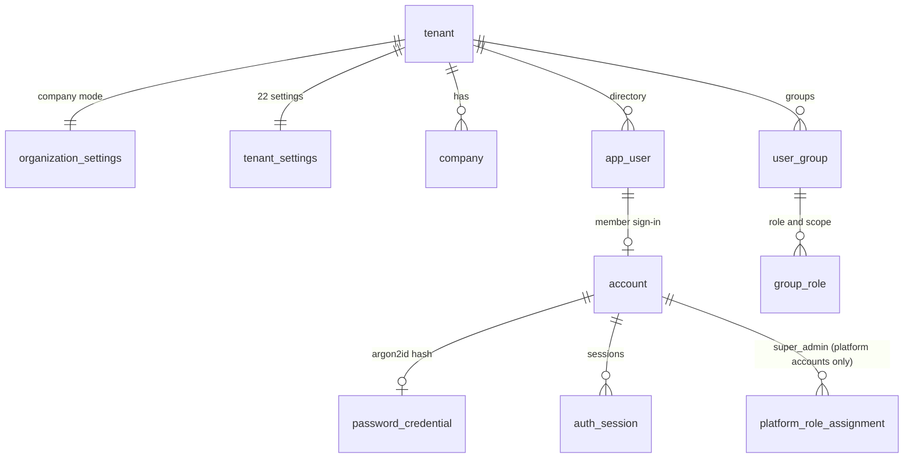
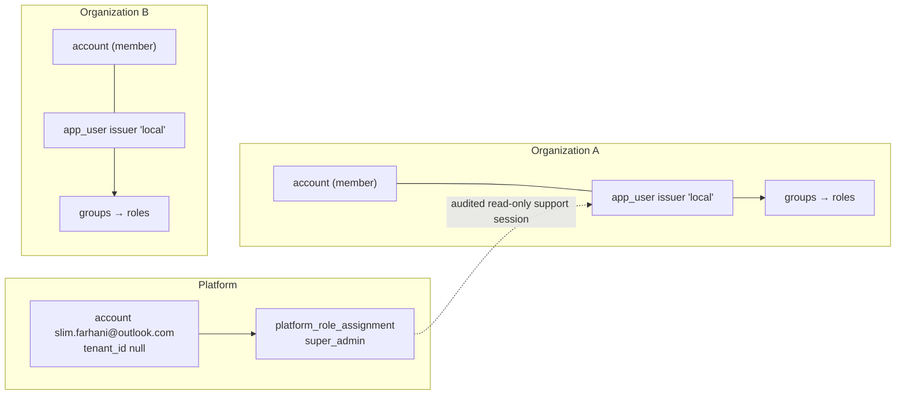
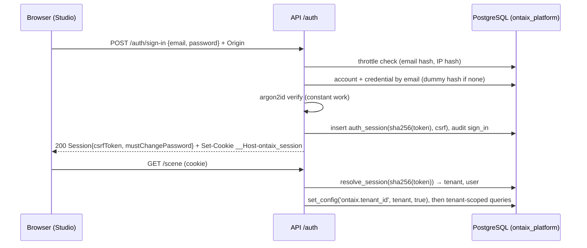

# ADR 0017: Organizations and Sign-In

Status: Accepted. Password sign-in is an owner decision — final (Slim, 2026-09-30); every other choice here is approved under owner delegation (decision row 140).

## Context

The owner asked for, verbatim:

- "Every tenant has multiple users, I want slim.farhani@outlook.com to be the super admin, and within the admin portal, the super admin is able to create an organization (the equivalent of tenant): an organization can have multiple companies or just one depending on the config in the admin portal."
- "Every organisation has its own instance, meaning every organization only sees its data."
- "Add a login page, only login, you can't create an account."
- "The only default account is the super admin account slim.farhani@outlook.com."
- "The super admin is able to create organization and assign new account to it with password."
- "Every user within the organization will see only his organization data."

Today the API authenticates nobody outside `dev`: `app/auth.py` accepts only the `X-Ontaix-User` header, and only when `ONTAIX_ENVIRONMENT` is exactly `dev`. Tenants exist (`tenant`), but nothing creates one except the seed. Isolation is enforced by code alone: every repository takes a `tenant_id` from the caller, and composite foreign keys on `(tenant_id, id)` stop a row from pointing into another tenant. A repository that forgets its `tenant_id` filter would leak across tenants, and no layer below would stop it.

`CLAUDE.md` says "OIDC is for authentication only". ADR 0003 made OIDC the only way users authenticate. The owner's password sign-in conflicts with that reading.

## Decision

### 1. Password Sign-In (the Non-Negotiable Conflict)

Owner decision — final (Slim, 2026-09-30): users sign in with an email and a password held by Ontaix. This deployment has local password accounts only. OIDC stays in the contract (`bearerAuth`, `tenant_identity_provider`) as a second authentication method that a later deployment can turn on, next to passwords, without changing authorisation. This supersedes "OIDC is for authentication only" for this deployment. The rule behind it still holds: how someone authenticates never decides what they may do. Roles still reach a user only through the organization's own groups (ADR 0003), and no identity provider's groups are read.

There is no sign-up, no invitation email and no self-service recovery. Accounts exist because a super admin created them.

### 2. Organizations Are Tenants

An organization is a `tenant` row: its own instance, whose users see only its data. The API and the portal say "organization"; the schema keeps `tenant`, so no table, column or published path is renamed.



- A super admin creates, renames, disables and re-enables organizations (`/admin/organizations`). Disabling ends every session in the organization at once and keeps all its data. Nothing deletes an organization.
- **Company mode** (`organization_settings.company_mode`), set only by a super admin. `multiple` behaves as today: the organization's Administrator controls `multiCompany` ("Several companies in one view"), which shows or hides Add company as the reference does. `single` caps the organization at one company. A trigger refuses a second `company` row, `POST /companies` answers `409 company_limit`, `multiCompany` is forced off, and turning it back on answers `409 locked_setting`. Switching to `single` is refused while the organization has two or more companies. A later organization-level setting that disables company creation can only narrow this cap, never widen it.
- Creating an organization creates its settings, its view state, and five starter groups that each hold one role at tenant scope: `Administrators`, `Governors`, `Builders`, `Members` and `Auditors`. This lets the super admin give roles as he creates accounts. Owner roles are company-scoped or domain-scoped, so the organization's Administrator adds them afterwards on the Groups page. It creates no company. The first company added becomes the home company.

### 3. Accounts, Platform Role and Super Admin



- `account` is the sign-in identity. A **member account** belongs to exactly one organization and is linked one-to-one to its directory user (`app_user`, issuer `local`, subject = account id). A **platform account** has no organization. Emails are lower-cased and unique across the deployment, so the sign-in page asks for no organization. One person therefore cannot hold accounts in two organizations with the same email.
- `super_admin` is the only platform role. A composite foreign key stops a member account from holding it. It lets the holder manage organizations, their accounts and passwords, and read the platform audit log. It gives nothing inside an organization.
- **Cross-organization access is explicit.** To look inside an organization, the super admin opens a **support session** (`POST /admin/organizations/{id}/support-session`, with a required reason). It lasts 60 minutes and grants exactly `model.read`, `directory.read` and `audit.read` at tenant scope, read-only. Opening it, ending it, and its expiry are written to the platform log and to the organization's own audit log (kind `platform`, actor kind `platform`), where that organization's Administrators and Auditors see it.
- Only the super admin creates accounts (with an initial password and groups of that organization), renames them, changes their groups, disables and enables them, and resets their passwords. An organization's Administrator manages groups and roles as today, but cannot create accounts or reset passwords.

### 4. Bootstrap With No Secret in Chat, Code, Logs or Commits

The only default account is `slim.farhani@outlook.com`. It is created by a local command that the owner runs himself, in a terminal attached to the API image, with the platform database login in `.env` or from Key Vault:

```
python -m app.admin create-super-admin slim.farhani@outlook.com
python -m app.admin set-password slim.farhani@outlook.com
```

`create-super-admin` creates the platform account and its `super_admin` role, then prompts twice for the password with `getpass` (no echo), checks it against the policy and stores only the argon2id hash (`set_reason` `bootstrap`, no forced change). It refuses if the account already exists. `set-password` resets any account's password the same way. It exists for the super admin's own recovery, because no one else can reset his password. It ends every session of that account. Neither command takes the password as an argument, reads it from an environment variable, prints it or logs it. Both write `super_admin_created` or `super_admin_password_set` to the platform audit log. In the cluster the owner runs them through `kubectl exec -it`, so the password travels only over his own TTY.

No migration, seed or configuration creates a platform account or a password. The dev seed's demo users have no password.

### 5. Password Security

- **Hashing**: argon2id through `argon2-cffi`, at RFC 9106's second recommended parameters: memory 64 MiB, 3 iterations, parallelism 4, 16-byte salt, 32-byte tag. These exceed OWASP's minimum of 19 MiB and 2 iterations. The PHC string keeps the parameters, and a hash with older parameters is rehashed at the next successful sign-in. At most 4 hashes run at once per API process, so peak hashing memory is 256 MiB.
- **Policy** (NIST SP 800-63B): 12 to 128 characters after NFC normalisation, any characters, no composition rules, and no expiry. A password is refused if it appears in a bundled offline list of the 100,000 most common breached passwords, contains the email's local part, or equals the current password.
- **Throttle and lockout**: five failed attempts within 15 minutes lock that key for 15 minutes. The keys are the SHA-256 of the normalised email and of the client IP (`sign_in_throttle`). The email key counts whether or not an account exists, so neither the lock nor its message reveals which emails exist. A success clears the email key. A super admin's reset clears it as well. The client IP comes from the ingress's `X-Forwarded-For`, trusting only the configured proxy hop.
- **Constant time**: an unknown email is verified against a fixed dummy argon2id hash. A wrong password, an unknown email, a disabled account and a disabled organization all return the same `401 invalid_credentials` after the same work. Tokens are compared with `hmac.compare_digest`. Sessions are looked up by the SHA-256 of a 256-bit random token, so the lookup's timing reveals nothing usable.
- **Forced change**: a password set by someone other than its holder (initial or reset) carries `must_change`. Until it is changed, the session may only read `GET /auth/session`, change the password and sign out. Every other call answers `403 password_change_required`.
- **Password change** (`PUT /auth/password`) requires the current password. A failed check counts toward the email's throttle. A successful change ends every other session of the account and issues a new token for this one.

### 6. Sessions: Server-Side Cookie

We choose a server-side session with an opaque cookie instead of short-lived tokens:

- The Studio is a browser application on the same origin as the API. An `HttpOnly` cookie keeps the credential out of JavaScript, so an XSS bug cannot copy it out, while a token held in memory or storage is readable by any script on the page.
- Disabling an account or organization, resetting a password and signing out must take effect on the next request. A server-side row ends at once. A self-contained token stays valid until it expires, unless we add a revocation list, which is a session table by another name.
- It needs no signing key, so no new secret goes into Key Vault.

The cookie is `__Host-ontaix_session`: a 256-bit random token (43 base64url characters) with `Secure`, `HttpOnly`, `SameSite=Lax`, `Path=/` and no `Domain`. It has no `Max-Age`, so the browser drops it when it closes. `auth_session` stores only the SHA-256 of the token.

- **Timeouts**: the idle timeout is 30 minutes, slid forward by every authenticated call. The absolute timeout is 12 hours after sign-in.
- **Rotation**: a new token is issued at sign-in (any presented session ends, which prevents session fixation), at a password change, and when a support session starts or ends. Every change of privilege therefore gets a new token.
- **CSRF**: the session carries a synchronizer token (`csrfToken`, from sign-in and `GET /auth/session`). The Studio sends it as `X-CSRF-Token` on every POST, PUT, PATCH and DELETE, and the API compares it in constant time. The API also requires an allowed `Origin` header. `SameSite=Lax` is a third layer. Sign-in checks `Origin` (login CSRF).
- **Limits**: at most 10 live sessions per account; the oldest ends (`session_limit`).
- **WebSocket**: the ticket from `POST /ws/ticket` is bound to the session. The hub re-checks the session at least every 60 seconds and closes the socket (code 4401) when it ends.
- **Logout** (`POST /auth/sign-out`) ends the row, clears the cookie, and always answers `204`.



### 7. Strict Isolation

The repositories keep their explicit `tenant_id` filters, and PostgreSQL row-level security (RLS) adds a second layer beneath them (`contracts/schema.sql`, section "Tenant isolation"):

- **Two NOLOGIN roles.** `ontaix_app` serves every organization request and per-organization job. `ontaix_platform` serves `/auth/*`, `/admin/*`, the admin CLI, the outbox relay, the projector and the purge jobs. Each deployment grants one of these roles to the login it connects with. The API keeps two pools. The schema owner runs migrations only.
- **One RLS policy per table.** Every table with a `tenant_id` column (33 at this revision), plus `tenant` itself, has RLS enabled. For `ontaix_app` the policy is `tenant_id = current_tenant_id()`, applied to both reads and writes. `current_tenant_id()` reads the transaction-local setting `ontaix.tenant_id`, which the auth dependency sets from the resolved session. When the setting is unset the result is null, which matches no row, so a missing setting fails closed. `ontaix_platform` has an explicit allow-all policy. A check at the end of the DDL fails the load if any `tenant_id` table lacks RLS.
- **Privileges.** `ontaix_app` has no privilege on the sign-in tables (`account`, `password_credential`, `platform_role_assignment`, `auth_session`, `sign_in_throttle`, `platform_audit_entry`). It reaches a session only through the `SECURITY DEFINER` function `resolve_session(token_hash)`. It can read `tenant` and `organization_settings` but not write them, so an organization's Administrator can never change the company mode or re-enable a disabled organization.
- Validated on pgserver (PostgreSQL 16.2) with the schema loaded. Under `ontaix_app`, the smoke test showed: with no tenant set, no company is visible. With tenant A set, only A's companies and A's tenant row are visible. An insert into B's groups is refused by RLS. Reading `auth_session` and writing `organization_settings` are refused. The company-mode triggers refuse a second company and a switch to single while two companies exist.

A super admin's session sets no tenant, so the organization endpoints answer `403` until he opens a support session. That session sets the support organization and read-only grants.

### 8. Audit of Every Auth Event

`platform_audit_entry` is append-only, enforced by the same trigger as `audit_entry`. It records every sign-in, failed sign-in, lock, sign-out, expiry of a support session, password change and failed change, reset, account and organization change, support session, and CLI bootstrap. Each entry has the client IP and never holds a password, token, hash, or an email that matches no account. Events about an organization's members, or done inside an organization, are also written in the same transaction to that organization's `audit_entry`: kind `auth` for member sign-in, sign-out and password events, and kind `platform` for super admin actions, which carry actor kind `platform` and `actor_account_id`. The super admin reads the platform log at `GET /admin/audit`.

### 9. Sign-In Page and Platform Pages (UI)

The reference has no sign-in page. These screens are added in its visual language (`docs/ui-contract.md`). They reuse only the reference's own classes and tokens: `--bg`, `.wordmark`, `.dlg.sm`, `.dh`, `.db`, `.df`, `.form`, `.msg`, `.btn.primary`, `.spin`, and the light theme through `data-theme`. They add no CSS token. The screenshot harness hides `#adminAccount` in both pages. The sign-in, password and platform screens get their own Studio-only baselines, because the reference has nothing to compare them with.

**Sign-in page** (shown whenever `GET /auth/session` answers `401`). The page background is `--bg` with no canvas. The `.wordmark` (`Ontaix` and `business as a product`) sits centred above a `.dlg.sm` card that has no × button, because this screen cannot be closed.

| Element | Exact text |
|---|---|
| Card title (`.dh b`) | `Sign in` |
| Sub (`.dh span`) | `Use the account your administrator gave you` |
| Label, input `type=email`, `autocomplete=username` | `Email` |
| Label, input `type=password`, `autocomplete=current-password` | `Password` |
| Button (`.btn.primary`, in `.df`, Enter submits) | `Sign in` |
| Note under the form (`.msg`) | `No account? Ask your administrator. Forgot your password? Ask your administrator to reset it.` |
| `401 invalid_credentials` (`.msg`, conflict colour) | `Email or password is incorrect.` |
| `429 sign_in_locked` | `Too many attempts. Try again in <n> minutes.` (`in 1 minute.` for one) |
| Network or 5xx | `Sign-in is unavailable. Try again in a moment.` |

There is no sign-up link, no "remember me" and no recovery link. The password field is cleared after every failure, and focus returns to it.

**Choose a new password** (shown when `mustChangePassword` is true, and nothing else is reachable). This is the same card.

| Element | Exact text |
|---|---|
| Title | `Choose a new password` |
| Sub | `Your password was set by an administrator. Choose your own to continue.` |
| Labels | `Current password`, `New password`, `Confirm new password` |
| Hint (`.msg`) | `At least 12 characters. Avoid common passwords.` |
| Button | `Save password` |
| Left footer link-button (`.btn`, `.left`) | `Sign out` |
| Errors | `The passwords do not match.` · `Current password is incorrect.` · `Use at least 12 characters.` · `This password is too common. Choose another.` · `Choose a password different from the current one.` · `The password must not contain your email name.` |

**Account controls.** The admin portal's `.head` gains `#adminAccount` before its ×. It holds a `<span>` with the signed-in email, then two `.btn` buttons, `Change password` and `Sign out`. `Change password` opens a `dialog()` titled `Change password` with the three fields above and the button `Save password`. On success the toast reads `Password changed`. `Sign out` returns to the sign-in page, whose `.msg` reads `You are signed out.` An expired session returns to the sign-in page with the `.msg` `Your session has ended. Sign in again.`

**Platform portal** (super admin, no support session). This uses the reference's admin window (`.admin .win`) with the title `Ontaix platform` and a nav group `Platform` containing `Organizations` and `Platform audit log`, plus `#adminAccount`. It has no × button, because it is the super admin's home.

- `Organizations`: `h2` `Organizations`. The lead is `Each organization is its own instance: its users see only its data. Only a super admin creates organizations and their accounts.` The page has a `.btn.primary` button `+ Create an organization` and a list with columns `Name`, `Companies` (`One company` / `Several companies`), `Users`, `Status` (`Active` / `Disabled`) and `Created`. The row actions are `Users`, `Open`, `Rename`, and `Disable` or `Enable`.
- `Create an organization` dialog: fields `Name` and `Companies` (a `select`: `Several companies` (default), `One company`), and the button `Create`. The Rename dialog, titled `Rename <name>`, has the field `Name` and the button `Rename`. The company mode is changed from the same `Companies` select in an `Edit <name>` dialog, reached by clicking the row, with the button `Save`. A refusal shows the Problem's `detail` in `.msg`.
- `Users` opens a `listDialog` titled `Users of <organization>` with the button `+ Add a user` and columns `Name`, `Email`, `Groups` and `Status` (`Active`, `Disabled`, `Locked`, `Must change password`). The row actions are `Edit`, `Reset password`, and `Disable` or `Enable`.
- The `Add a user` dialog has the fields `Name`, `Email`, `Department (optional)` and `Initial password`, and `Groups` as checkboxes with the organization's groups. The note reads `They must choose a new password at first sign-in. Give them this password yourself; Ontaix never shows it again.` The button is `Add user`.
- The `Reset password for <name>` dialog has the field `New password` and the note `They must choose a new password at next sign-in, and every session of theirs is signed out.` The button is `Reset password`.
- Confirmations use the reference's `confirmDialog` with a `danger` button. `Disable <name>?` has the body `They are signed out and can no longer sign in.` and the button `Disable`. `Disable <organization>?` has the body `Every user of <organization> is signed out and can no longer sign in. Its data is kept.` and the button `Disable`.
- `Open` asks for the reason in a `dialog()` titled `Open <organization>`, with the sub `A read-only support session for 60 minutes, recorded in its audit log`, the field `Reason` and the button `Open`. While a support session is open, the Studio shows the organization read-only. The header `.status` pill reads `Support · <organization> · read-only`, and `#adminAccount` gains `.btn` `End support`.
- `Platform audit log`: columns `When`, `Who`, `Action`, `Organization`, `What` and `Result` (`ok` / `refused`), using the reference's list pattern.

### 10. Development Header

The `X-Ontaix-User` path remains for development and tests only. It is accepted only when `ONTAIX_ENVIRONMENT` is `dev` or `test` **and** the new setting `ONTAIX_DEV_IDENTITY_HEADER` is true. The process refuses to start with the flag on in any other environment. The flag defaults to false, so a deployed environment named `dev` (the Azure environment) does not accept the header unless someone sets the flag. The compose stack and pytest set it. A live session cookie takes precedence over the header. Header callers skip CSRF, because the header cannot be set by a cross-site form. The seed's nine demo users keep issuer `dev` and have no account and no password, so they can never sign in with a password. The Studio's `?user=` switch sends the header only in dev builds, as it does today.

### 11. Migration of the Demo Tenant

Migration `0008_organizations_and_sign_in`:

1. Adds the enum value `actor_kind.platform`, the new enums, `tenant.disabled_at` and `tenant.updated_at`, and `audit_entry.actor_account_id` with its check. Existing rows all have actor kinds other than `platform`, so the check holds.
2. Creates `organization_settings`, `account`, `password_credential`, `platform_role_assignment`, `auth_session`, `sign_in_throttle`, `platform_audit_entry`, `resolve_session()`, the company-mode triggers, the two roles, the RLS policies and the grants.
3. Inserts one `organization_settings` row for every existing tenant with `company_mode` `multiple`. The demo tenant (`demo`, "Ontaix demo", Northwind and Aurora) becomes an organization with its ids, data, groups and audit log unchanged. The new slug check accepts `demo`.
4. Creates no account. On a deployed database, the owner runs `create-super-admin` once. He then creates accounts in the demo organization (or in new ones) from the platform portal. The demo organization's fixture users stay header-only.

Every new organization-scoped request path must set `ontaix.tenant_id` before its first statement. Background jobs that work per organization (document extraction, speech budget) set it per job. Cross-organization jobs (outbox relay, projector, purges) move to `ontaix_platform`.

## Consequences

- An organization's data is protected twice: by the repositories' filters and by RLS. A missing filter now returns no rows instead of another organization's rows.
- The permission vocabulary of ADR 0003 gains `platform.admin`, held only through the `super_admin` platform role and declared on every `/admin` operation. `authenticated` also covers `/auth/sign-out`, `/auth/session` and `/auth/password`.
- One email means one account in one organization. Serving the same person in two organizations needs two emails, or a later decision to add an organization picker.
- Losing the super admin's password is recovered only through `set-password` in a terminal with platform database access. That is deliberate: no remote path resets the platform role.
- The UI gains screens that the reference does not have (sign-in, password, platform portal, account controls). They are built only from the reference's own classes and tokens, and they are recorded as deliberate differences in decision row 140.
- Turning OIDC on later is additive: a `tenant_identity_provider` row and a bearer-token path that resolves to an `app_user` of that organization. Sessions, RLS and roles stay as they are.
