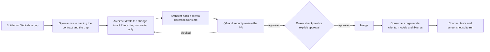

# Contracts

The contracts under `contracts/` and the ADRs under `docs/adr/` are frozen when the owner approves them at checkpoint 1. Every builder agent implements against them; QA tests against them; nobody changes one without the architect and a row in `docs/decisions.md`.

## Index

| Contract | Governs | Consumers | Validation |
|---|---|---|---|
| `contracts/openapi.yaml` | Every HTTP endpoint of `apps/api`: resources, proposal-only mutations, pagination and filter conventions, Problem+JSON error codes, the scene snapshot, the WebSocket entry point | `apps/api` routers and Pydantic models, `apps/studio` generated client and mock API, `apps/gateway` client, QA contract tests | `npx --yes @redocly/cli lint contracts/openapi.yaml` |
| `contracts/schema.sql` | PostgreSQL 16 DDL: every table, enum, constraint, index, the append-only audit trigger, the outbox, and the two reference-data inserts (domain templates, connector catalogue) | `apps/api` repositories and migrations, the Fuseki projector, QA fixtures | `uv run --with pglast python -c "import pglast; pglast.parse_sql(open('contracts/schema.sql').read())"` |
| `contracts/events.yaml` | AsyncAPI 3.0 event catalogue: NATS subjects, payload schemas, the WebSocket envelope and resume protocol | `apps/api` outbox writers and relay, the WebSocket hub, `apps/studio` event reducer, the Fuseki projector | `npx --yes @asyncapi/cli validate contracts/events.yaml` |
| `contracts/design-tokens.json` | W3C design tokens with the verbatim values of the reference: CSS custom properties (dark and light), canvas theme, semantic colours, surfaces, typography, radii, layout, durations and easings, physics constants | `apps/studio` stylesheet and canvas theme generation, the Playwright screenshot suite | `python -c "import json; json.load(open('contracts/design-tokens.json'))"` |
| `docs/adr/0001` to `0007` | Module boundaries, proposal-only writes, native authorisation, persistence and projection, events, seeded randomness, Studio port strategy | Every agent | Owner review at checkpoint 1 |

Related, not contracts: `docs/requirements-addendum.md` is the product owner's extraction from the reference and the input these contracts were derived from; `docs/ui-contract.md` and `reference/ontaix-studio-reference.html` govern what the Studio looks like.

## How A Contract Changes

Rules:

- A builder never edits a file under `contracts/` in a feature PR. If the implementation needs a different shape, the builder opens an issue and works around it locally until the contract PR lands.
- Additive changes (a new optional field, a new endpoint, a new event) need the architect PR and the decisions row. Breaking changes (a removed or renamed field, a changed enum, a changed subject) also need the owner's explicit approval before merge.
- Every contract PR runs the four validation commands above in CI.
- The OpenAPI version stays `1.0.0` during the fifteen days; breaking changes after the demo bump the major version and add `/api/v2`.
- Design token values are verbatim from the reference. A token value changes only when the reference changes first, so the screenshot suite stays the acceptance test.
- Schema changes ship as a migration next to the DDL; `contracts/schema.sql` always describes the current end state.
