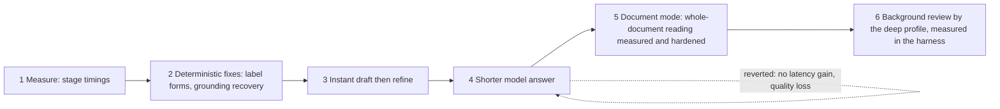
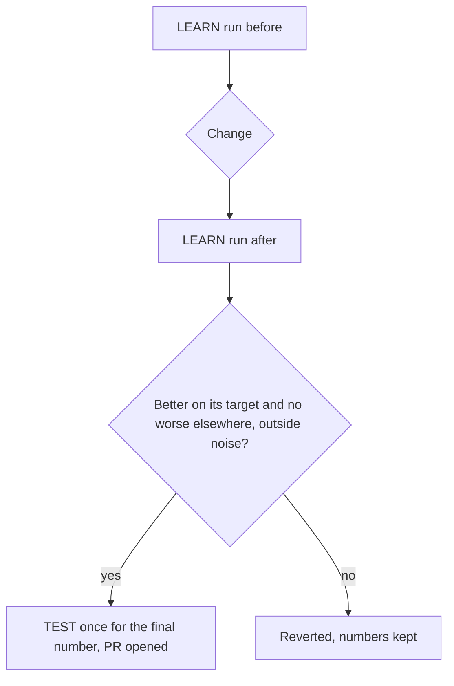

# Extraction Speed And Quality 2026-09-30

Six steps to make text-to-ontology processing faster and better, never one for the other (owner decision, Slim, 2026-09-30). Each step is a small pull request gated by the evaluation harness on the LEARN split, with the TEST split used once per step for its final number. Every number below comes from a JSON record under `docs/evals/results/2026-09-30/` (see Results Files); run-to-run noise on the speech sets is about 2 concepts, and 4 to 8 invented labels on the LEARN document. Decision rows 154 (step 1), 155 (step 2), 156 (step 3), 157 (step 5) and 158 (step 6) record the steps; step 4 was reverted and has no row.

## Summary

| Step | Shipped | Quality before to after | Latency before to after | EUR |
|---|---|---|---|---|
| 1 Stage timings | PR #48 | unchanged (measurement only) | unchanged; the provider call is the parse: call p50 4.3 s, p90 5.2 s, every other stage p90 at most 12 ms | 0.77 |
| 2 Label forms and grounding recovery | PR #51 | LEARN parent at depth 230 to 232 of 245, invented 5 to 0, missed 4 to 2, concept F1 0.982 to 0.996; TEST speech 107 to 107 of 110, invented 8 to 6, missed 3 to 0, F1 0.951 to 0.974 | p50 4.3 to 4.3 s, p90 5.2 to 5.5 s (noise) | 1.24 |
| 3 Instant draft then refine | PR #50 | unchanged by construction (the result holds the model's drafts alone) | first cell of an eligible typed sentence at 0 ms of model time instead of after the model's first intent | 0 |
| 4 Shorter model answer | reverted | LEARN parent at depth 230 to 218, missed 4 to 15, relations 18 to 15 | output tokens mean 276 to 227 (18 % fewer), call p50 4.33 to 4.23 s, p90 5.19 to 4.92 s (inside noise) | 0.72 |
| 5 Document mode | PR #49 | LEARN document: sentence mode F1 0.545, invented 118, parent 24/74; whole-document mode F1 0.93, invented 7, parent 67/74; this PR parent 71/74, refused chunks 1.3 to 0.3 per run | 1,176 s to 41 s (whole document); 41 s to 38 s with the section pass read at once | 2.60 |
| 6 Background review | not built; harness measurement in PR #52 | LEARN recordings reviewed by Claude Fable 5.1: parent at depth 146 to 139 of 163, invented 5 to 6, missed 5 to 4 | not on the live path; 5.9 s per review, 0.0062 EUR per reviewed sentence | 0.88 |

## Method

The harness (`apps/api/evals`) runs every case through the real pipeline against a scratch PostgreSQL with the model client swapped per configuration. Speech cases go in sentence by sentence as the Studio microphone sends them; documents go through sentence-by-sentence import or the whole-document job. Tuning used the LEARN split only (21 speech recordings, 22 typed cases, the `structure_ostrava_mutual_claims` document); the leak tests keep TEST material out of every prompt and example.

## Step 1: Stage Timings

Every parse and every model step publish per-stage wall-clock timings (`app/utilities/stage_clock.py`), reported by the harness as p50, p90 and max per stage. On the LEARN set (43 cases, 78 model calls, `gpt-6-sol@none`, `learn-base-timing`):

| Stage | p50 | p90 |
|---|---|---|
| provider call (client latency) | 4.3 s | 5.2 s |
| view (ontology load) | 7 ms | 11 ms |
| budget and reserve | 4 ms | 6 ms |
| candidates, examples, context | 1 ms | 2 ms |
| interpret (validate, ground, map) | 2 ms | 7 ms |
| settle | 6 ms | 12 ms |
| turns | 4 ms | 8 ms |
| output tokens | 218 | 385 |

Latency correlates 0.80 with output tokens at about 4.9 ms per token, so the answer's length is the only lever inside the pipeline. The `provider` stage of that record includes the harness's own gate wait after a 429 narrowed its concurrency; the harness now publishes that wait as its own clock. Streamed calls also record the provider's time to the first answer fragment.

## Step 2: Label Forms And Grounding Recovery

Two failure patterns of the speech tuning were deterministic: a multi-word label spoken in the singular and in the plural became two concepts (`Features of interest` beside `Feature Of Interest`), and accented French quotes lost their concepts to source ranges that started inside a word, to quotes in another Unicode form, and to elided articles (`l'accueil`). The fix: labels compare with every word in the singular, with the irregular plurals known and singular words ending in `s` left alone (`News` and `New` stay apart); quotes match loosely (accents and apostrophe shapes) and ranges widen to word edges; an elided article no longer hides its noun. The scorer compares labels the same way, and `evals.rescore` re-scores stored runs so the numbers stay comparable.

| Set | Before | After |
|---|---|---|
| LEARN, 43 cases (`learn-base` rescored, `learn-labels`) | parent at depth 230/245, invented 5, missed 2 to 4, F1 0.982 | 232/245, invented 0, missed 2, F1 0.996 |
| TEST speech, 21 cases (`final2-test-gpt` rescored, `test-labels`) | parent at depth 107/110, invented 8, missed 3, F1 0.951 | 107/110, invented 6, missed 0, F1 0.974; the SSN narration 12/12 and the French hospital recording 4/4 |

## Step 3: Instant Draft Then Refine

A typed sentence the grammar reads whole with no fallback trigger, whose drafts look like concept names, streams the grammar's drafts at once; the model's result replaces them and they are never proposed in its place. Streamed drafts match by concept (company, label up to singular and plural, parent), on the server and in the Studio, so a refined draft keeps its cell. Offline, on the stored typed runs, 13 of 57 typed sentences are eligible and the model keeps about half of those previews as they are. No paid run.

## Step 4: Shorter Model Answer (Reverted)

The provider format and the worked examples dropped the `explanation` and the `source` offsets (the quote places every intent). On the LEARN set (`learn-short-answer`) the answer shrank by 18 % (mean output tokens 276 to 227) but the call latency moved by 2 to 5 %, inside noise, and two recordings lost concepts (parent at depth 230 to 218, missed 4 to 15). Not shipped; the branch `feat/extract-output` holds the change and the record.

## Step 5: Document Mode

The harness gained a `whole` mode that runs the whole-document extraction job as the Studio does. On the LEARN document, whole-document reading is the document path: concept F1 0.545 to 0.93, invented 118 to 7, wall 1,176 s to 41 s against sentence-by-sentence import. Row 137 already makes it the Studio's default. The job itself was hardened: a section intent whose fields disagree with its kind is read by its fields instead of refusing the whole chunk (one chunk in nearly every run was lost that way), the section pass reads chunks at once, and a refused chunk's log names its schema errors. Three runs each on `gpt-6-sol@none`: refused chunks 1.3 to 0.3 per run, parent at depth 66.7 to 71.3, F1 0.934 to 0.933, invented 7.0 to 7.7, wall 41.1 s to 37.8 s. Heading-aware chunk cuts measured within noise and are not shipped.

## Step 6: Background Review By The Deep Profile

Measured in the harness before any product code: after each scored recording, Claude Fable 5.1 (the deep profile, low effort) reads the recording and the drafted tree and returns corrections (rename, delete, move, add), which the harness grounds in the recording, applies and scores again (`learn-review`, 21 LEARN recordings, 53 sentences). The review returned 21 corrections, applied 18, and lowered the result: parent at depth 146 to 139 of 163, invented 5 to 6, missed 5 to 4, relations 17 of 17 both ways. One recording improved (the French bank chain, 4 to 6 of 6); the retail monologue lost 8 concepts to ten applied moves and deletes the recording does not support. Cost 0.33 EUR for the reviews, 0.0062 EUR per reviewed sentence, median 5.9 s per review. Under the gate the background review is not built; the harness keeps the review pass (`--review`) as the way to measure a reviewer again, on a stronger prompt or model, before any product code proposes corrections.

## Spend

| Item | EUR |
|---|---|
| Step 1 LEARN baseline with timings | 0.77 |
| Step 2 LEARN and TEST | 1.24 |
| Step 4 LEARN | 0.72 |
| Step 5 whole-document runs (3 models, then 3 + 3 + 1 diagnosis on `gpt-6-sol`) | 2.60 |
| Step 6 review run (live model 0.55, reviews 0.33) | 0.88 |
| Total | 6.24 |

## Results Files

`docs/evals/results/2026-09-30/`: `learn-base-timing` (step 1), `learn-base`, `learn-labels`, `test-labels` (step 2), `learn-short-answer` (step 4), `whole-base`, `whole-verbose`, `whole-verbose2`, `whole-after*`, `whole-final-gpt1` to `3` (step 5), `learn-review` (step 6).
