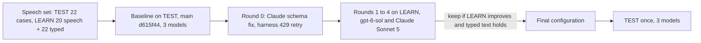

# Speech Tuning 2026-09-30

How well the teach pipeline understands a spoken recording, sentence by sentence: the right concepts, drilled down to the right depth, under the right parent, linked with the speaker's verb. This report measures the `main` branch at d615f44, tunes on LEARN material only, and reports the result on TEST material once.

## Summary

- The biggest finding is not a prompt problem. Since taught attributes landed (#31), the output schema made a `rel` intent's `object` optional, and Claude's structured outputs then dropped it and filled other fields with invented values. On `main`, 31 of 54 TEST sentences from Claude Sonnet 5 and 37 of 54 from Claude Fable 5.1 were refused as invalid output, so both Claude profiles understood almost nothing (parent at depth 10 of 118). With the schema fixed, Claude Fable 5.1 reaches 115 of 118 and Claude Sonnet 5 107 of 118.
- `gpt-6-sol` (the owner's stack) was already good on `main` and gains from the prompt and example changes: parent at depth 107 to 112 of 118, missed labels 6 to 2, cases at gold depth 21 to 22 of 22.
- The owner's recording is right sentence by sentence on `gpt-6-sol` before and after. Its text is quoted in the extraction instructions, so it is not an independent test (see Caveats).
- Recommendation: keep `gpt-6-sol` for live speech. Claude Fable 5.1 scores slightly higher, but it is 3.7 times slower at the median, 6.5 times the cost, global rather than EU, and times out on long monologues.
- Spend: 28.70 EUR of the 80 EUR budget.

## Method

- TEST speech (22 cases): the 18 spoken cases of `teach_cases.yaml` that `split.json` puts in TEST (single transcripts and the three multi-sentence recordings), the owner's recording `en-speech-owner-financial-services`, and three narrations of TEST benchmarks: ValueFlows processes (8 sentences), the W3C Organization Ontology (7) and SOSA/SSN observations (7). 118 expected concepts, 18 expected relations, 2 expected attributes, gold depth up to 7.
- LEARN (tuning only): the 13 LEARN spoken cases of `teach_cases.yaml`, narrations of GoodRelations, PROV-O and DCAT (6 to 7 sentences each, DCAT drilling five levels down), and two recordings written for tuning: one shaped like the owner's (a service line split in two, billing attributes, a buyer of both, its divisions) and one that drills down with "under X there are", "each of them has", "is split into" and jumps back up a level. The 22 LEARN typed-text cases run in every round as the regression check.
- Every recording is sent sentence by sentence as `origin: speech` in one session, drafts proposed before the next sentence, as the Studio microphone does. One repeat per configuration.
- Configurations: `gpt-6-sol@none`, `claude-sonnet-5@none`, `claude-fable-5-1@low`, all at the API's own timeouts.
- Metrics per case, summed over cases: parent at depth (expected concepts drafted under an accepted parent at the right level), verb accuracy (matched concepts with an accepted verb), relations (expected relations drafted with an accepted verb), attributes (taught attributes on the right concept with an accepted value), cases whose drafts reach the gold depth, invented labels, missed labels.

## Baseline Versus Final On TEST

22 speech cases, 54 sentences, 118 expected concepts. Baseline is `main` at d615f44; final is this branch.

| Model | Run | Parent at depth | Verb | Relations | Attributes | Cases at gold depth | Invented | Missed | Sentences refused |
|---|---|---|---|---|---|---|---|---|---|
| gpt-6-sol@none | baseline | 107/118 (0.907) | 111/112 (0.991) | 14/18 | 2/2 | 21/22 | 8 | 6 | 3 (rate limit) |
| gpt-6-sol@none | final | 112/118 (0.949) | 112/116 (0.966) | 13/18 | 2/2 | 22/22 | 8 | 2 | 1 (invalid output) |
| claude-sonnet-5@none | baseline | 10/118 (0.085) | 23/38 (0.605) | 1/18 | 0/2 | 7/22 | 87 | 80 | 51 (31 invalid, 16 rate limit, 4 timeout) |
| claude-sonnet-5@none | final | 107/118 (0.907) | 109/110 (0.991) | 14/18 | 1/2 | 19/22 | 8 | 8 | 1 (invalid output) |
| claude-fable-5-1@low | baseline | 10/118 (0.085) | 22/37 (0.595) | 1/18 | 1/2 | 7/22 | 86 | 81 | 48 (37 invalid, 7 rate limit, 4 timeout) |
| claude-fable-5-1@low | final | 115/118 (0.975) | 113/116 (0.974) | 15/18 | 2/2 | 22/22 | 6 | 2 | 0 |

The baseline ran without the harness's rate-limit retry, so its rate-limited sentences fell back to the rule-based grammar; the final runs retried them (3, 4 and 1 rate-limited calls were retried). The Claude baseline is dominated by invalid output, which the retry does not change.

Latency of the final TEST calls (one call per sentence):

| Model | Median | 90th percentile | Slowest | TEST cost |
|---|---|---|---|---|
| gpt-6-sol@none | 2.1 s | 3.2 s | 6.5 s | 0.50 EUR |
| claude-sonnet-5@none | 3.7 s | 6.1 s | 9.4 s | 1.01 EUR |
| claude-fable-5-1@low | 7.7 s | 17.5 s | 27.0 s | 3.20 EUR |

## LEARN Rounds

Parent at depth on the 20 LEARN speech cases (155 expected concepts) and on the 22 LEARN typed cases (82), and sentences refused as invalid output. Round 0 is `main` plus the Claude schema fix and the harness retry, so Claude answers at all.

| Round | Change | gpt-6-sol speech | gpt-6-sol typed | Claude Sonnet 5 speech | Claude Sonnet 5 typed | Kept |
|---|---|---|---|---|---|---|
| 0 | Claude answers in the required form; 429 retried in the harness | 105 (0.677), 1 invalid | 82/82 | 99 (0.639), 2 invalid | 72/82 | yes |
| 1 | Attribute rule without the contradiction; descriptive nouns and "kinds of"; drill-down, "each of them", jumps back up; "its" after a buyer | 121 (0.781), 1 invalid | 82/82 | 95 (0.613), 8 invalid | 59/82 | yes |
| 2 | One output shape per intent kind (`rel` and `spec` require `object`) | 119 (0.768), 1 invalid | 82/82 | 107 (0.690), 1 invalid | 82/82 | yes |
| 3 | Two multi-turn speech examples replace two GoodRelations document examples | 130 (0.839), 0 invalid | 82/82 | 115 (0.742), 1 invalid | 82/82 | yes |
| 4 | "Sells X to its B", "both kinds of Z", facilities are concepts not attribute values | 121 (0.781), 1 invalid | 82/82 | 115 (0.742), 2 invalid | 82/82 | no |

Claude Fable 5.1 ran round 0 only on LEARN: 104 of 155 (0.671), typed 76 of 82, with timeouts on the 1,088-character monologue.

Round 1 lowered Claude Sonnet 5 overall only through invalid output (a `rel` intent with `"object": null`); on the cases both rounds answered it rose from 78 to 85 of 99, and round 2 removed the cause. Round 4 changed nothing on the cases every round answered, so it was reverted. The number of earlier turns sent was not varied: the session keeps the last 8 sentences, and no recording in either set is longer than 8 sentences, so every sentence already sees all of its recording.

Documents: one LEARN document (`structure_ostrava_mutual_claims`, sentence import) on `gpt-6-sol`, `main` against this branch: 116 sentences, 74 expected concepts; parent at depth 21 to 24, verb 61 to 64, invented 122 to 118, missed 2 and 2, concept F1 0.537 to 0.545, sentences refused as invalid output 3 to 1. No regression.

## The Owner's Recording

`gpt-6-sol@none`, the owner's stack, sentence by sentence. The baseline and the final drafts are the same except for the first sentence's relation.

| Sentence | Baseline (main) | Final (this branch) |
|---|---|---|
| Insight sells financial services to its customers | Insight sells Financial services; Insight has Customers; Financial services is sold to Customers | Insight sells Financial services; Insight has Customers; Insight sells to Customers |
| these services are split in advisory and um managed services | Financial services is split into Advisory and Managed services | same |
| the managed ones are billed monthly | Managed services: billing = monthly | same |
| advisory is billed per day | Advisory: billing = per day | same |
| ADNOC buys them both | ADNOC buys Advisory (born under Advisory); ADNOC buys Managed services | same |
| its subsidiaries XRG and Drilling buy advisory | ADNOC has Subsidiaries, which includes XRG and Drilling; XRG buys Advisory; Drilling buys Advisory | same |

Scores: baseline 8/8 parent at depth, 5/5 relations, 2/2 attributes; final 8/8, 4/5 (the final run relates Customers to Insight with "sells to" instead of to Financial services with "is sold to"), 2/2.

On Claude the same recording went from nothing understood to the owner's tree:

| Sentence | Claude Sonnet 5, baseline | Claude Sonnet 5, final | Claude Fable 5.1, final |
|---|---|---|---|
| Insight sells financial services to its customers | timeout; grammar drafts Sell, Financial, Service | Insight sells Financial services | Insight sells Financial services; Insight has Customers; Financial services is sold to Customers |
| these services are split in advisory and um managed services | invalid output; grammar drafts Split, Advisory, Managed | Financial services is split in Advisory and Managed services | same as Sonnet |
| the managed ones are billed monthly | Managed: billing = monthly (on the grammar's wrong "Managed") | Managed services: billing = monthly | same |
| advisory is billed per day | refused (ungrounded label) | refused (ungrounded label) | Advisory: billing = per day |
| ADNOC buys them both | invalid output, nothing | ADNOC buys Advisory and Managed services | same |
| its subsidiaries XRG and Drilling buy advisory | invalid output; grammar drafts Subsidiary, Drilling under Advisory | ADNOC has Subsidiaries (XRG, Drilling); each buys Advisory | same |

## Which Model For Live Speech

Keep `gpt-6-sol@none`. On TEST it reaches 112 of 118 parents at the right depth, every case at its gold depth, 2 missed labels, with a median of 2.1 s per sentence, EU data residency and the lowest cost. Claude Fable 5.1 at low effort scores higher (115 of 118, no refusal), but its median is 7.7 s and its 90th percentile 17.5 s per sentence, far from live, it costs 6.5 times as much, it is a global deployment, and on LEARN it timed out on a long monologue at the API's 45 s speech limit. Claude Sonnet 5 is now usable as a fallback (107 of 118) but is not better than `gpt-6-sol`. No switch is recommended.

Fable at low effort is a fit for the `deep` profile (documents), where latency matters less, once a document benchmark confirms it.

## What Changed

- `app/clients/anthropic_llm_client.py`, `app/utilities/strict_json_schema.py`: Claude receives the schema in a required form (every property required; an optional string or list written empty when unset; other optional properties nullable), which stays within Claude's limit of 16 union-typed properties (the strict form of the typed schema has 17 and is refused with status 400). Nulls and empties are removed from the answer.
- `app/ai/prompts/teach_extraction.py`: one output shape per intent kind, so `rel` and `spec` intents require `object`; the property rule now sends billing and pricing to `attr` intents instead of contradicting the attribute rule; descriptive nouns ("starting points", "ways", "parts") and "kinds/types of X" as specialisations; a drill-down rule ("is split into", "under X there are", "each of them has", coming back up to an earlier concept, "has a <noun> which is a Y"); "its" points to the concept just talked about, not the company.
- `app/ai/examples/teach_examples.json`: the "billed per hour" example returns an `attr` intent instead of an unresolved phrase; two multi-turn speech examples (a possessive after a buyer with an attribute on "the field ones", and "each of them has" with a jump back up) replace two GoodRelations document examples.
- `app/services/teach_extraction_service.py`: a segment that starts before the previous one ends is repaired instead of refusing the whole transcript.
- Harness: taught attributes are scored (`expected.attributes`); parent at depth accepts the level of any accepted path (a concept with parents at different levels was always marked wrong under the deeper one); rate-limited calls are retried and recorded; the speech tuning set is `evals/cases/speech_recordings.yaml`.

## Remaining Failure Patterns

- Descriptive noun against specialisation: "these policies come in three flavours home motor and travel" now gives Policies with Home, Motor and Travel as kinds of it on `gpt-6-sol` (the gold reads "flavours" as descriptive, so Home, Motor and Travel under Insurance). The "kinds/types" rule generalised to "flavours". Parent at depth on this case fell from 4/4 to 1/4.
- Plural label drift: "features of interest" drafted as a second concept "Features of interest" beside "Feature Of Interest" (SSN narration, all three models), and "Economic events" beside "Economic event" (ValueFlows, Claude). Singular and plural of a multi-word label introduced in the same sentence are not merged.
- Relations against births: "Insight sells financial services to its customers" is drafted with Customers under Insight and the "sold to" relation sometimes on Insight rather than on Financial services; "persons and organizations provide and receive the events" gives relations from Persons and Organizations rather than from Agent.
- Attribute subject refused: Claude Sonnet 5 answers "advisory is billed per day" with an attribute whose subject is refused as ungrounded (both before and after); Fable and `gpt-6-sol` get it right.
- Whole-answer refusals remain possible: one `gpt-6-sol` sentence ("a process has inputs and outputs and uh those are all economic events") and one Claude Sonnet 5 sentence were refused as invalid output. On LEARN, the 1,088-character monologue is still refused when two segments need the same words ("customers can join our loyalty programme" and "loyalty programme which has two tiers"); dropping only the conflicting intents would save the rest.
- Rate limits: the dev `gpt-6-sol` deployment refuses most calls at 4 concurrent requests and some at 1 (3 to 4 per 54-sentence run). The API does not retry a 429, so in the product a refused sentence falls back to the grammar. A retry with a short pause inside the live timeout, or more quota, would remove this.
- Invented relations the gold does not list are often right ("Frozen bays has Temperature sensors" for "they each have"): the gold names one parent per concept and scores the second link as invented.

## Caveats

- The owner's recording is TEST by instruction, but the extraction instructions already quote its sentences ("ADNOC buys them both", "its subsidiaries XRG and Drilling buy advisory", "the managed ones"), so it measures recall of the prompt more than generalisation. The LEARN recording shaped like it (`en-speech-recording-billing-drilldown`) is the independent check: 8/8 on `gpt-6-sol` and Claude Sonnet 5 after round 3.
- One repeat per configuration: differences of 2 or 3 concepts on a round are within run-to-run noise, and one refused answer on the 33-concept monologue moves a LEARN total by up to 31 concepts (round 4 lost 9 on `gpt-6-sol` that way). The round decisions therefore compare the cases every round answered.
- The narrations' gold is hand-written from the benchmark gold for the narrated section: the labels are the benchmark's class names, the tree is the one the narration states, and the benchmark's property names are among the accepted verbs.
- One LEARN gold was widened after round 1: in "Corvel Foods runs two plants a bakery and a dairy", Plants reads either way under the documented gold rules, so Bakery and Dairy also accept the company as parent.

## Spend

| Item | EUR |
|---|---|
| TEST baseline, 3 models (plus a first `gpt-6-sol` run lost to rate limits, 0.18) | 3.70 |
| Diagnosis of the Claude refusals and the refused monologue | 0.42 |
| LEARN round 0 (3 models, run twice: the first pass exposed the 400 on the typed schema) | 8.67 |
| LEARN rounds 1 to 4 (2 models) | 8.27 |
| TEST final, 3 models | 4.71 |
| Document regression, 2 runs | 2.88 |
| Direct probes of the Claude schema | 0.05 |
| Total | 28.70 |
