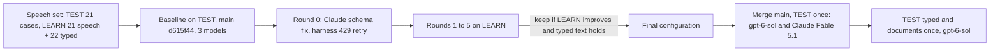

# Speech Tuning 2026-09-30

How well the teach pipeline understands a spoken recording, sentence by sentence: the right concepts, drilled down to the right depth, under the right parent, linked with the speaker's verb. This report measures `main` at d615f44, tunes on LEARN material only, and reports the result on TEST material. The final numbers are for this branch after merging `main` at 7d02da7 (#24, #27, #32) and the review changes.

## Summary

- The biggest finding is not a prompt problem. Since taught attributes landed (#31), the output schema made a `rel` intent's `object` optional, and Claude's structured outputs then dropped it and filled other fields with invented values. On `main`, 28 of 48 TEST sentences from Claude Sonnet 5 and 34 of 48 from Claude Fable 5.1 were refused as invalid output, so both Claude profiles understood almost nothing (parent at depth 10 of 110). With the schema fixed, Claude Fable 5.1 reaches 107 of 110.
- `gpt-6-sol` (the owner's stack) was already good on `main` and gains a little: parent at depth 99 to 105 of 110, verb 103/104 to 105/106, relations 9 to 10 of 13, missed labels 6 to 4, no sentence refused.
- The owner's recording is LEARN material, not a test: the extraction instructions quote its sentences, and the owner chose to use it for training. On LEARN it is right sentence by sentence on `gpt-6-sol` before and after (8/8 parents, 5/5 relations, 2/2 billing attributes).
- Recommendation: keep `gpt-6-sol` for live speech. Claude Fable 5.1 scores 2 concepts higher on TEST, but it is 3 times slower at the median (6 times at the 90th percentile), 6.5 times the cost, global rather than EU, and timed out on a long LEARN monologue.
- Spend: 50.36 EUR of the 80 EUR budget.

## Method

- TEST speech (21 cases): the 18 spoken cases of `teach_cases.yaml` that `split.json` puts in TEST (single transcripts and the three multi-sentence recordings), and three narrations of TEST benchmarks: ValueFlows processes (8 sentences), the W3C Organization Ontology (7) and SOSA/SSN observations (7). 48 sentences, 110 expected concepts, 13 expected relations, gold depth up to 7. No TEST case has an expected attribute.
- LEARN (tuning only): the 13 LEARN spoken cases of `teach_cases.yaml`, the owner's recording, narrations of GoodRelations, PROV-O and DCAT (6 to 7 sentences each, DCAT drilling five levels down), and two recordings written for tuning: one shaped like the owner's (a service line split in two, billing attributes, a buyer of both, its divisions) and one that drills down with "under X there are", "each of them has", "is split into" and jumps back up a level. The 22 LEARN typed-text cases run in every round as the regression check. The owner's recording moved from TEST to LEARN at review; rounds 1 to 4 ran without it, round 5 with it.
- Every recording is sent sentence by sentence as `origin: speech` in one session, drafts proposed before the next sentence, as the Studio microphone does. One repeat per configuration.
- Configurations: `gpt-6-sol@none`, `claude-sonnet-5@none`, `claude-fable-5-1@low`, all at the API's own timeouts.
- Metrics per case, summed over cases: parent at depth (expected concepts drafted under an accepted parent at a level one of its accepted paths gives it), verb accuracy (matched concepts with an accepted verb), relations (expected relations drafted with an accepted verb), attributes (taught attributes on the right concept with an accepted value), cases whose drafts reach the gold depth, invented labels, missed labels.
- Every number below comes from the harness's JSON records in `docs/evals/results/2026-09-30/` (see Results Files).

## Baseline Versus Final On TEST

21 speech cases, 48 sentences, 110 expected concepts, 13 expected relations. Baseline is `main` at d615f44. Final is this branch merged with `main` at 7d02da7. The middle rows are the same branch before the merge and the review changes, kept for Claude Sonnet 5, which the final rerun did not include.

| Model | Run | Parent at depth | Verb | Relations | Cases at gold depth | Invented | Missed | Sentences refused |
|---|---|---|---|---|---|---|---|---|
| gpt-6-sol@none | baseline | 99/110 (0.900) | 103/104 | 9/13 | 20/21 | 8 | 6 | 3 (rate limit) |
| gpt-6-sol@none | before review | 104/110 (0.945) | 104/108 | 9/13 | 21/21 | 8 | 2 | 1 (invalid output) |
| gpt-6-sol@none | final | 105/110 (0.955) | 105/106 | 10/13 | 20/21 | 9 | 4 | 0 |
| claude-sonnet-5@none | baseline | 10/110 (0.091) | 23/35 | 1/13 | 7/21 | 82 | 75 | 47 (28 invalid, 16 rate limit, 3 timeout) |
| claude-sonnet-5@none | before review | 100/110 (0.909) | 102/103 | 10/13 | 18/21 | 8 | 7 | 1 (invalid output) |
| claude-fable-5-1@low | baseline | 10/110 (0.091) | 22/34 | 1/13 | 7/21 | 81 | 76 | 44 (34 invalid, 7 rate limit, 3 timeout) |
| claude-fable-5-1@low | before review | 107/110 (0.973) | 105/108 | 10/13 | 21/21 | 6 | 2 | 0 |
| claude-fable-5-1@low | final | 107/110 (0.973) | 108/108 | 9/13 | 21/21 | 9 | 2 | 0 |

The baseline ran without the harness's rate-limit retry, so its rate-limited sentences fell back to the rule-based grammar; the later runs retried them (3 calls for `gpt-6-sol` and 1 for Fable in the final runs). The Claude baseline is dominated by invalid output, which the retry does not change. Between "before review" and "final" the `gpt-6-sol` difference is run-to-run noise: the missed labels come from one French transcript whose quotes failed grounding in the final run (see Remaining Failure Patterns).

Latency of the final TEST calls, one call per sentence:

| Model | Median | 90th percentile | Slowest | TEST cost |
|---|---|---|---|---|
| gpt-6-sol@none | 2.0 s | 3.4 s | 4.2 s | 0.45 EUR |
| claude-fable-5-1@low | 6.1 s | 19.8 s | 23.2 s | 2.91 EUR |

## TEST Typed Text And Documents

`gpt-6-sol@none`, the final configuration, once. There is no baseline run for these; they check that the speech tuning leaves typed text and document import working.

Typed text, 23 TEST cases (32 turns): parent at depth 63 of 64, verb 63 of 63, relations 6 of 6, every case at its gold depth, 0 invented, 1 missed, no turn refused.

Documents, sentence import, one `.md` file per document. The org and ssn benchmarks stand for the four TEST benchmarks; time and valueflows (about 21 EUR more) were left out to keep within the budget. "Rules" counts sentences the grammar read without calling the model.

| Document | Sentences (model, rules, refused) | Expected | Matched | Parent at depth | Verb | Invented | Missed | Concept F1 | Depth reached / gold |
|---|---|---|---|---|---|---|---|---|---|
| adversarial_pellucid_incidents | 31 (31, 0, 0) | 26 | 26 | 25 | 25 | 3 | 0 | 0.945 | 5 / 5 |
| adversarial_quenby_suppliers | 38 (38, 0, 0) | 28 | 28 | 28 | 28 | 3 | 0 | 0.949 | 5 / 5 |
| it_services_corvane | 312 (243, 69, 0) | 129 | 115 | 91 | 108 | 282 | 14 | 0.437 | 9 / 6 |
| manufacturer_aldermoor | 277 (244, 30, 3) | 110 | 109 | 81 | 89 | 225 | 1 | 0.491 | 7 / 6 |
| structure_brackwater_distribution | 115 (114, 0, 1) | 66 | 51 | 3 | 40 | 96 | 15 | 0.479 | 4 / 5 |
| structure_lestrade_logistique_fr | 120 (119, 0, 1) | 63 | 50 | 44 | 41 | 103 | 13 | 0.463 | 5 / 5 |
| benchmark org | 351 (267, 73, 11) | 13 | 6 | 0 | 0 | 202 | 7 | 0.054 | 4 / 3 |
| benchmark ssn | 458 (245, 208, 5) | 22 | 11 | 3 | 1 | 253 | 11 | 0.077 | 5 / 2 |

Sentence-by-sentence import of long documents finds nearly every expected concept in the business documents (recall 0.77 to 1.00) but drafts two to three times as many concepts as the gold holds, so precision stays near 0.3. On the benchmarks it is far worse: their gold is a small flat OWL class list, and the specification prose names hundreds of things the gold does not. The adversarial documents' injected labels were not drafted (the 3 invented labels in each are ordinary words from the text). In brackwater, 3 of 51 matched concepts sit at the right depth: the drafts place them one level off. These are document-import limits, outside this speech tuning; whole-document extraction (#24) is the path the product takes for documents.

## LEARN Rounds

Parent at depth on the LEARN speech cases (20 cases and 155 expected concepts in rounds 0 to 4, 21 and 163 in round 5 with the owner's recording) and on the 22 LEARN typed cases (82), and sentences refused as invalid output. Round 0 is `main` plus the Claude schema fix and the harness retry, so Claude answers at all.

| Round | Change | gpt-6-sol speech | gpt-6-sol typed | Claude Sonnet 5 speech | Claude Sonnet 5 typed | Kept |
|---|---|---|---|---|---|---|
| 0 | Claude answers in the required form; 429 retried in the harness | 105 (0.677), 1 invalid | 82/82 | 99 (0.639), 2 invalid | 72/82 | yes |
| 1 | Attribute rule without the contradiction; descriptive nouns and "kinds of"; drill-down, "each of them", jumps back up; "its" after a buyer | 121 (0.781), 1 invalid | 82/82 | 95 (0.613), 8 invalid | 59/82 | yes |
| 2 | One output shape per intent kind (`rel` and `spec` require `object`) | 119 (0.768), 1 invalid | 82/82 | 107 (0.690), 1 invalid | 82/82 | yes |
| 3 | Two multi-turn speech examples replace two GoodRelations document examples | 130 (0.839), 0 invalid | 82/82 | 115 (0.742), 1 invalid | 82/82 | yes |
| 4 | "Sells X to its B", "both kinds of Z", facilities are concepts not attribute values | 121 (0.781), 1 invalid | 82/82 | 115 (0.742), 2 invalid | 82/82 | no |
| 5 | Review: the "kinds" rule narrowed to "kinds", "types" and "sorts" with a LEARN example (GoodRelations price specifications); any other variety noun stays descriptive | 128/163 (0.785), 1 invalid | 82/82 | not run | not run | yes |

Claude Fable 5.1 ran round 0 only on LEARN: 104 of 155 (0.671), typed 76 of 82, with timeouts on the 1,088-character monologue.

Round 1 lowered Claude Sonnet 5 overall only through invalid output (a `rel` intent with `"object": null`); on the cases both rounds answered it rose from 78 to 85 of 99, and round 2 removed the cause. Round 4 changed nothing on the cases every round answered, so it was reverted. In round 5 the GoodRelations "three types of price specification" narration stays 13/13 and the typed cases 82/82; on the cases rounds 3 and 5 both answered, 118 against 119 of 122. The number of earlier turns sent was not varied: the session keeps the last 8 sentences, and no recording in either set is longer than 8 sentences, so every sentence already sees all of its recording.

A LEARN document (`structure_ostrava_mutual_claims`, 116 sentences, sentence import) on `gpt-6-sol`, `main` against the branch before review: parent at depth 21 to 24 of 74, verb 61 to 64, invented 122 to 118, missed 2 and 2, concept F1 0.537 to 0.545, sentences refused as invalid output 3 to 1. No regression.

## The Owner's Recording (LEARN)

The owner's recording is training material: `split.json` lists it under LEARN and the extraction instructions quote it. It is shown here because it is the owner's own speech, not as evidence of generalisation. `gpt-6-sol@none`, sentence by sentence; baseline is `main` (the first TEST baseline run, when the case was still TEST), final is round 5.

| Sentence | Baseline (main) | Final (this branch) |
|---|---|---|
| Insight sells financial services to its customers | Insight sells Financial services; Insight has Customers; Financial services is sold to Customers | same |
| these services are split in advisory and um managed services | Financial services is split into Advisory and Managed services | same |
| the managed ones are billed monthly | Managed services: billing = monthly | same |
| advisory is billed per day | Advisory: billing = per day | same |
| ADNOC buys them both | ADNOC buys Advisory (born under Advisory); ADNOC buys Managed services | same |
| its subsidiaries XRG and Drilling buy advisory | ADNOC has Subsidiaries, which includes XRG and Drilling; XRG buys Advisory; Drilling buys Advisory | same |

Scores: 8/8 parent at depth, 5/5 relations, 2/2 attributes, before and after.

On Claude the same recording went from nothing understood to the owner's tree (runs made while it was still a TEST case):

| Sentence | Claude Sonnet 5, baseline | Claude Sonnet 5, before review | Claude Fable 5.1, before review |
|---|---|---|---|
| Insight sells financial services to its customers | timeout; grammar drafts Sell, Financial, Service | Insight sells Financial services | Insight sells Financial services; Insight has Customers; Financial services is sold to Customers |
| these services are split in advisory and um managed services | invalid output; grammar drafts Split, Advisory, Managed | Financial services is split in Advisory and Managed services | same as Sonnet |
| the managed ones are billed monthly | Managed: billing = monthly (on the grammar's wrong "Managed") | Managed services: billing = monthly | same |
| advisory is billed per day | refused (ungrounded label) | refused (ungrounded label) | Advisory: billing = per day |
| ADNOC buys them both | invalid output, nothing | ADNOC buys Advisory and Managed services | same |
| its subsidiaries XRG and Drilling buy advisory | invalid output; grammar drafts Subsidiary, Drilling under Advisory | ADNOC has Subsidiaries (XRG, Drilling); each buys Advisory | same |

## Which Model For Live Speech

Keep `gpt-6-sol@none`. On TEST it reaches 105 of 110 parents at the right depth with no sentence refused, a median of 2.0 s per sentence, EU data residency and the lowest cost. Claude Fable 5.1 at low effort reaches 107 of 110, also with no refusal, but its median is 6.1 s and its 90th percentile 19.8 s per sentence, far from live, it costs 6.5 times as much, it is a global deployment, and on LEARN it timed out on a long monologue at the API's 45 s speech limit. Two concepts on one repeat is not clearly better, so no switch is recommended. Claude Sonnet 5 is usable again as a fallback (100 of 110 before review) but is not better than `gpt-6-sol`.

## What Changed

- `app/clients/anthropic_llm_client.py`, `app/utilities/strict_json_schema.py`: Claude receives the schema in a required form (every property required; an optional string or list written empty when unset; other optional properties nullable), which stays within Claude's limit of 16 union-typed properties (the strict form of the typed schema has 17 and is refused with status 400). Nulls and empties are removed from the answer.
- `app/ai/prompts/teach_extraction.py`: one output shape per intent kind, so `rel` and `spec` intents require `object`; the property rule sends billing and pricing to `attr` intents instead of contradicting the attribute rule; descriptive nouns ("starting points", "ways", "parts"); only "kinds", "types" and "sorts" name specialisations, with a LEARN example; a drill-down rule ("is split into", "under X there are", "each of them has", coming back up to an earlier concept, "has a <noun> which is a Y"); "its" points to the concept just talked about, not the company.
- `app/ai/examples/teach_examples.json`: the "billed per hour" example returns an `attr` intent instead of an unresolved phrase; two multi-turn speech examples (a possessive after a buyer with an attribute on "the field ones", and "each of them has" with a jump back up), both from LEARN recordings, replace two GoodRelations document examples. Neither shares a 4-word run with any TEST case. The second uses the same pattern as the TEST phrase "they each have temperature sensors", which is ordinary English rather than copied material.
- `app/ai/examples/split.json`: the owner's recording and the new recordings and narrations are assigned; the owner's recording is LEARN.
- `app/services/teach_extraction_service.py`: a segment that starts before the previous one ends is repaired instead of refusing the whole transcript.
- `tests/test_teach_examples.py`: the extraction instructions, like the examples, may share no 6-word run with TEST material. The first version of this branch quoted the TEST SSN narration in the instructions; this test now catches that.
- Harness: taught attributes are scored (`expected.attributes`); parent at depth accepts the level of any accepted path (a concept with parents at different levels was always marked wrong under the deeper one); rate-limited calls are retried and recorded; the speech tuning set is `evals/cases/speech_recordings.yaml`.

## Remaining Failure Patterns

- Plural label drift: "features of interest" drafted as a second concept "Features of interest" beside "Feature Of Interest" (SSN narration, both models), and "Economic events" beside "Economic event" (ValueFlows, Fable). Singular and plural of a multi-word label introduced in the same sentence are not merged.
- Grounding of accented French quotes: in the final `gpt-6-sol` run, three intents of "l'hôpital a un service des urgences ... d'abord l'accueil et ensuite le tri" were refused as ungrounded because their source ranges started inside a word ("gences euh font..."), so Accueil, Tri and Niveau de priorité were missed; the run before review missed only Accueil. The model's offsets drift on this text and the quote match does not recover.
- Relations the gold does not list: "persons and organizations provide and receive the events" gives relations from Agents or Persons rather than from Agent; "Organizations has Agents" is drafted beside the expected membership relation. Several invented relations are right but name a second link the gold scores as invented ("Frozen bays has Temperature sensors" for "they each have").
- Attribute subject refused: Claude Sonnet 5 answers "advisory is billed per day" with an attribute whose subject is refused as ungrounded (before and after); Fable and `gpt-6-sol` get it right.
- Whole-answer refusals remain possible: on LEARN, the 1,088-character monologue is still refused on some runs when two segments need the same words ("customers can join our loyalty programme" and "loyalty programme which has two tiers"); dropping only the conflicting intents would save the rest.
- Rate limits: the dev `gpt-6-sol` deployment refuses most calls at 4 concurrent requests and some at 1 (3 per 48-sentence run). The API does not retry a 429, so in the product a refused sentence falls back to the grammar. A retry with a short pause inside the live timeout, or more quota, would remove this.

## Caveats

- The first version of this branch leaked TEST material into the instructions (the SSN narration's "three kinds of systems" sentence) and scored the owner's recording as TEST although the instructions quote it. Both are fixed: the example is from a LEARN narration, the owner's recording is LEARN, and the TEST numbers above exclude it. The rows marked "before review" were measured with the leaked sentence in the prompt; only the SSN narration could benefit, and it scores the same (10 of 12) in the final run without it.
- One repeat per configuration: differences of 2 or 3 concepts are within run-to-run noise, and one refused answer on the 33-concept LEARN monologue moves a LEARN total by up to 31 concepts. The round decisions therefore compare the cases every round answered.
- The narrations' gold is hand-written from the benchmark gold for the narrated section: the labels are the benchmark's class names, the tree is the one the narration states, and the benchmark's property names are among the accepted verbs.
- One LEARN gold was widened after round 1: in "Corvel Foods runs two plants a bakery and a dairy", Plants reads either way under the documented gold rules, so Bakery and Dairy also accept the company as parent.

## Results Files

`docs/evals/results/2026-09-30/` holds the JSON record and the markdown report the harness wrote for every run the numbers come from:

- `base-test-{gpt,sonnet,fable}`: TEST baseline on `main` (22 cases, including the owner's recording, which the tables above leave out).
- `r0-learn-*` to `r5-learn-gpt`: the LEARN rounds.
- `final-test-{gpt,sonnet,fable}`: TEST before review (22 cases, the owner's recording left out above).
- `final2-test-{gpt,fable}`: TEST, final configuration after the merge.
- `final2-test-typed-gpt`, `final2-test-docs-gpt`: TEST typed text and documents, final configuration.
- `doc-main`, `doc-branch`: the LEARN document regression.

Runs lost to the dev deployment's rate limits, the first round 0 runs broken by Claude's 400 on the typed schema, and diagnosis runs are counted in the spend but not stored.

## Spend

| Item | EUR |
|---|---|
| TEST baseline, 3 models (plus a first `gpt-6-sol` run lost to rate limits, 0.18) | 3.70 |
| Diagnosis of the Claude refusals and the refused monologue | 0.42 |
| LEARN round 0 (3 models, run twice: the first pass exposed the 400 on the typed schema) | 8.67 |
| LEARN rounds 1 to 4 (2 models) | 8.27 |
| TEST before review, 3 models | 4.71 |
| LEARN document regression, 2 runs | 2.88 |
| Direct probes of the Claude schema | 0.05 |
| Review: LEARN round 5 (`gpt-6-sol`) | 0.73 |
| Review: TEST rerun after the merge (`gpt-6-sol` and Fable, cap 15 EUR) | 3.36 |
| Review: TEST typed (0.27) and documents (17.30), `gpt-6-sol` | 17.57 |
| Total | 50.36 |
