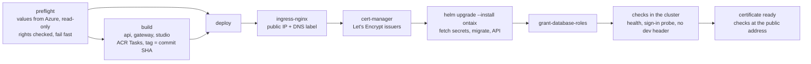

# Provisioning

Azure, France Central, one environment (`dev`) used for development and demos. Infrastructure is
Terraform (`infra/terraform/azure`), applied by GitHub Actions through OIDC federation.

## What Terraform creates
| Resource | Name | Notes |
|---|---|---|
| Resource group | rg-ontaix-dev-frc | tags: project, environment, owner, purpose, expires |
| Virtual network | vnet-ontaix-dev-frc | 10.40.0.0/16; snet-aks /20, snet-postgres /24 (delegated) |
| AKS | aks-ontaix-dev-frc | Free tier, 1–3 × Standard_D4s_v5, Azure CNI overlay + Cilium, OIDC issuer + workload identity, Container Insights |
| Container registry | crontaixdevfrc&lt;hash&gt; | Basic; AcrPull for the kubelet identity, no admin user |
| PostgreSQL Flexible 16 | psql-ontaix-dev-frc-&lt;hash&gt; | B_Standard_B2s, VNet-only, private DNS; password generated → Key Vault |
| Key Vault | kv-ontaix-dev-frc-&lt;hash&gt; | RBAC; secrets `postgres-admin-password`, `database-url`; the optional `anthropic-api-key` is set by the owner, not by Terraform, and only when the `anthropic` provider is used (see below) |
| Azure AI Foundry | ais-ontaix-dev-frc-&lt;hash&gt; | Kind `AIServices`, S0, key authentication disabled; model deployment `gpt-6-sol` (version 2026-09-22), DataZoneStandard (EU); outputs `foundry_endpoint`, `foundry_deployment_name` |
| Managed identity | id-ontaix-dev-frc | workload identity for `ontaix/ontaix-api`; Key Vault Secrets User; Cognitive Services OpenAI User on the Foundry resource |
| Log Analytics | log-ontaix-dev-frc | 30-day retention |
| Budget | budget-ontaix-dev-frc | €400/month; alerts at 80 % actual and 100 % forecast |

Fuseki, Valkey and NATS run inside the cluster from the Helm chart; they need no Azure resource.
Rough run cost: ~€250–350/month with one node; scale to zero by destroying the environment
between demo periods (`terraform destroy` keeps the state account).

## One-time bootstrap
1. `SUBSCRIPTION="<name or id>" bash infra/scripts/bootstrap-azure.sh` — with a signed-in Azure
   CLI as the owner. Creates the state storage, the CI identity (OIDC only, no secret), its role
   assignments, and writes `infra/scripts/ontaix-ci.env` (identifiers only).
2. `gh repo create slimfarhanigithub/ontaix --private --source . --push` (once).
3. `bash infra/scripts/bootstrap-github.sh` — with a signed-in GitHub CLI. Sets repository
   secrets (identifiers), variables and the `azure-dev` environment.
4. Open a pull request touching `infra/terraform/**` → plan. Merge to main → apply.

## Running Terraform locally (owner only)
```
cd infra/terraform/azure
az login
terraform init -backend-config="resource_group_name=$TF_STATE_RESOURCE_GROUP" \
  -backend-config="storage_account_name=$TF_STATE_STORAGE_ACCOUNT" \
  -backend-config="container_name=tfstate" -backend-config="key=azure-dev.tfstate"
TF_VAR_subscription_id=<id> terraform plan -var-file=env/dev.tfvars
```

## Language Model Provider
The teach extraction model step (ADR 0008, decision row 93) calls Azure AI Foundry by default: the deployment `gpt-6-sol` (version 2026-09-22), DataZoneStandard (EU), on the Foundry resource above, billed to the Insight Azure subscription (Microsoft Azure Sponsorship). Access is keyless; no secret is needed for the default provider:

- In the cluster the API authenticates with `DefaultAzureCredential`, which resolves to the workload identity `id-ontaix-dev-frc`. Terraform assigns it the built-in role Cognitive Services OpenAI User on the Foundry resource: inference on its deployments, no management, no key listing.
- Locally the same credential resolves to the owner's `az login` session. Terraform assigns the owner the same role on the Foundry resource.
- The Foundry resource has key authentication disabled, so no Foundry API key exists.

Deployment configuration (Helm values in the cluster, the ignored `.env` locally):

| Variable | Default | Notes |
|---|---|---|
| `ONTAIX_LLM_PROVIDER` | `azure_foundry` | `azure_foundry` or `anthropic` |
| `ONTAIX_FOUNDRY_ENDPOINT` | none | Terraform output `foundry_endpoint`; not a secret |
| `ONTAIX_FOUNDRY_DEPLOYMENT` | `gpt-6-sol` | Terraform output `foundry_deployment_name` |
| `ONTAIX_LLM_MODEL` | `gpt-6-sol` | Model name recorded in `llm_call.model`; key of the price table |
| `ONTAIX_LLM_PRICE_TABLE` | none | JSON, e.g. `{"gpt-6-sol": {"inputEurPerMTok": <n>, "outputEurPerMTok": <n>}}`, from the Azure retail price of the deployment in euros; the API does not start when a provider is configured and its model has no price |
| `ONTAIX_LLM_TIMEOUT_SECONDS` | 15 | Typed and document sentences; maximum 15 |
| `ONTAIX_LLM_SPEECH_TIMEOUT_SECONDS` | 45 | Speech transcripts; maximum 45 |

Concept expansion (ADR 0009) and whole-document extraction (ADR 0010) use the same provider, endpoint, credentials and price table and run on the `deep` model profile (`ONTAIX_FOUNDRY_DEEP_*`, `ONTAIX_LLM_DEEP_REASONING_ALLOWANCE_TOKENS`); their own settings below bound size, budget and time. None of these is a secret.

| Variable | Default | Notes |
|---|---|---|
| `ONTAIX_EXPAND_MAX_NODES` | 200 | Drafts per run, 1 to 2,000; cost protection only, no depth limit |
| `ONTAIX_EXPAND_MAX_OUTPUT_TOKENS` | 32768 | |
| `ONTAIX_EXPAND_CONTEXT_LABELS` | 1000 | |
| `ONTAIX_EXPAND_TIMEOUT_SECONDS` | 120 | Maximum 300 |
| `ONTAIX_EXPAND_CALLS_PER_HOUR` | 30 | Per user |
| `ONTAIX_DOCUMENT_EXTRACTION_CHUNK_CHARS` | 10000 | Overlap is 2 sentences |
| `ONTAIX_DOCUMENT_EXTRACTION_OUTLINE_CONTEXT_NODES` | 600 | |
| `ONTAIX_DOCUMENT_EXTRACTION_MAX_NODES` | 2000 | Drafts per job, 1 to 5,000; cost protection only, no depth limit |
| `ONTAIX_DOCUMENT_EXTRACTION_MAX_TOKENS` | 1000000 | Settled tokens per job, within the tenant's monthly cap |
| `ONTAIX_DOCUMENT_EXTRACTION_MAX_CHARS` | 400000 | Largest document a job accepts |
| `ONTAIX_DOCUMENT_EXTRACTION_TIMEOUT_SECONDS` | 180 | Per call; maximum 300 |
| `ONTAIX_DOCUMENT_EXTRACTION_JOB_TIMEOUT_MINUTES` | 60 | Per job |
| `ONTAIX_DOCUMENT_EXTRACTION_JOBS_PER_HOUR` | 5 | Per user |
| `ONTAIX_DOCUMENT_EXTRACTION_MAX_ATTEMPTS` | 3 | Runner claims per job before it fails with `too_many_attempts`; 1 to 10 |
| `ONTAIX_BRANCH_APPROVE_BATCH` | 200 | Proposals per branch-approval transaction |
| `ONTAIX_BRANCH_APPROVE_MAX_ROUNDS` | 50 | Batches per branch-approval call |

OCR of scanned PDF pages (ADR 0011) calls a Mistral document model deployed on the same Foundry resource as DataZoneStandard (EU), keyless like the teach deployment. The deployment and its role assignment for the API's workload identity are added in `infra/terraform/azure` before OCR is configured; until then a scanned PDF import answers `503 unavailable`. Ontology import (ADR 0012) calls no model.

| Variable | Default | Notes |
|---|---|---|
| `ONTAIX_OCR_ENDPOINT` | value of `ONTAIX_FOUNDRY_ENDPOINT` | Unset means OCR is not configured |
| `ONTAIX_OCR_DEPLOYMENT` | `mistral-document-ai` | Or `mistral-ocr-4-0` |
| `ONTAIX_OCR_MODEL` | value of `ONTAIX_OCR_DEPLOYMENT` | Its `ONTAIX_LLM_PRICE_TABLE` entry is `{"eurPerPage": <n>}` |
| `ONTAIX_OCR_MAX_PAGES` | 100 | Image-only pages per import |
| `ONTAIX_OCR_TIMEOUT_SECONDS` | 120 | Maximum 300 |
| `ONTAIX_OCR_PAGES_PER_HOUR` | 600 | Per user or agent |
| `ONTAIX_ONTOLOGY_IMPORT_MAX_BYTES` | 20971520 | 20 MiB |
| `ONTAIX_ONTOLOGY_IMPORT_MAX_NODES` | 5000 | Drafts per import, at most 20,000; no depth limit |
| `ONTAIX_ONTOLOGY_IMPORT_PARSE_TIMEOUT_SECONDS` | 60 | Child-process wall clock |
| `ONTAIX_EXPORT_MAX_CONCEPTS` | 20000 | Concepts per export (ADR 0016); `413` above |
| `ONTAIX_EXPORT_PER_HOUR` | 20 | Exports per user or agent |
| `ONTAIX_EXPORT_TIMEOUT_SECONDS` | 60 | Child-process wall clock; `503 unavailable` past it |
| `ONTAIX_EXPORT_BASE_IRI` | `urn:ontaix:` | Base of every exported IRI |

Without `ONTAIX_FOUNDRY_ENDPOINT` the API runs normally and the teach bar uses the rule-based grammar alone (`llmOutcome` `not_configured`).

### Optional Anthropic Provider
Only when `ONTAIX_LLM_PROVIDER` is `anthropic` (with `ONTAIX_LLM_MODEL` set to an Anthropic model id and priced in the table) does the API need an Anthropic API key. It is a secret and exists in two places only:

- Azure Key Vault, secret name `anthropic-api-key`. The owner sets the value from a signed-in shell of their own; Terraform does not manage the value, so it never enters Terraform state or CI logs. The API reads it at start-up through the workload identity `id-ontaix-dev-frc`, which already holds Key Vault Secrets User.
- Local development: the ignored `.env` file, variable `ONTAIX_ANTHROPIC_API_KEY`.

The key is never in settings, API responses, events, audit entries, logs, tests, fixtures, commits or documentation, and no agent asks the owner for it in a conversation. This provider sends prompts to Anthropic outside Azure, with no EU residency guarantee (ADR 0008, Data Residency).

## Sign-In and Organizations
Users sign in with an email and a password held by Ontaix (ADR 0017, decision row 140). There is no sign-up: the only default account is the super admin, created once by the owner from a terminal attached to the API image, so the password travels only over his own TTY and never enters chat, code, logs, commits or Key Vault:

```bash
kubectl exec -it <api pod> -- python -m app.admin create-super-admin slim.farhani@outlook.com   # prompts twice, no echo
kubectl exec -it <api pod> -- python -m app.admin set-password slim.farhani@outlook.com        # his own recovery
```

The API opens two connection pools on `ONTAIX_DATABASE_URL`, and each connection switches with `SET ROLE` as it opens: organization requests to the NOLOGIN role `ontaix_app`, which row-level security confines to the organization of the session, and sign-in, the platform portal and cross-organization jobs to `ontaix_platform`. Migration `0008` creates both roles and grants them to no login; the login the API connects with must be able to `SET ROLE` to the role it switches to. A separate platform login goes in `ONTAIX_PLATFORM_DATABASE_URL`. The bootstrap commands run with the schema owner's login (the `database-url` secret), because only that login may grant the platform role.

### Database Role Grant (Once per Database)

On Azure the API connects with the server's administrator login `ontaix_admin` (the `database-url` secret; the password lives in Key Vault only). That login is not a superuser: on PostgreSQL 16 a login that creates a role gets ADMIN OPTION on it but not the SET option, so after the migration `SET ROLE ontaix_app` is refused with `permission denied to set role` and the API cannot serve a request. The embedded and compose databases do not show this, because their login is a superuser. Decision row 152.

The grant is applied by the bootstrap CLI, with the schema owner's login (the roles' creator, which holds ADMIN OPTION on both) and the login names from the environment. Login names are not secrets; the command takes no password and prints no URL:

```bash
kubectl exec -it <api pod> -- env ONTAIX_APP_DATABASE_LOGIN=ontaix_admin python -m app.admin grant-database-roles
```

It runs `GRANT ontaix_app TO <app login> WITH INHERIT FALSE, SET TRUE` and `GRANT ontaix_platform TO <platform login> WITH INHERIT FALSE, SET TRUE` in one transaction, then confirms each login can `SET ROLE` to its role. `INHERIT FALSE` means the login holds none of the role's privileges outside `SET ROLE`. It grants nothing else and revokes nothing; a second run is a no-op (PostgreSQL answers a repeated grant with a notice). Run it once after the first migration that reaches `0008`, and again only when the login changes or a new login is added. When the platform pool has its own login, name it in `ONTAIX_PLATFORM_DATABASE_LOGIN`: each login then holds only its own role. A connection that lacks ADMIN OPTION on the roles (any login other than their creator or a superuser) is refused by the server and the command exits 1.

| Variable | Default | Notes |
|---|---|---|
| `ONTAIX_ALLOWED_ORIGINS` | none | JSON list of the Studio's origins, checked on sign-in and on every cookie-authenticated write |
| `ONTAIX_TRUSTED_PROXY_HOPS` | 0 | 1 behind the ingress: the client IP of the sign-in throttle comes from that hop of `X-Forwarded-For` |
| `ONTAIX_DEV_IDENTITY_HEADER` | false | Accept `X-Ontaix-User`; only in `dev` or `test`, the API refuses to start with it on elsewhere. Never set in the cluster |
| `ONTAIX_PLATFORM_DATABASE_URL` | `ONTAIX_DATABASE_URL` | A distinct login for the platform pool, when the deployment wants one |
| `ONTAIX_APP_DATABASE_LOGIN` | none | Login name inside `ONTAIX_DATABASE_URL`, granted `ontaix_app` by `grant-database-roles`; `ontaix_admin` on Azure. Not a secret |
| `ONTAIX_PLATFORM_DATABASE_LOGIN` | `ONTAIX_APP_DATABASE_LOGIN` | Login name inside `ONTAIX_PLATFORM_DATABASE_URL`, granted `ontaix_platform` |

## Deploying to AKS

Ontaix runs on `aks-ontaix-dev-frc` as a public, invite-only instance at `https://ontaix-dev.francecentral.cloudapp.azure.com`. Everything the deployment needs is in the repository: the application chart `infra/helm/ontaix`, the values of the in-cluster platform `infra/helm/platform` (ingress-nginx, cert-manager), the Let's Encrypt issuers chart `infra/helm/cluster-issuers`, and the workflow `.github/workflows/deploy.yml`, which only the owner starts. It authenticates with the same OIDC federation as `infra.yml` (the `azure-dev` environment), makes no Azure change outside the cluster and reads no secret value.

### What the Deploy Workflow Does



1. `preflight` resolves the non-secret values from the resource group with read-only `az` calls (registry, Key Vault name, the two identity client ids, the Foundry endpoint and its `gpt-6-sol` deployment, the Speech resource, the Postgres FQDN) and checks that the secret `database-url` exists (names only). It then checks the rights the run needs and stops with the missing role assignment named: reading the registry and listing the cluster credentials (both in Contributor on `rg-ontaix-dev-frc`, which the CI identity holds) and cluster-admin in Kubernetes (the cluster uses local accounts, so the cluster user credential is cluster-admin). Image builds need `Microsoft.ContainerRegistry/registries/scheduleRun/action`, also in Contributor.
2. `build` runs `az acr build` for the three images, in parallel, tagged with the commit SHA. The Studio is built with `VITE_ONTAIX_API_URL=/api/v1`, so it calls the API on its own origin; a production build carries no development identity header. With `image_tag` set (letters, digits, `_`, `.` and `-`, at most 128 characters), this job is skipped. Either way the deploy resolves each image's digest from the registry and pins the pods to it (`<image>@sha256:…`), so a tag moved later changes nothing in the cluster.
3. `deploy` installs ingress-nginx (its LoadBalancer service carries the DNS label, the Azure health-probe path and `externalTrafficPolicy: Local`, so the API's sign-in throttle sees the real client address), waits for the public IP and for the name to resolve, installs cert-manager and the two ClusterIssuers, then `helm upgrade --install ontaix` with the values of `values-azure-dev.yaml` plus the resolved ones (`--set-string`). The API pod runs two init steps before the API process: `fetch-secrets` reads `database-url` from Key Vault with the workload identity and writes it as the container's `.env` file, and `migrate` applies every migration and prints the revision. After the rollout the workflow prints that revision, runs `python -m app.admin grant-database-roles` with `ONTAIX_APP_DATABASE_LOGIN=ontaix_admin` (when `run_role_grant` is on, the default; a repeat is a no-op), and checks the release in the cluster: the three health routes, the Studio's `/api` proxy, a sign-in with an unknown account that must answer `401` (it opens a connection and runs `SET ROLE ontaix_platform`, so a missing grant answers `500`), no `permission denied to set role` in the API log, and no `ONTAIX_DEV_IDENTITY_HEADER` anywhere. Every check runs inside a pod of the release with `kubectl exec`, so the network policies need no exception for a probe pod. It waits for the certificate, then checks the public address: `/healthz` and `/api/v1/healthz` answer `200`, `/api/v1/openapi.json` answers `404` (the API serves no documentation in production), the Studio sends HSTS and a Content Security Policy, the API's responses carry `X-Content-Type-Options: nosniff`, HTTP redirects to HTTPS, and the certificate issuer is printed.

Inputs: `image_tag` (empty builds the commit), `run_role_grant` (default true), `certificate_issuer` (`letsencrypt-staging`, the default, or `letsencrypt-production`). Let's Encrypt limits production issuance to five certificates per week for one name, so the first runs use staging; browsers do not trust that certificate, and the workflow checks it with `--insecure`.

### Running It

From a signed-in GitHub CLI, after the pull request is merged:

```bash
gh workflow run deploy.yml --ref main -f certificate_issuer=letsencrypt-staging
gh run watch
gh workflow run deploy.yml --ref main -f certificate_issuer=letsencrypt-production      # once staging is green
gh workflow run deploy.yml --ref main -f image_tag=<sha> -f run_role_grant=false -f certificate_issuer=letsencrypt-production   # redeploy a built tag
```

### Secrets in the Cluster

No Kubernetes Secret holds an Ontaix secret and no deployment value is one. The API pod's service account `ontaix-api` federates to `id-ontaix-dev-frc` (Terraform), which holds Key Vault Secrets User; the `fetch-secrets` step exchanges the pod's projected token for a Key Vault token and writes `ONTAIX_DATABASE_URL` into an in-memory, pod-scoped volume mounted as `/app/.env`, where the API's settings, the migrations and `python -m app.admin` read it. The chart refuses `ONTAIX_DATABASE_URL`, `ONTAIX_DEV_IDENTITY_HEADER` and `ONTAIX_ALLOWED_ORIGINS` in `api.env`: the first is a secret, the second is never set in a cluster, the third is computed from the ingress host. On a plain cluster the same chart takes `secrets.existingSecret`, a Secret whose keys are the variables, and no `fetch-secrets` step runs.

### Pod and Network Hardening

The API and gateway images run as uid and gid 10001 (the code and the virtual environment stay owned by root), and the pods require a non-root user by number, init containers included. Every container has a read-only root filesystem, drops all capabilities and refuses privilege escalation; `/tmp` is an emptyDir, the one writable path (the API's extraction and export child processes, the unprivileged nginx image's pid and temporary files). The API serves `/docs`, `/redoc` and `/openapi.json` outside production only.

Network policies (`networkPolicy` in the values, on by default) deny all traffic in the namespace and then allow exactly what runs: ingress to the Studio and the API from the ingress controller's namespace, the Studio's proxy and the gateway to the API, the API to the database (on Azure the delegated subnet `10.40.16.0/24`, port 5432) and to HTTPS endpoints (Entra ID, Key Vault, Foundry, Speech), every pod to the cluster DNS, and the challenge from the ingress controller to cert-manager's HTTP-01 solver pods, which run in this namespace. The cluster enforces them with Cilium. On a plain cluster set `networkPolicy.database.cidrs` to the database's address range, or `networkPolicy.enabled: false`.

### The Public Address and Certificate

The address is a DNS label on the public IP the cloud provider creates for the ingress controller's LoadBalancer service, in the cluster's node resource group; no Azure resource outside Terraform is declared. The IP is dynamic: it exists while that service exists, and the label is released with it. A fixed address is a Terraform change the owner approves separately: an `azurerm_public_ip` (Standard, static, `domain_name_label = "ontaix-dev"`) in `rg-ontaix-dev-frc`, a Network Contributor assignment for the cluster identity (`azurerm_kubernetes_cluster.main.identity[0].principal_id`) on that IP, and in `infra/helm/platform/ingress-nginx.values.yaml` the annotation `service.beta.kubernetes.io/azure-load-balancer-resource-group: rg-ontaix-dev-frc` with `controller.service.loadBalancerIP` set to the address. Network Contributor is one of the four roles the CI identity may assign.

cert-manager requests the certificate from Let's Encrypt with an HTTP-01 challenge through ingress-nginx and renews it a month before expiry; the ACME account email is `infra/helm/cluster-issuers/values.yaml`. ingress-nginx adds HSTS (one year, the host only), redirects HTTP to HTTPS, sets `X-Content-Type-Options: nosniff` on every response (the API's JSON included) and limits each client to 10 requests per second on `/api` with a burst of 50 (`503` above); the Studio's own server sends the Content Security Policy (its origin, Google Fonts and the regional Speech WebSocket `wss://francecentral.stt.speech.microsoft.com`, the one endpoint the Studio's recogniser opens), `X-Content-Type-Options`, `X-Frame-Options: DENY`, `Referrer-Policy`, `Permissions-Policy` (microphone for itself only) and `Cross-Origin-Opener-Policy`. The session cookie is `__Host-` prefixed, Secure, HttpOnly and Lax.

### First Sign-In and Inviting Users

There is no sign-up route, so nobody enters without an account the super admin created. The super admin is created once, from a terminal attached to the API container (the password travels over the owner's TTY only):

```bash
az aks get-credentials -n aks-ontaix-dev-frc -g rg-ontaix-dev-frc
kubectl -n ontaix exec -it deploy/ontaix-api -c api -- python -m app.admin create-super-admin slim.farhani@outlook.com
```

The super admin signs in at `https://ontaix-dev.francecentral.cloudapp.azure.com/` and, from the platform portal (`POST /api/v1/admin/organizations`, then `POST /api/v1/admin/organizations/{id}/users`), creates an organization and its accounts with a name, an email, the groups and an initial password handed to the person outside Ontaix. An initial or reset password must be changed at the first sign-in (`mustChangePassword`; every other request answers `403 password_change_required` until it is). Accounts and organizations are disabled and enabled from the same portal, and `PUT .../users/{id}/password` resets a password, which again forces a change. The super admin's own recovery is `python -m app.admin set-password <email>` from the same terminal.

### Reaching the Cluster Directly

```bash
kubectl -n ontaix port-forward svc/ontaix-api 8000:8000        # http://localhost:8000/healthz, /api/v1/...
kubectl -n ontaix port-forward svc/ontaix-studio 5173:8080     # http://localhost:5173/ (its /api proxy reaches the API)
kubectl -n ontaix logs deploy/ontaix-api -c migrate            # the migration log and revision
kubectl -n ontaix logs deploy/ontaix-api -c api --since=1h
```

Sign-in needs an allowed `Origin`, and the cluster allows the public host only; a port-forwarded Studio can read health routes but not sign in unless `api.allowedOrigins` in `values-azure-dev.yaml` also lists `http://localhost:5173`.

### Rollback and Rotation

- Releases: `helm -n ontaix history ontaix` lists the revisions; `helm -n ontaix rollback ontaix <revision>` restores one, images included, and the migration step runs again (migrations are forward-only, so an older release must accept the current schema). Deploying a known image again is a run with `image_tag`.
- Database password: Terraform generates it (`random_password.postgres`) and writes `database-url`; after a Terraform change of the password, `kubectl -n ontaix rollout restart deploy/ontaix-api` makes the pod read the new value.
- Super admin password: `python -m app.admin set-password` as above. Any account: the portal's password reset.
- Certificate: renewed by cert-manager; `kubectl -n ontaix describe certificate ontaix-tls` shows its state. Changing `certificate_issuer` on a run re-issues it.
- Platform versions: `INGRESS_NGINX_VERSION` and `CERT_MANAGER_VERSION` in the workflow.

### Before Going Public

- A run with `certificate_issuer=letsencrypt-production` is green and the browser shows the Let's Encrypt certificate for `https://ontaix-dev.francecentral.cloudapp.azure.com`.
- The super admin exists and its password lives in the owner's password manager only.
- `helm -n ontaix get values ontaix` shows `ONTAIX_ENVIRONMENT: production`, the public host as the only allowed origin, and no `ONTAIX_DEV_IDENTITY_HEADER`.
- `ONTAIX_LLM_PRICE_TABLE` in `values-azure-dev.yaml` is the current Azure retail price of `gpt-6-sol`; the hourly caps (`ONTAIX_LLM_CALLS_PER_HOUR` and the others there) and the monthly Azure budget are the limits wanted for strangers' usage.
- `curl -sI https://ontaix-dev.francecentral.cloudapp.azure.com/` shows `strict-transport-security` and `content-security-policy`; the microphone works in the Studio (the CSP allows the Speech endpoints).
- Every account was invited by the super admin; disabled organizations stay disabled.
- The decision on a fixed address (the Terraform change above) is taken, since the dynamic IP changes if the ingress controller is reinstalled.

Terraform follow-ups the owner approves separately, each a decision row:

- A dedicated database login for the API. The pods connect as the server administrator `ontaix_admin` today. A login `ontaix_api` (password generated by Terraform, stored as a second Key Vault secret `database-url-api`, created in the server by the owner from a terminal since Terraform carries no PostgreSQL provider) would hold only `ontaix_app` and `ontaix_platform` through `grant-database-roles` (`ONTAIX_APP_DATABASE_LOGIN=ontaix_api`, run with the administrator's URL), and `secrets.keyVault.secrets` would point `ONTAIX_DATABASE_URL` at it; the administrator's URL then serves migrations and the admin commands only.
- Entra-integrated AKS with local accounts off: `azure_active_directory_role_based_access_control` with Azure RBAC on `azurerm_kubernetes_cluster.main`, `local_account_disabled = true`, the CI identity assigned Azure Kubernetes Service RBAC Writer on the `ontaix`, `ingress-nginx` and `cert-manager` namespaces (and Azure Kubernetes Service RBAC Cluster Admin only if the CRDs of cert-manager stay installed by the workflow), `kubelogin` in the workflow after `az aks get-credentials`, and the owner as Azure Kubernetes Service RBAC Cluster Admin. The preflight check then expects those roles instead of the cluster user credential.

## Security posture
- No client secret anywhere: CI uses OIDC federation; pods use workload identity; images are pulled
  with the kubelet identity; the database is VNet-only.
- The CI identity can only assign the four roles Terraform needs (RBAC Administrator with condition).
- Terraform state storage is Entra-only (shared keys disabled), versioned, soft-deleted 30 days.
