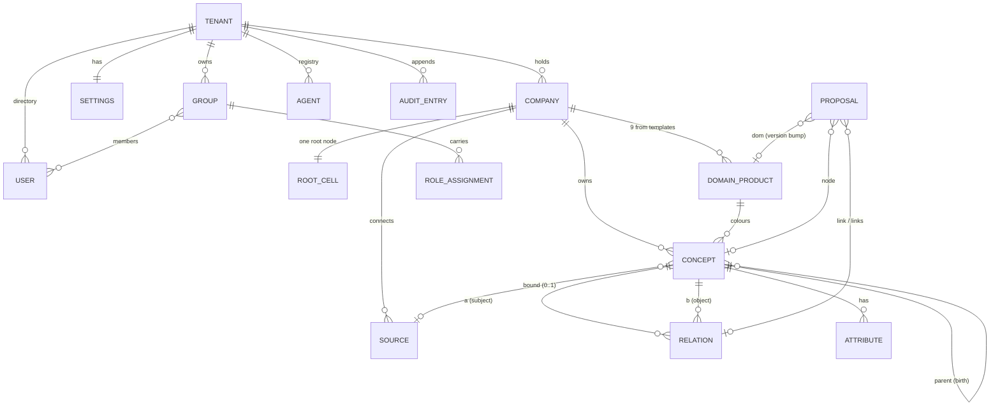
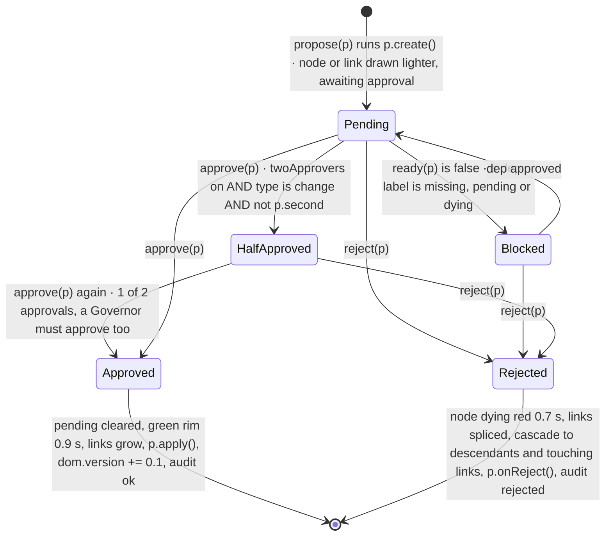
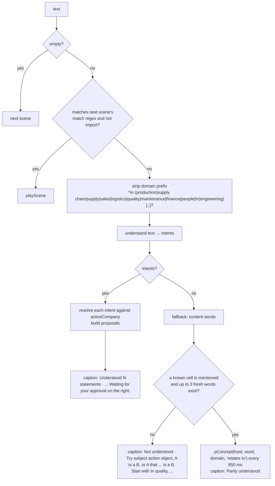

# Ontaix Studio — Requirements Addendum

This addendum is extracted from `reference/ontaix-studio-reference.html` (the UI contract, 1101 lines, about 228 KB). Every statement cites the JavaScript function, constant or CSS rule that implements it, with the approximate line number in the reference file written as `L<n>`. The architect turns this document into the OpenAPI spec, the database schema, the event catalogue and the design tokens. Where the reference leaves something open, or contradicts `docs/ui-contract.md`, the item is listed in the last section as an ambiguity for the owner to decide.

Reading guide: the reference keeps the whole model in two arrays, `nodes` and `links` (`L250`), plus `companies`, `DOMAINS`, `proposals`, `AUDIT`, `OGROUPS`, `USERS`, `AGENTS` and one `SETTINGS` object. Everything the canvas draws and everything the admin portal lists is derived from those. The persisted shape is `serialize()` at `L1073`, the persistence key is `ontaix-demo-state-v1` (`L1072`).

Sections:

1. Domain Model
2. Proposal Contract
3. Teach Bar Parser
4. Canvas Behaviours: Suggest, Focus, Hover, Arrange, Coverage, Lineage
5. Admin Portal
6. Keyboard Shortcuts, Persistence Keys And Theme Tokens
7. Seed Data: Northwind And Aurora
8. What The API Must Provide
9. Ambiguities For The Owner

## 1. Domain Model

The demo has three node kinds (`root`, `concept`, `source`) and five link kinds (`rel`, `isa`, `same`, `clash`, `bind`). Companies, domain products, proposals, audit entries, groups, users, roles, agents and settings are separate structures. Identifiers in the demo are in-memory integers (`nid` for nodes at `L250`, `pid` for proposals at `L569`, positional index for persisted nodes at `L1073`); the API replaces them with stable ids. The tables below list fields exactly as the demo stores them, then the persisted subset.

### 1.1 Company

Created by `addCompany(name, sub)` at `L268`.

| Field | Type | Source | Notes |
|---|---|---|---|
| `key` | string | `L268` | `name.toLowerCase().replace(/[^a-z0-9]+/g,'-')`; used as the `<select id="companySel">` option value and looked up by the Acquisition scene as `'aurora-valves'` (`L812`) |
| `name` | string | `L268` | Display name; drawn uppercase as the company header (`L360`) |
| `sub` | string | `L268` | One line of context, for example `industrial pumps · 4 plants · 2,300 people` |
| `x`, `y` | number | `layoutCompanies` `L267` | Companies sit on one horizontal row, gap `2*DOMAIN_R+1100` (2432 px) |
| `domains` | DomainProduct[] | `L268` | Always the nine templates, copied per company |
| `root` | Node | `L269` | The single `kind:'root'` node, `fixed:true`, colour `C.root` `#d8deee`, label = company name, sub = company sub |

Persisted: `name`, `sub`, `domains[]{key, version, hidden}` (`L1074`). Position is recomputed. The first company cannot be removed from the Companies page (`i>0` guard at `L1013`); removal of any other company is a `change` proposal (`L1049`). `activeCompany` is the company being taught, switched by the company select or by clicking one of its cells (`setActive` `L618`).

### 1.2 Domain Product

Nine fixed templates, `DOMAIN_TEMPLATES` at `L255`, instantiated per company at `L268` with `version:1.0, hidden:false`.

| key | name | owner | colour |
|---|---|---|---|
| `production` | Production | Plant operations | `#3fb8a9` |
| `supply` | Supply chain | Procurement | `#8b86cf` |
| `sales` | Sales | Commercial | `#d9a15b` |
| `logistics` | Logistics | Distribution | `#d98b6b` |
| `quality` | Quality | Quality assurance | `#cf7d98` |
| `maintenance` | Maintenance | Asset management | `#7fb6d9` |
| `finance` | Finance | Controlling | `#b9b36a` |
| `people` | People | Human resources | `#8fbf7a` |
| `engineering` | Engineering | R&D | `#c58ad0` |

Per-company fields: `key`, `name`, `owner`, `color`, `company`, `version` (float, starts `1.0`, displayed `v${version.toFixed(1)}`), `hidden` (boolean, the Enable/Disable switch in the domains card and the "Visible" column of the Domain products page). Colour is tenant-wide: `applyColors` (`L986`) writes `SETTINGS.colors[key]` into every company's domain of that key and into every member cell. A domain product "exists" for lists and headers only when at least one non-dying node has `domain===d` (`L367`, `L957`, `L1014`). Domain centre: on a ring of radius `DOMAIN_R = max(470, 9*74) = 666` around the company, angle `-π/2 + i*2π/9` by template index (`L273`).

Persisted per company: `key`, `version`, `hidden` (`L1074`). Colour overrides persist through `SETTINGS.colors`.

### 1.3 Concept (Cell)

Created only by `divide(parent, label, color, o)` at `L304`, never directly (`addNode` at `L275` is the raw constructor used by `divide`, `addCompany`, `addSource` and `restore`).

| Field | Type | Notes |
|---|---|---|
| `id` | int | `nid++` |
| `label` | string | Unique per company by case-insensitive lookup (`find` `L277`) |
| `sub` | string | Root: company sub. Specialisation: the rule text, set 900 ms after birth (`L599`). After conflict resolution: `failed inspection · certified` or `scrapped · certified` (`L803`). Drawn under the label in the domain colour (`L463`) |
| `kind` | `'root' \| 'concept' \| 'source'` | |
| `domain` | DomainProduct or null | Root has none |
| `company` | Company | |
| `color`, `finalColor`, `cloneColor` | hex | `cloneColor` = parent colour at birth, `finalColor` = domain colour, `color` interpolates over 0.25 s (`L318`) |
| `pending` | boolean | `awaiting approval`; drawn at alpha 0.62 (`L451`) |
| `conflict` | boolean | Two specialisations of one parent with the same label; drawn pulsing toward `C.conflict` and jittered (`L326`, `L451`) |
| `_rule` | string | The specialisation rule, for example `> 5,000 h since last service` |
| `parent` | Node | Birth parent (`L307`) |
| `birthLink` | Link | The `isa` or `rel` link created at birth (`L307`) |
| `bornAt` | Date | Set at birth (`L307`), shown in the lineage drawer as `dd MMM HH:mm` en-GB (`L655`) |
| `bound` | `{source, records, fresh}` or null | See 1.6 |
| `attrs` | Attribute[] | See 1.7 |
| `x`, `y`, `vx`, `vy`, `r`, `rt`, `alpha`, `labelAlpha`, `seed`, `fixed`, `pinned`, `drag`, `split`, `diff`, `recoil`, `tween`, `flash`, `dying` | physics / animation | `CELL = 24` radius (`L250`). `pinned` survives Arrange (`L324`) and is persisted |

Lifecycle: `proposed` (node exists, `pending:true`, alpha 0.62, label "awaiting approval") → `approved` (`pending:false`, green rim flash 0.9 s) or `rejected` (`dying:{color:RED}`, shrinks 30 percent and fades over 0.7 s, then removed with all its links at `L328`). A concept is `certified` when its `sub` contains "certified" (derived, Entities page `L991`). A concept is a `specialisation` when it has an outgoing `isa` link (`L991`). Deletion of an approved concept is a `change` proposal whose `apply` sets `dying` on the node and every descendant (`proposeDeleteNode` `L990`). Rename is a `change` proposal whose `apply` sets `label` (`proposeRename` `L989`).

Persisted (`L1075`): `label`, `sub`, `kind`, `color` (final), `x`, `y` (rounded), `dom` (key), `co` (company index), `pending`, `rule`, `conflict`, `pinned`, `ai`, `parent` (index), `bornAt` (epoch ms), `bound {src index, records, fresh}`, `attrs` (approved only). Dying nodes are skipped.

### 1.4 Relation (Link)

Created by `addLink(a, b, kind, rest, label)` at `L276`.

| Field | Type | Notes |
|---|---|---|
| `a`, `b` | Node | Direction a → b; the arrowhead is drawn at b (`L388`) |
| `kind` | `'rel' \| 'isa' \| 'same' \| 'clash' \| 'bind'` | `rel` = action relation, `isa` = specialisation (dashed `[6,5]`, a is the child, b the parent, label `is a`), `same` = equivalence across companies (dotted `[2,5]`, two arrowheads, label `equivalent to`), `clash` = conflict (jittered red line, label `conflicts with`, never proposed, created by `afterApply` `L586`), `bind` = source feeds concept (a is the source, label `bound to`) |
| `label` | string | The action, lower case, shown in a chip at the midpoint (`L394`) |
| `rest` | number | Spring rest length: `isa` 170 same domain / 300 cross domain; `rel` 220 / 330; cross-company 560; `bind` 300; `clash` 130 (`L307`, `L600`, `L604`, `L586`) |
| `pending` | boolean | Drawn at alpha ×0.55 (`L381`); chips of pending links are not clickable (`L489`) |
| `born`, `alpha`, `grow`, `pulses`, `seed`, `_chip`, `dying` | animation | `grow` traces the line over 0.3 s; `seed` bends the curve by `(seed-0.5)*0.3` (`L341`) |

Lifecycle: `pending` → approved (`pending:false`, `grow` restarts) or rejected (spliced out of `links` immediately, `L582`). Removing an approved relation is a `change` proposal whose `apply` sets `dying` and splices after 700 ms (`deleteLink` `L714`). Editing action or direction is a `change` proposal whose `apply` rewrites `label` and swaps `a`/`b` (`submitLink` `L723`). `isa` and `same` links cannot be relabelled (`structural` at `L709`); reversing an `isa` is allowed and submits at once (`L711`).

Persisted (`L1076`): `a`, `b` (node indices), `kind`, `rest`, `label`, `pending`.

### 1.5 Equivalence

Not a separate entity: an equivalence is a `same` link created by `pEquiv(labelA, companyA, labelB, companyB)` at `L607`, which calls `pRelation(a,'equivalent to',b)`. It is only allowed when `SETTINGS.crossCompany` is on (`L600`); otherwise a toast `Not allowed · companies may not interact · enable it in the admin portal` appears. The Companies page counts `same` links touching a company as "Equivalences" (`L1013`).

### 1.6 Source And Binding

A source is a node of `kind:'source'` created by `addSource(company, label, kind)` at `L279`: `sub` = kind text (`ERP`, `CRM`, `manufacturing execution`, ...), radius 16, colour `BRASS`, anchored outside the domain ring at radius `DOMAIN_R+360` and angle `-π/2 + π/9 + ai*2π/8` where `ai` is the source index within the company (max eight distinct anchors). Extra fields set by the wizard (`L1067`): `_type` (catalogue code such as `SAP`), `_host`, `_scope`; and `disabled` (boolean, set by the Data sources Enable/Disable toggle at `L1039`). A pending source draws at alpha 0.62 and shows `awaiting approval` under its label; a disabled one at alpha 0.45.

A binding is stored on the concept: `n.bound = { source, records, fresh }` (`L605`) plus a `bind` link from the source to the concept. `records` comes from `RECORDS[label]` (`L300`) or a random `800..9800`; `fresh` is one of `'2 min'`, `'4 min'`, `'11 min'`, `'1 h'` at binding, `'paused'` when the source is disabled, `'2 min'` when re-enabled, `'just now'` after "Refresh all" (`L1039`, `L1041`). A concept has at most one binding. Unbind is a `change` proposal (`L1007`); removing a source is a `change` proposal that nulls every `bound` pointing at it (`L1040`).

Persisted: source nodes as nodes with `ai`; `bound {src, records, fresh}` on the concept; `bind` links. Not persisted: `_type`, `_host`, `_scope`, `disabled` (see ambiguities).

### 1.7 Attribute

`{ name, type, col, fill, state }` on `n.attrs` (`L605`, `L606`). `type` is one of `id`, `text`, `number`, `ref`, `date`; `col` is the source column path such as `sap.mara.matnr`; `fill` is the percentage of rows filled (0–100); `state` is `approved` or `proposed`. On binding approval the attribute spec comes from `ATTR[label]` (`L280`, 16 concepts) or `generic(label)` (`L299`: `<slug>_id`, `name`, `created_at`, `status`). Entries flagged `'new'` in the spec are not written as approved; each becomes an `attr` proposal (`pAttr`) and, if `SETTINGS.autoAttrs` is on, is approved immediately. Rejecting an `attr` proposal removes the attribute. Only approved attributes persist (`L1075`).

### 1.8 Proposal

`propose(p)` at `L573`. Fields, as built by the helpers at `L598`–`L607`, `L715`, `L724`, `L802`, `L989`, `L990`, `L1007`, `L1040`, `L1049`:

| Field | Type | Notes |
|---|---|---|
| `id` | int | `pid++` |
| `type` | `concept \| spec \| relation \| change \| source \| bind \| attr` | Panel heading text: New concept, Specialisation, Relation, Change, Data source, Binding, Attribute (`L590`); suffixed with ` · <domain name>` when `dom` is set and type is not `relation` |
| `title` | string | Audit "what" text and toast text |
| `color` | hex | Dot colour in the panel: domain colour, `#a9b3cc` neutral, `BRASS`, or `C.conflict` for deletions |
| `dom` | DomainProduct or null | The domain whose version increments on approval |
| `company` | Company | Used by `ready()` to resolve label dependencies |
| `parentLabel` | string | Concept and spec proposals |
| `deps` | (string \| () => boolean)[] | A string dep means "a non-pending, non-dying node with this label exists in the company"; a function dep is evaluated (`ready` `L574`) |
| `waitFor` | string | Shown as `after <waitFor>` when blocked |
| `html` | string | Rich one-line description |
| `why` | string | Small grey line under the description |
| `caption` | string | Canvas caption spoken on approval |
| `node`, `link`, `links` | refs | What the proposal created in pending state |
| `second` | boolean | Set after the first click when `twoApprovers` is on and type is `change` |
| `create()`, `apply()`, `onReject()` | functions | `create` runs at propose time and makes the pending node/link; `apply` runs on approval; `onReject` on rejection |

Proposals are not persisted (`restore` at `L1087` says "Pending proposals were not kept"). See ambiguities: pending nodes and links are persisted, which leaves orphaned "awaiting approval" cells after a reload.

### 1.9 Audit Entry

`audit(kind, what, ok)` at `L910`: `{ t: Date, kind, what, ok }`, prepended, capped at 400. `kind` is the proposal type for approvals and rejections, or one of `setting`, `groups`, `roles`, `source`, `company`, `demo`, `list`. `ok` renders as `approved` (green `#4fc98f`) or `rejected` (`--conflict`); every non-proposal entry passes `true`. The page shows the newest 120, time as `toLocaleTimeString('en-GB')` (`L1034`). Not persisted.

### 1.10 User

`USERS` at `L935`: 180 deterministic records from a seeded generator: `{ id, name, email, dept, company }`. `dept` is one of Production, Supply chain, Sales, Logistics, Quality, Maintenance, Finance, People, Engineering, IT. Every fifth user belongs to Aurora Valves with an `@auroravalves.com` address; the rest to Northwind Industries with `@northwind.com`. Users are read-only in the portal; roles are derived from group membership (`L1029`). Not persisted (regenerated).

### 1.11 Group And Role Assignment

`OGROUPS` at `L936`, defaults at `defaultGroups()` `L937`: `{ id, name, desc, members: userId[], roles: {role, scope}[] }`. Role names `ROLE_NAMES = ['Owner','Builder','Governor','Member','Administrator','Auditor']` (`L1016`); scopes `SCOPES() = ['Tenant', ...company names, ...domain template names]` (`L1015`). A group may hold the same role on several scopes; duplicates of `{role, scope}` are refused (`L1028`). Groups persist (`L1074`). Group, membership and role changes are immediate and audited, not proposals.

Default groups:

| Group | Description | Members | Roles |
|---|---|---|---|
| Plant operations · owners | Owns the Production domain product | first 4 of Production | Owner · Production |
| Procurement · builders | Models and binds Supply chain | first 6 of Supply chain | Builder · Supply chain |
| Commercial · owners | Owns Sales | first 3 of Sales | Owner · Sales |
| Governance board | Second approver for certification, deletions and conflicts | 2 Quality + 1 Finance + 1 IT | Governor · Tenant |
| Data platform team | Connects sources, administers the portal | first 5 of IT | Administrator · Tenant, Builder · Tenant |
| All employees | Reads the model | everyone | Member · Tenant |
| PE due-diligence team | Time-boxed read access across the portfolio | first 3 of Finance | Auditor · Tenant |

Role descriptions shown on the Roles page (`L1033`): Owner "Owns one or more domain products. Approves and certifies changes in them."; Builder "Models, binds and connects. Proposes; cannot approve alone."; Governor "Second approver for certification, deletions and conflict resolutions."; Member "Reads the model, asks questions, comments. Can teach if enabled."; Administrator "This portal: settings, sources, companies, groups."; Auditor "Read-only, time-boxed access to the model and the audit log."; Agent "Machine identity. Reads the certified model through the gateway; every read is logged." The demo does not enforce any role on any action.

### 1.12 Agent And Cost Record

`AGENTS` at `L946`: 2400 deterministic records `{ id, name, platform, domain, owner, reads, cost, on, _kind:'agents' }`. Platforms: Microsoft Agent 365, Salesforce Agentforce, Databricks Genie, Snowflake Cortex, Amazon Bedrock, Google Cloud, Custom · Claude, ServiceNow, SAP Joule, Fabric IQ. Name pattern `<first word of domain> <role> <n>` with roles assistant, planner, copilot, analyst, monitor, router, summariser, forecaster, dispatcher, auditor. `reads` is a monthly read count; `cost` is euros for the month; `on` is access (about 92 percent on). Toggling access is immediate and audited as kind `agents`. Cost management KPIs (`L1035`): measured = sum of cost of agents with access; allocated = `round(measured*1.35/1000)*1000` or 3000; agents registered / with access; model reads. "By platform" table sorted by cost descending with share percent. Not persisted.

### 1.13 Tenant Settings

`SETTINGS` at `L909`, persisted whole (`L1074`):

| Key | Default | Where it acts |
|---|---|---|
| `theme` | `'dark'` | `applyTheme`, `data-theme` attribute |
| `colors` | `{}` | Domain colour overrides by key |
| `accent` | `#3fb8a9` | `--accent` custom property |
| `source` | `#d6bd8a` | `BRASS` (sources, bindings, attributes) |
| `voice` | true | Shows the microphone button |
| `importDocs` | true | Shows the Import button |
| `liveTeaching` | true | Enables the teach input; placeholder `Live teaching is disabled in the admin portal` when off |
| `everyoneTeaches` | false | Displayed only |
| `approvalRequired` | true | Locked on ("Always on") |
| `twoApprovers` | false | Second click needed on `change` proposals |
| `autoAttrs` | false | Discovered attributes auto-approved |
| `notifyOwners` | true | Displayed only |
| `multiCompany` | true | Shows the Company button |
| `crossCompany` | true | Cross-company relations and equivalences allowed; disabling requires typing `disable` |
| `animations` | true | Inverse of `SKIP`; `applySettings` keeps them in sync (`L953`) |
| `coverageDefault` | false | Displayed only |
| `legend` | true | Shows the legend and its toggle |
| `readOnlyConnectors` | true | Locked on |
| `refresh` | `'15 min'` | Options `5 min`, `15 min`, `1 h`, `daily`; default for the wizard |
| `agentAccess` | true | Agent count on the Roles page reads 0 when off |
| `costCap` | true | Displayed only |

### 1.14 Appearance

Appearance is part of `SETTINGS`: `theme`, `colors` (nine domain keys), `accent`, `source`. "Reset to defaults" restores `colors={}`, accent `#3fb8a9`, source `#d6bd8a` (`L1052`). `DEFAULT_COLORS` at `L980` is the template map.

### 1.15 Camera And View State

Not an entity but part of "everything persists": `COVERAGE` (boolean) and `sceneIdx` are persisted (`L1074`); the panel-off, legend-off and domains-card-off states, `SKIP`, zoom and focus are not. Restore drops state older than 12 hours or with fewer than two nodes (`L1078`).

## 2. Proposal Contract

Nothing enters the model without approval (`L568`). Every mutation path in the demo goes through `propose()` except: cross-company link removal when the "Companies may interact" switch is turned off (`L965`, explicitly "without a proposal"), group / membership / role edits, source enable/disable/reconfigure, agent access toggles, appearance and settings, and the automatic `clash` link (`L586`).

### 2.1 States And Transitions

Rules, with citations:

- `ready(p)` (`L574`): every dep must hold. A string dep resolves `find(label, company)` and requires the node to exist, not be pending and not be dying. Function deps are called. Blocked proposals render with class `blocked` (opacity 0.7), the Approve button disabled and the text `after <waitFor>`.
- `approve(p, bulk)` (`L575`): returns if not ready. If `SETTINGS.twoApprovers` and `p.type==='change'` and not `p.second`: set `second`, append `1 of 2 approvals · a Governor must approve too` to `why`, re-render, stop. Otherwise remove from `proposals`, `audit(p.type, p.title, true)`, toast `Approved <title>` unless bulk, clear `pending` on `node`/`link`/`links`, flash the node green (`GREEN #4fc98f`, softer when bulk), restart `grow` on `links`, call `apply()`, then `dom.version = round((version+0.1)*10)/10`, caption, `afterApply()`.
- `reject(p)` (`L580`): remove, `audit(p.type, p.title, false)`. If `node`: mark `dying` red, clear pending, then reject every other proposal whose node `descends()` from it (`L584`: walk up through `isa` a→b or `rel` b←a, max 50 hops) and every proposal whose `link` touches it. If `link`/`links`: splice them out at once. Call `onReject()`. Caption `Rejected · <title> was not kept. The model only holds what its owners approved.`
- `afterApply()` (`L585`): when two approved `isa` children of the same parent share a label and are not yet in conflict, after 3600 ms both get `conflict=true` and a `clash` link (`conflicts with`, rest 130) is added; caption `The model noticed · Two departments use the same name for different things...`.
- Approve all (`L595`): loop `while (proposals.some(ready))` up to 200 rounds approving every ready proposal in bulk mode, then caption `Approved · All pending proposals are now part of the model.` The button is disabled when nothing is ready.
- Reject all (`L596`): reject every proposal; caption `Rejected · All pending proposals were discarded.` Disabled when the list is empty.
- Finalise all (`L558`): turns Skip on, plays every remaining scene, after each scene runs six rounds of bulk approval, then six more rounds, captions `Finalised · N companies, N concepts, N bound to data, N equivalences. Everything approved.`, toasts, `audit('demo','finalised all scenes',true)`, saves, then restores the previous Skip state. Button label reads `Building…` while running.
- Skip animation (`toggleSkip` `L555`): `SKIP` flag; button label toggles `Skip animation` / `Animations off`, `aria-pressed`. With SKIP on: division lasts 0.02 s, colour and line growth are instant, `wait()` resolves immediately, no recoil.
- Two-approver mode applies only to `type:'change'` proposals (renames, deletions, unbinds, relation edits and removals, conflict resolution, company and source removal). Concept, spec, relation, source, bind and attr proposals never need a second approval. The second approval is a second click by any user; no role is checked.

### 2.2 Versioning Of Domain Products

Every company's domain product starts at `1.0`. On approval, if `p.dom` is set, `version` increases by `0.1` (one decimal, `L578`), displayed `v1.1`, `v1.2`, ... in the domain header (`L375`), the drawer (`L640`) and the Domain products page (`L1014`). Proposals that carry `dom`: `concept` (the target domain), `spec` (the target domain), `relation` (the subject's domain, `L600`), `change` from rename / delete concept / edit relation / remove relation / unbind (the concept's or subject's domain). Proposals without `dom` (no bump): `source`, `bind`, `attr`, the conflict-resolution `change` (`L802`), source removal (`L1040`), company removal (`L1049`). Version is persisted per company and domain. See ambiguity A2: `docs/ui-contract.md` says "+1".

### 2.3 What Each Proposal Type Creates

| Type | Builder | Pending artefacts | `apply()` | `deps` |
|---|---|---|---|---|
| `concept` | `pConcept(parentLabel, label, domainKey, pred, cap, company, reverse)` `L598` | Node by `divide()` with `pending`, plus its birth `rel` link (`parent pred child`, or `child pred parent` when `reverse`) | none | `[parentLabel]` |
| `spec` | `pSpec(parentLabel, label, rule, cap, domainKey, company)` `L599` | Node by `divide(..., {isa:true})`, `isa` link child→parent labelled `is a`; `sub` set to rule after 900 ms | none | `[parentLabel]` |
| `relation` | `pRelation(a, pred, b, cap, company)` `L600` | Link `rel`, or `isa` when pred is `is a`, or `same` when pred is `equivalent to` | none | both ends not pending/dying |
| `source` | `pSource(company, label, kind, cap)` `L601` | Source node pending | none | none |
| `bind` | `pBind(company, sourceLabel, conceptLabels, cap)` `L602` | One `bind` link per target, pending | sets `bound` on each target, writes approved attrs, proposes `new` attrs | source and all targets not pending |
| `attr` | `pAttr(n, spec)` `L606` | Attribute pushed with `state:'proposed'` | `state='approved'` | none |
| `change` | inline `propose({type:'change', ...})` | nothing drawn | rename / delete / edit relation / remove relation / unbind / remove source / remove company / resolve conflict | varies |

Panel row layout (`L591`): a coloured dot (`spec` = hollow ring, `relation`/`bind` = short bar), kind heading, `html`, optional `why`, buttons `Approve` (class `ok`, accent) and `Reject` (class `no`), and the `after …` note when blocked. The panel header shows `Proposed changes <count>`; with the panel hidden the top-right button reads `Show changes (N)`.

## 3. Teach Bar Parser

The teach bar is `<form class="bar" id="bar-form">` (`L202`): a company select (hidden when there is one company), the text input `#say`, the microphone, `Teach` (submit) and `Next` (primary, plays the next story scene). Submitting calls `teach(text)` (`L864`); an empty submission plays the next scene. Import (`L889`) feeds every sentence of a document through `teach(sentence, true)` with a 450 ms pause.

### 3.1 Pipeline

Domain prefix (`L865`): `hr` maps to `people`; `supply` and `supply chain` map to `supply`. The prefix is removed from the text and the key is used as `domKey` for every intent in the sentence.

### 3.2 Lexicon

- `STOP` (`L841`): stop words removed in the fallback path.
- `DET` (`L843`): determiners stripped repeatedly (max 4) from the start of a noun phrase: `a an the each every all our its their some many any one this that these those of new`.
- `VERBS_LEX` (`L844`): about 150 canonical predicates, multi-word first (`is a kind of`, `is a type of`, `is part of`, `is made of`, `is made from`, `consists of`, `is composed of`, `is executed on`, `is executed by`, `is placed by`, `is bought from`, `is sold to`, `is stored in`, `is produced by`, `is produced in`, `is checked by`, `is inspected by`, `is monitored by`, `is handled by`, `is managed by`, `is owned by`, `is defined by`, `is validated by`, `is scheduled by`, `is staffed by`, `is billed by`, `is charged to`, `is fulfilled by`, `is delivered by`, `is shipped as`, `is grouped in`, `is limited by`, `is priced from`, `is earned through`, `is governed by`, `is followed by`, `is preceded by`, `belongs to`, `reports to`, `depends on`, `delivers to`, `sells to`, `buys from`, `leads to`, `results in`, `applies to`, `refers to`, `runs in`, `runs on`, `works in`, `works on`) then single verbs (`operates`, `manages`, `owns`, `produces`, `makes`, `builds`, `creates`, `generates`, `uses`, `consumes`, `needs`, `requires`, `contains`, `includes`, `has`, `have`, `holds`, `runs`, `executes`, `places`, `receives`, `sends`, `ships`, `delivers`, `stores`, `tracks`, `records`, `monitors`, `measures`, `checks`, `inspects`, `validates`, `tests`, `triggers`, `starts`, `schedules`, `plans`, `assigns`, `employs`, `trains`, `certifies`, `serves`, `supplies`, `provides`, `feeds`, `defines`, `specifies`, `updates`, `evolves`, `issues`, `pays`, `invoices`, `bills`, `approves`, `raises`, `handles`, `follows`, `precedes`, `supports`, `maintains`, `repairs`, `replaces`, `installs`, `packs`, `loads`, `routes`, `processes`, `transforms`, `assembles`, `welds`, `paints`, `moves`, `carries`, `transports`, `fulfils`, `fulfills`, `covers`, `governs`, `groups`, `limits`, `prices`, `signs`, `opens`, `closes`). The port must copy the list verbatim.
- `CANON` / `VARIANTS` (`L845`): for `is …` forms an `are …` variant maps back to the `is` form; for single verbs the plural-less form is generated (`has`→`have`, `-ies`→`-y`, `-(ch|sh|ss|x|z)es`→ stem, `-s` → stem, only if longer than 2 characters). `VERB_RE` (`L846`) is the alternation of all variants, longest first, word-bounded, whitespace-tolerant.
- `singular` (`L847`): `ies`→`y`, `(ch|sh|s|x|z)es`→ stem, trailing `s` (not `ss`) removed.
- `cleanNP` (`L848`): trim, strip trailing `.!?,;:` and leading `,;:`, strip determiners, singularise the last word.
- `resolve(np, company)` (`L849`): `find(Title(np))`, else case-insensitive label match in the company, else singular/plural match against non-source nodes.
- `splitList` (`L850`): split on `,`, ` and `, ` or `, then `cleanNP` each part.
- `title` (`L842`): capitalise the first character only.

### 3.3 Grammar (`understand`, `L851`)

The text is lower-cased, whitespace-collapsed and stripped of trailing `.!?`. Patterns are tried in order; the first two return immediately.

| # | Pattern (regex as written) | Intent |
|---|---|---|
| 1 | `^(.+?)\s+(?:that\|who\|which)\s+(.+?)\s+(?:is\|are)\s+(?:a \|an \|the )?(.+)$` | `spec` with `subj = cleanNP(m[3])` (the new specialised concept), `rule = m[2]`, `obj = cleanNP(m[1])` (the parent). Example: "a machine that has run 5,000 hours is a machine due for maintenance" |
| 2 | `^(.+?)\s+(?:is\|are)\s+(?:a \|an )?(?:kind of \|type of \|sort of )?(.+)$` and `m[2]` contains no lexicon verb and no ` by/in/on/to/of/from/with ` | `spec` with `subj = cleanNP(m[1])`, `obj = cleanNP(m[2])`. Example: "operators are employees" |
| 3 | Clause split on `;`, on `, [and] <determiner>`, on ` and <determiner>` (`L859`); per clause the first lexicon verb whose left side is a non-empty NP | `rel` with `subj = cleanNP(left)`, `pred = CANON[verb]`, objects from the right side |
| 3a | Right side matching `^(.*?)\s+(to\|into\|from\|in\|on\|at\|with\|through\|for)\s+(.+)$` with a non-empty first NP | Two sets of `rel` intents: for each object in `splitList(pp[3])` the predicate is `<pred> <preposition>`; then for each object in `splitList(pp[1])` the predicate is `<pred>`. Example: "a line runs work orders in shifts" gives `Line runs in Shift` and `Line runs Work order` |
| 3b | Otherwise | One `rel` per `splitList(rest)` object |

Passives are handled by the lexicon: `is produced by`, `is checked by`, and so on are canonical predicates, so "products are checked by inspections" yields `Product is checked by Inspection` with the subject kept on the left (no argument swap).

### 3.4 What Becomes A Proposal (`teach`, `L866`–`L879`)

With `co = activeCompany`, `dk = domKey`:

| Intent | Subject resolves | Object resolves | Proposal(s) |
|---|---|---|---|
| `spec` | child found | parent found | `pRelation(child, 'is a', parent)` |
| `spec` | child missing | parent found | `pSpec(parent, Title(subj), rule, cap, dk, co)` |
| `spec` | child found | parent missing | `pConcept(child, Title(obj), dk ?? child.domain ?? 'production', 'is a kind of', reverse=true)` (new parent hangs off the child) |
| `spec` | neither | neither | `pConcept(root, Title(obj), dk ?? 'production', 'has')` then `pSpec(Title(obj), Title(subj), rule)` |
| `rel` | a found | b found | `pRelation(a, pred, b)` (skipped when a is b) |
| `rel` | a found | b missing | `pConcept(a, Title(obj), dk ?? a.domain ?? 'production', pred)` |
| `rel` | a missing | b found | `pConcept(b, Title(subj), dk ?? b.domain ?? 'production', pred, reverse=true)` |
| `rel` | neither | neither | `pConcept(root, Title(subj), dk ?? 'production', 'has')` then `pConcept(Title(subj), Title(obj), dk ?? 'production', pred)` |

Nothing is ever created silently: unresolved names become pending cells born from the nearest resolved cell or from the company root. The caption lists each statement as `A pred B`, `A pred B (new)`, `A (new) pred B` or `A pred B (both new)`.

### 3.5 Story Interception

`teach` first checks the next scene's `match` regex (`L864`); a matching sentence plays that scene instead of being parsed. The regexes are, per scene: Production `/plant|production line|machine|shift/i`; Supply chain `/material|supplier|purchase|warehouse|stock/i`; Sales `/customer|sales order|quotation|price/i`; Logistics `/delivery|shipment|carrier|route/i`; Quality and maintenance `/inspection|defect|maintenance|hours|sensor/i`; Finance and people `/invoice|cost centre|budget|employee|training|certification/i`; Engineering `/specification|engineering|test|design/i`; Two products, one word `/defective|scrap|failed/i`; Resolution `/keep|both|kind of/i`; Wired to reality `/connect|system|sap|mes|wired|bind/i`; Acquisition `/acqui|aurora|buy|merge/i`; Align vocabularies `/align|means|equivalent|same/i`; Due diligence `/diligence|aurora.*erp|what is real|coverage/i`; It keeps learning `/keeps|learning|every/i`. This is demo behaviour; whether the product keeps a scripted story is ambiguity A9.

### 3.6 Voice And Import

- Voice (`L1091`): Web Speech API, `lang` = `fr-FR` when `navigator.language` starts with `fr`, else `en-GB`; interim results shown in the input; the final result is passed to `teach`. The header `Listening` status pill (`.status.on`) shows while recording. When unavailable the mic button is dimmed to opacity 0.4 with title `Voice input is not available in this browser`.
- Import (`L891`): `.docx` through mammoth 1.8.0, `.pdf` through pdf.js 3.11.174 (both loaded from cdnjs on demand), `.csv` cells joined by spaces and rows by `. `, everything else as text. `sentencesOf` (`L896`) splits on sentence punctuation or newlines and keeps sentences between 13 and 399 characters. Drag-and-drop anywhere on the page imports the first file (`L906`). Accepted extensions: `.txt,.md,.csv,.json,.docx,.pdf`.

## 4. Canvas Behaviours: Suggest, Focus, Hover, Arrange, Coverage, Lineage

### 4.1 Suggest Action (`suggestAction`, `L674`)

Order, returning the first hit:

1. If both nodes are known: the most common `rel` label the subject already uses toward other cells in the object's domain (`mostCommon` over `links` with `l.a===subjNode && l.b.domain===objNode.domain && l.b!==objNode`).
2. `DOES` (`L670`): the first regex matching the subject's lower-case name, keyed on the subject. Table, in order: `discount|promotion|coupon|rebate|price list|tariff|rate` → `applies to`; `customer|client|account|buyer` → `places`; `supplier|vendor|carrier|provider` → `supplies`; `order|requisition|quotation|request|demand` → `contains`; `invoice|bill|payment|credit note|ledger` → `bills`; `inspection|test|audit|check|review` → `checks`; `plan|schedule|forecast|calendar` → `schedules`; `standard|policy|rule|regulation|norm|contract|specification` → `governs`; `warehouse|store|depot|site|plant|location` → `stores`; `shipment|delivery|route|transport` → `delivers`; `employee|operator|staff|technician|worker|team` → `works on`; `sensor|meter|gauge|monitor` → `monitors`; `alarm|defect|incident|complaint|non-conformity|claim` → `concerns`; `machine|equipment|asset|line|tool|robot` → `produces`; `material|component|part|ingredient` → `used in`; `product|article|item|good|sku` → `sold as`; `certification|training|skill|qualification` → `qualifies`; `report|document|drawing|record` → `describes`; `budget|cost centre|fund` → `funds`; `shift|batch|lot|campaign|run` → `produces`; `region|category|family|segment|group` → `groups`; `bill of materials|bom|recipe|formula` → `defines`; `work order|job|task|ticket` → `executes on`.
3. `DONE_TO` (`L672`): the first regex matching the object's name. In order: `order|requisition|quotation|request` → `places`; `line|machine|equipment|asset|tool|sensor` → `has`; `material|component|part|ingredient` → `uses`; `product|article|item|good` → `produces`; `customer|client|account` → `serves`; `supplier|vendor|carrier` → `bought from`; `plan|schedule|forecast|budget` → `scheduled by`; `inspection|test|audit|check` → `checked by`; `invoice|payment|credit note|ledger` → `billed by`; `employee|operator|staff|technician|worker` → `staffed by`; `warehouse|site|plant|store|location` → `located in`; `report|document|specification|drawing|contract` → `described by`; `defect|incident|alarm|non-conformity|complaint` → `raises`; `delivery|shipment|route` → `shipped as`; `certification|training|skill` → `requires`; `shift|batch|lot|campaign` → `runs in`; `region|category|family|segment` → `grouped in`; `cost centre|account` → `charged to`; `standard|policy|rule|regulation|norm` → `complies with`; `bill of materials|bom|recipe` → `defined by`; `discount|promotion|coupon` → `eligible for`.
4. Most common `rel` label the subject uses toward anything; then the most common incoming label on the object.
5. `relates to`.

The suggestion is written into the action input, focused and selected; it is never submitted by itself (`L685`, `L686`). In the new-concept box the name must be typed first (toast `Name first · the suggestion depends on the new concept’s name`).

### 4.2 Hover, Click, Focus (`L477`–`L504`)

- Hit testing: a cell is hit within `r*1.5` (sources `r*1.9`) in world space (`hit` `L488`); a link chip within its measured radius + 6 (`hitChip` `L489`, pending and clash chips excluded); a domain region by `hitDomain` (`L481`): the point is inside the hull polygon of the domain's members grown by 86 px; when several domains match, the one whose nearest member is closest wins (the "nearest-cell rule").
- Hover: `focusSet = neighbours(n)` (the cell and every linked cell, `L302`); everything else draws at alpha 0.2 (`dimOf` `L337`); the hovered cell's label goes bold and its rim brighter. Leaving restores `stickyFocus`.
- Click on a non-root cell without moving more than 3 px: `focusOnCell(n)` sets sticky focus to its neighbourhood (unless lineage is showing), clears domain focus, opens the drawer. Clicking any cell also makes its company the active one (`setActive`).
- Click on the root cell: same, drawer shows company summary.
- Click on a link chip: opens the relationship dialog for that link (`openLinkBox(l.a, l.b, x, y, l)`).
- Click on empty canvas inside a domain region: `focusOnDomain(d)` = members plus every cell linked to a member (`L487`); caption `<Domain> · <Domain> and the concepts of other domain products it relates to. Click elsewhere to release.` Domain regions draw at `domFocusA` with non-focused domains mixed 55 percent toward `#070b16` (`L368`). Clicking the same domain again or elsewhere releases focus and closes the new-concept box, relationship dialog and drawer.
- Drag a cell: it follows the pointer, `drag=true` freezes physics; the nearest other cell within `r*1.6` becomes `dropTarget` (white ring). Release on a target after moving more than 3 px: the dragged cell tweens back to where it started (keeping its pinned state) and the relationship dialog opens for `(dragged, target)`. Dropping a concept on a source (or a source on a concept) skips the dialog and proposes a binding immediately (`L706`, `L722`).
- Drag on empty canvas pans (`userZoomed=true`). Wheel zooms by `1 - deltaY*0.0012` clamped `0.3..2.4`. Double-click a cell: zoom to 1.6 centred on it; double-click empty space: return to auto-fit.
- Auto-fit (`L330`): when the user has not zoomed and nothing is being dragged, the camera fits all shown, non-dying nodes with padding `175+80` horizontally and `175+70` vertically into `(W - panelW - 60) × (H - 250)`, scale clamped `0.32..1`, centre offset +20 px down. Idle drift after 6 s at scale 1 when nothing is pinned: `x = sin(t*0.11)*30`, `y = cos(t*0.09)*22` (times 0.35 under reduced motion).
- Escape (`L887`): resets zoom, clears cell and domain focus, closes boxes, drawer and lineage.

### 4.3 Domains Card (`renderDomains`, `L621`)

Left-bottom card `Domain products` listing, per company (company header rows only with two or more companies), the domains that have at least one cell: colour dot, name button, member count, Enable/Disable switch (`.sw`). The header button toggles between `disable all` and `enable all`. Clicking a name sets `focusDomain`: every domain not equal to it and not linked to one of its members is hidden (`hidden=true`); clicking again shows all. This is a visibility filter, distinct from canvas `domainFocus` (dimming). A company row switch hides or shows all of that company's domains. Hidden domains are skipped by drawing, hit testing and auto-fit (`shown` `L271`). Card toggle button text: `Hide domains` / `Show domains`.

### 4.4 Arrange (`arrange`, `L536`)

Arrange acts on the current highlight, in this priority: lineage, cell focus, domain focus, whole model. Every placement is a 1.3 s eased tween (`tw` `L508`, `L324`) after which the cell is `pinned` (physics stops moving it). Button title changes accordingly (`arrangeTitle` `L652`).

- Whole model (`L540`): every domain's members spiral around the domain centre, radius `70*sqrt(k+0.5)`, angle `k*2.399963` (golden angle), members with an incoming cross-domain link first (parents first); cells without a domain tween to the company centre; camera resets to auto-fit. Roots lose any tween.
- Domain (`arrangeDomain` `L520`): staging origin = `stageOrigin(set)` (`L510`): x = max x of every non-highlighted shown cell + `DOMAIN_R*1.6`, y = vertical middle of those cells; members spiral at `78*sqrt(k+0.5)`; linked cells of other domains (excluding `bind` links and roots) sit on an outer ring of radius `78*sqrt(n+0.5)+150` at the angle of the member they touch, spaced at least `min(0.55, 2π/count)` apart; then `focusOnDomain(d)` and `fitTo(set)`; caption `<Domain>, arranged · Moved to a clear area: N concepts of <Domain> in the centre, the M concepts it relates to on the outer ring, next to what they touch. Press Arrange with nothing selected to put everything back.`
- Cell (`arrangeCell` `L532`): the cell at the staging origin, neighbours (non-root) on a ring of radius `max(170, n*26)` starting at `-π/2`, sorted by `domain name + label`; caption `<Cell> and its relations, arranged · ...`.
- Lineage (`arrangeLineage` `L512`): ancestors (non-root) in a column above at `V=130` spacing, the cell in the middle, descendants as a tree below with leaf slots `Hs=140` wide; caption `Lineage of <Cell>, arranged · Moved to a clear area: ancestors above, descendants below, siblings side by side. The rest of the model is untouched and out of the way.`
- `fitTo(set, 260, 220)` (`L507`): zoom clamped `0.32..1.6`, centre +10 px down, marks `userZoomed`.

### 4.5 Coverage View (`toggleCoverage`, `L564`)

`COVERAGE` toggles with the button or `C`, persisted. Effects: unbound concepts draw at alpha ×0.38 with the caption line `no data behind it` (`L451`, `L466`); bound concepts always show `<records en-GB> records · <source> · fresh <fresh>` in brass (`L465`); company header appends ` · <percent> % bound` (`L361`); domain header appends ` · <bound> of <members> bound` (`L375`). Sources are brass rounded squares (radius 7 corners, three horizontal bars) anchored outside the domain ring (`drawSource` `L445`) with label and `<kind> · N concepts` and `awaiting approval` when pending. Bind links are 1 px brass lines whose `bound to` chip only shows when both ends are in the focus set (`L394`).

### 4.6 Drawer (`openDrawer`, `L637`)

Top-left card, 300 px wide. Title: label (`· sub` for specialisations), dot in the cell colour (brass for sources). Meta line: root → `<Company>` / sub / `N domain products · N concepts`; source → `<kind> · <Company>` / `N concepts bound · N pending`; concept → `<Domain> · domain product owned by <owner> · vX.Y` / `awaiting approval|approved · N relations` (bind links excluded). Source box: source → `<Source> feeds: a, b, c` or `nothing yet`; bound concept → `Bound to <Source> · N records · fresh X`; unbound → `No data behind it yet. Bind it to a system to read its attributes.`; root → `Company`. Attributes list: name, state pill (`found in data · pending` in brass or `approved`), `type · column` in monospace, fill bar. Buttons: `Grow a concept from it` (hidden for sources; opens the new-concept box at 35 percent / 40 percent of the viewport) and `Lineage` (concepts only, `aria-pressed`).

### 4.7 Lineage (`showLineage`, `L653`)

`ancestorsOf` walks `parent` up to 60 levels; `childrenOf` / `descendantsOf` use `parent` pointers. The lineage set = the cell, ancestors, descendants, plus the bound source of the cell and of every descendant. The set becomes the sticky focus; lineage links (`parent` edges and bind links inside the set) draw at 2.2 px (`L386`). Drawer sections: `Ancestry · N generations from <root label>` as a vertical chain (root step reads `the company`; each step reads how it was born: `is a <parent>` or `<parent> <action> <child>` / `<child> <action> <parent>`, its domain, `born dd MMM HH:mm`, `awaiting approval` when pending), `Descendants · N` (children with `· <how> · M below`, or `Nothing has been born from it yet.`), `Data lineage` (source step `feeds <cell> · N records · fresh X` and `<n> attributes read from <source>`, or `No data behind it yet.`). Names are clickable and call `goTo(node)` (closes admin, zooms to 1.4, focuses, opens drawer). Caption: `Lineage of <Cell> · A → B → Cell → N descendants. Everything else is dimmed.`

### 4.8 Cell Division (`divide` `L304`, `step` `L314`, `drawNeck` `L405`)

For the renderer port (verbatim constants): the child starts at the parent's position with the parent's colour; over `dur` (0.85 s, 1.1 s with an explicit distance, 0.02 s with SKIP) it moves to distance `D = max(CELL*3.1, dist)` along `ang` (toward the domain centre plus or minus 0.6 rad noise, `L305`) with `ease(clamp((p-0.2)/0.8))`; during the first 20 percent both cells throb by 8 percent (`L454`); at the first movement the parent is kicked back 55 units unless fixed or pinned; the neck (`neckPath`) with cleavage furrow from `q=0.3` to `0.8` breaks when `D > (r1+r2)*1.28`, both cells recoil for 0.45 s; on completion the child differentiates to its final colour over 0.25 s and its label fades in; its links start growing over 0.3 s. Easing everywhere is `ease(t) = t<.5 ? 4t³ : 1-(-2t+2)³/2` (`L247`).

### 4.9 New-Concept Box And Relationship Dialog

- New-concept box `#newbox` (`L215`, `openNewBox` `L690`): opened by clicking a cell then "Grow a concept from it" in the drawer (the hint says "click · new concept"). Fields: `<parent> divides into <preview>`, name input (placeholder `new concept, e.g. Batch`), action input (placeholder `action from the parent, e.g. produced in`) with the suggest icon, domain select (defaults to the host's domain, else the first template), buttons `Propose` and `Specialisation` (title `The new cell inherits everything the parent is`), closed by ×. Enter in the name moves to the action if empty, otherwise proposes; Escape closes. `submitNew` (`L694`) title-cases the name, lower-cases the action, refuses an existing name with caption `Already there · <name> is already in the model. Drop <host> onto it to relate them instead.`, then calls `pSpec` or `pConcept` (default action `relates to`) and captions `One proposal · ...`.
- Relationship dialog `#linkbox` (`L219`, `openLinkBox` `L705`): `<from> ⇄ <to>` with the reverse-direction icon between, action input (placeholder `action, e.g. uses, produces, belongs to`), suggest icon, propose icon (check mark, title `Propose` or `Propose change`), and for existing links the row `Delete this relation` in `--conflict`. For `isa` and `same` links the action is read-only at opacity 0.5 and the propose and suggest buttons are hidden; reverse is hidden for `same` and, for `isa`, titled `Reverse: make the other one the parent` and submits at once. Duplicate `a v b` is refused with caption `Already there`. Position: clamped to `170..W-panelW-170` horizontally, `min(y, H-230)` vertically. The `VERBS` array (`L704`) is unused by the UI (no chips), matching the do-not rule.

## 5. Admin Portal

The portal is a modal window `.admin .win` (`L104`): `min(1180px, 100%) × min(760px, 100%)`, radius 18, grid `220px 1fr` with a 52 px header. Header text `Ontaix admin portal` followed by `<company names joined by · > · N proposals waiting on the canvas`, the theme button (`Light mode` / `Dark mode`) and ×. Opened by the header button `Admin portal` or `G`; closed by ×, `G`, Escape or clicking the backdrop. Default page is `sources` (`adminPage` `L914`). Navigation (`renderAdmin` `L957`) with group labels and live counts in this order:

| Group | Page id | Label | Count |
|---|---|---|---|
| Portal | `overview` | Overview | — |
| Portal | `settings` | Tenant settings | — |
| Portal | `appearance` | Appearance | — |
| Data | `sources` | Data sources | source nodes |
| Data | `connectors` | Connectors | — |
| Model | `entities` | Entities | non-dying concepts |
| Model | `relations` | Relationships | non-bind, non-dying links |
| Model | `bindings` | Bindings | bound concepts |
| Model | `companies` | Companies | companies |
| Model | `domains` | Domain products | domains with at least one cell |
| Governance | `groups` | Groups | groups |
| Governance | `users` | Users | users |
| Governance | `roles` | Roles | — |
| Governance | `audit` | Audit log | audit entries |
| Governance | `agents` | Cost management | — |

Common building blocks: `setRow(key, title, desc, locked)` (`L956`) renders a setting with a fixed-width `Enable`/`Disable` toggle (`.tg`, 88 × 30, green dot when on, disabled with title `Always on` when locked); `renderList` (`L921`) is the searchable, filterable, sortable, paginated list used by Entities, Relationships, Bindings, Groups, Users and every list dialog: a search box (`Search…`), filter pills (`All` plus every distinct value of `filterKey`, shown only with two or more values), sortable headers (click toggles direction), a sticky header table, footer `N of M · <footer text>` and `‹ page / pages ›` paging; page size 40 (50 for the agent registry). `dialog()` (`L916`) is the generic dialog: header with title, optional subtitle and ×, body, footer buttons; closed by ×, Escape or clicking the backdrop. `confirmDialog(title, body, label, onYes, danger)` (`L947`) is a small dialog with `Cancel` and one action button. `toast2` (`L915`) shows a bottom-centre toast for 3 s.

### 5.1 Overview (`pageOverview`, `L971`)

Lead: `What this tenant holds and what is switched on. Everything here is the same model you see on the canvas.` Four KPIs: companies; `concepts · N bound to data`; `data sources · N pending`; `proposals awaiting approval`. Section `Enabled` with rows: Approval on every change (locked), Voice capture, Document import, Portfolio mode (`multiCompany`), Companies may interact (`crossCompany`), Agent access through the gateway (`agentAccess`).

### 5.2 Tenant Settings (`pageSettings`, `L974`)

Lead: `Switch capabilities on or off for everyone in this tenant. Changes apply immediately and are written to the audit log.` Sections and rows (key in brackets): Capture and teaching: Live teaching (`liveTeaching`), Voice input (`voice`), Document import (`importDocs`), Members can teach (`everyoneTeaches`). Governance: Approval required for every change (locked), Two approvers for changes (`twoApprovers`), Auto-approve discovered attributes (`autoAttrs`), Notify domain owners (`notifyOwners`). Portfolio: Several companies in one view (`multiCompany`), Companies may interact (`crossCompany`). Data: Connectors are read-only (locked), Refresh interval select `5 min | 15 min | 1 h | daily`. Display: Animations (`animations`), Coverage view by default (`coverageDefault`), Show the relationship legend (`legend`). Every toggle writes `audit('setting', '<key> enabled|disabled', true)` and calls `applySettings()`.

"Companies may interact" switch (`disableCrossCompany` `L965`): turning it off with no cross-company link just flips the setting. With links, a dialog `Disable interaction between companies?` (subtitle `this cannot be undone by re-enabling`) lists the company pairs, up to six sample relations and `and N more`, and requires typing `disable` in `#ccConfirm`; the danger button `Disable and remove relationships` stays disabled (opacity 0.5) until the text matches, Enter submits. On confirm every cross-company link is marked dying and spliced after 700 ms, every pending proposal whose link crosses companies is rejected, audit `companies may interact disabled · N cross-company relationships removed`, toast `Disabled · N cross-company relationships removed`. This removal does not go through a proposal.

### 5.3 Appearance (`pageAppearance`, `L981`)

Lead: `Colours apply to every company in the tenant: a domain product keeps the same colour wherever it appears, so companies compare at a glance.` Sections: Domain products (nine `<input type="color">` cards with name and current hex), Theme (row `Light mode` with an Enable/Disable toggle), Interface (colour cards `Accent · buttons, focus, approvals` and `Data sources · systems and bindings`), button `Reset to defaults`. Colour inputs apply live through `applyColors()`.

### 5.4 Data Sources (`pageSources`, `L1010`)

Lead: `Systems connected to this tenant, what they feed, and their state. Adding one proposes it; it feeds nothing until an owner approves the binding.` Buttons `+ Add a data source` (primary) and `Refresh all` (spinner `Refreshing` for 900 ms, then every bound concept of an enabled source reads `fresh just now`, audit `all sources refreshed`, toast `Refreshed · counts and schemas re-read`). Plain table columns: Source, Type, Company, Feeds (`N concepts`), Records (sum over approved bindings, en-GB or `—`), State (`awaiting approval` brass dot, `disabled` grey, `connected · fresh` green), actions `Configure`, Enable/Disable toggle (disabled while pending), `Delete` (danger). Empty text `No data source yet.`

- Disable: confirm `Disable <Source>?` / `Syncing stops. The N concepts it feeds keep their attributes; counts and freshness are marked paused until you enable it again.`; bound concepts' `fresh` becomes `paused`; enable restores `2 min`. Immediate, audited as `source`.
- Delete: confirm `Delete <Source>?` / `This proposes a change for approval. The following concepts would lose their binding: … They keep their attributes as declared.` → `change` proposal `Remove <Source>` (`L1040`).
- Configure: opens the wizard at step 2 with the stored `_type`, `_host`, `_scope`; saving is immediate (`<name> reconfigured`).

Wizard (`showSourceForm` `L1055`), dialog `Add a data source` subtitle `three steps`, footer `Back` (left, hidden on step 1), `Cancel`, `Next` (primary; reads `Propose this source` on step 3; disabled on step 1 until a connector is selected):

1. Connector: search box (`Search connectors, e.g. SAP, Fabric, Workday`) filtering the `CATALOG` cards by name, category or scope text; selecting a card highlights it and pre-fills the display name with the catalogue name before ` ·` or ` (`.
2. Configure: `Connector` (read-only name and scope text), `Display name` (required; focus returns to it when empty), `Company` select, `Host or workspace` (placeholder `sap-prod.northwind.local · workspace id · account`), `Authentication` select `Service principal (Entra ID) | OAuth 2.0 client credentials | Managed identity | API key from Key Vault`, `Scope` (placeholder `schemas, tables or objects to read · blank = discover`), `Refresh` select `5 min | 15 min | 1 h | daily` defaulting to `SETTINGS.refresh`, note `Read-only. Ontaix never writes into a source system.`
3. Verify and propose: spinner `Connecting to <name> as <auth>…`, after 1100 ms `Connected · read-only · N objects discovered` and the `DISCOVER[type]` object list (`L1054`) each with a random `200..90199 rows` count, then `Proposing this source adds <name> to <company> on the canvas, awaiting approval. Bind concepts to it by dropping a cell on it.` The final button calls `pSource(company, name, catalogueCategory)` and stamps `_type`, `_host`, `_scope` on the pending node; toast `Proposed · <name> is waiting for approval on the canvas`.

`CATALOG` (`L911`), code · name · category · scope: `SAP` SAP ERP (S/4HANA, ECC) · ERP · OData / RFC · tables, CDS views; `SF` Salesforce · CRM · REST · objects and fields; `D365` Microsoft Dynamics 365 · ERP / CRM · Dataverse · tables; `FAB` Microsoft Fabric · OneLake · data platform · Lakehouse, warehouse, Fabric IQ ontology; `DBX` Databricks · data platform · Unity Catalog · tables, Genie ontology; `SNW` Snowflake · data platform · information schema · semantic views; `SQL` SQL Server · Azure SQL · database · schema and row counts; `PG` PostgreSQL · database · schema and row counts; `ORA` Oracle · database · schema and row counts; `MES` Siemens Opcenter · MES · MES · plants, lines, assets, orders; `X3` Sage X3 · ERP · facilities, items, business partners; `SN` ServiceNow · ITSM / CMMS · tables and CMDB; `WD` Workday · HRIS · workers, positions, organisations; `PI` AVEVA PI · OT · operations · tags and assets; `SP` SharePoint · files · documents · glossaries, procedures, specifications.

`DISCOVER` (`L1054`): SAP `MARA (materials), MAKT (descriptions), KNA1 (customers), LFA1 (vendors), VBAK (sales orders), EKKO (purchase orders), MARC (plant data), CSKS (cost centres)`; SF `Account, Contact, Opportunity, Quote, Pricebook2, Territory2`; MES `Plant, Line, Asset, Shift, WorkOrder, Downtime`; FAB `lakehouse.bronze.*, lakehouse.silver.customer, warehouse.dim_product, Fabric IQ · Northwind ontology`; DBX `main.sales.orders, main.supply.materials, Genie ontology · production`; SNW `SALES.ORDERS, SUPPLY.MATERIALS, semantic view · CUSTOMER_360`; X3 `FACILITY, ITMMASTER, BPCUSTOMER, BPSUPPLIER, SORDER`; WD `Worker, Position, Organization, Certification`; SN `cmdb_ci, incident, change_request`; PI `AF elements, tags · 12,600`; SP `Glossary.docx, Procedures/, Specifications/`; anything else `schema discovered`.

### 5.5 Connectors (`pageConnectors`, `L1012`)

Lead: `Connector types available to this tenant. Each one reads schemas, record counts and freshness; none writes back. Add one to configure a data source.` Card grid of the catalogue (badge with the code on brass, name, `category · scope`, button `Add` which opens the wizard at step 2 with that connector and switches the nav to Data sources).

### 5.6 Entities (`pageEntities`, `L991`)

Lead: `Every concept in the tenant. Open one on the canvas, rename it, or delete it; renames and deletions are proposals like everything else.` Columns: Entity, Kind (`concept` | `specialisation`), Company, Domain product, State (`awaiting approval` | `approved` | `certified`), Relations (count, right-aligned), Bound to (source label or `—`), actions `Open` (54 px), `Lineage` (64 px), `Rename` (66 px), `Delete` (64 px, danger). Search keys name, company, domain, kind, bound; filter by company; footer `N bound · N pending`. Rename dialog `Rename <name>` with `New name` (title-cased) → `change` proposal `Rename A to B` (why `N relations keep pointing at it`). Delete confirm `Delete <name>?` / `This proposes a change for approval. Its N relations and any specialisation of it go with it.` → `change` proposal `Delete <name>`.

### 5.7 Relationships (`pageRelations`, `L997`)

Lead: `Every line in the model, as subject, action, object. Edit changes the action or the direction; both go through approval.` Columns: Subject, Action, Object, Kind (`relation` | `is a` | `equivalence` | `conflict`), Company (`A` or `A ↔ B`), Scope (`<domain>`, `company`, or `<from> → <to>`), State, actions `Edit` (opens the relationship dialog on the canvas), `Delete` (proposal through `deleteLink`); both disabled for `conflict` rows. Filter by kind; footer `N pending`.

### 5.8 Bindings (`pageBindings`, `L1003`)

Lead: `Which entities have data behind them, from which system, how fresh, and how many attributes. Bind and unbind here; both are proposals.` Rows are approved concepts. Columns: Entity, Company, Domain product, Source, Records (en-GB or `—`), Fresh, Attributes (approved count, plus ` +N` pending in brass), State (`bound` green | `no data` grey), actions `Attributes` (opens the drawer), `Bind` or `Unbind`. Bind dialog `Bind <name>` with a source select (`label · kind`, approved sources of the same company; toast `No source · add a data source for <company> first` when none) → `pBind`. Unbind confirm → `change` proposal `Unbind <name> from <source>` (why `attributes stay as declared`). Filter by state; footer `N bound · N records`.

### 5.9 Companies (`pageCompanies`, `L1013`)

Lead: `Each company is its own business-as-a-product: its domain products, owners, vocabulary and sources. Nothing is merged between companies; alignment is explicit.` Plain table: Company, Context, Domain products (with cells), Concepts, Sources, Equivalences, action `Remove` (danger, every company except the first). Button `+ Add a company` opens the same dialog as the canvas button; adding keeps the portal open and re-renders it (`L615`). Remove confirm `Remove <name>?` / `This proposes a change for approval. Its N cells, its sources and its equivalences with other companies would leave the view.` → `change` proposal `Remove <name>` whose `apply` marks every cell dying and removes the company after 800 ms.

Add-company dialog (`openAddCompany` `L614`): `Add a company` / `a new business-as-a-product in the same view`; fields `Company name` (required), `One line of context` (placeholder `e.g. valve manufacturer · 2 plants · 640 people`), `Start with` radio: `Its own starter vocabulary · 13 concepts across the domain products, in its own words, waiting for approval` (default) or `One cell · Teach it, import its documents, or grow it by hand`; buttons `Cancel`, `Add company`. Audit `company · <name> added`; toast `Added <name> · 13 proposals waiting on the canvas`.

### 5.10 Domain Products (`pageDomains`, `L1014`)

Lead: `Owned, versioned slices of each company. The version increments on every approved change.` Plain table for domains with cells: Company, Domain product (in its colour), Owner, Version (`v1.0`), Concepts, Bound, Visible (Enable/Disable toggle bound to `hidden`).

### 5.11 Groups (`pageGroups`, `L1017`)

Lead: `Groups are Ontaix’s own: you create them here, add users, and give each group roles with a scope. Nothing depends on your identity provider’s groups; sign-in can still come from anywhere.` Button `+ Create a group`. Columns: Group, Description, Members (count), Roles (`Role · Scope, …`), actions `Members`, `Roles`, `Edit`, `Delete`. Footer `N memberships`.

- Edit / Create dialog (`groupEdit` `L1023`): `Name` (required, placeholder `e.g. Quality · owners`), `Description`; `Save` or `Create`; a new group opens its Members dialog 150 ms later.
- Members dialog (`groupMembers` `L1024`): large list dialog `Members · <group>` / `add or remove users · the directory is Ontaix’s own`; columns User, Email, Department, Company, Member (Enable/Disable toggle); filter by department; footer `N members in the group`; button `Done`.
- Roles dialog (`groupRoles` `L1027`): `Roles · <group>` / `a role plus the scope it applies to`; chips `Role · Scope ×`; add row with role select (`ROLE_NAMES`), scope select (`SCOPES()`), `Add`; note `Owner and Governor on the same scope is what certification needs. Administrator only applies at Tenant scope.`; button `Done`.
- Delete confirm: `Delete “<group>”?` / `Its N members lose the N role assignments it carries. Users themselves are not deleted.`

### 5.12 Users (`pageUsers`, `L1029`)

Lead: `Everyone who can sign in. Roles come from the groups a user belongs to; a user with no group can read nothing.` Columns: User, Email, Department, Company, Groups, Effective roles. Filter by company; footer `N in at least one group`. Read-only.

### 5.13 Roles (`pageRoles`, `L1033`)

Lead: `Five people roles plus Auditor and Agent. A role is given to a group, with a scope: Tenant, a company, or a domain product. The count is the number of users who hold it through their groups.` Plain table: Role, What it can do, Assigned (distinct users through groups; Agent row shows agents with access, or 0 when `agentAccess` is off), action `Groups` (Agent row: `Registry`). Groups dialog (`L1042`): large list `<Role> · groups` / `which Ontaix groups hold this role, and on which scope`; columns Group, Description, Members, Scope, Holds role (toggle); turning on asks `<Role> on which scope?` with a scope select and `Give role`; turning off removes every assignment of that role from the group.

### 5.14 Audit Log (`pageAudit`, `L1034`)

Lead: `Every approval, rejection, setting change and connection, append-only.` Grid rows `130px 90px 1fr 70px`: time (en-GB), kind, what, `approved` (green) or `rejected` (red). Newest first, 120 shown. Empty text `Nothing yet.`

### 5.15 Cost Management (`pageAgents`, `L1035`)

Lead: `Agents from any platform that read this model through the gateway, and what they cost this month, measured against what was allocated.` KPIs: `€ <measured>` measured this month; `€ <allocated>` allocated; `N agents registered · N with access`; `N model reads`. Rows: `Agents may read the certified model` (`agentAccess`, `When off, the gateway answers nothing.`), `Stop agents at 100 percent of allocation` (`costCap`, `Alerts at 50 and 80 percent.`). Table `By platform`: Platform, Agents with access, Cost · month, Share (percent). Button `Open the agent registry`: large list dialog `Agent registry` / `every agent, from every platform, that can read this model through the gateway`; columns Agent, Platform, Domain product, Owner, Reads · month, Cost · month, Access (toggle); filter by platform; page size 50; footer `N with access · € total`.

## 6. Keyboard Shortcuts, Persistence Keys And Theme Tokens

### 6.1 Keyboard Shortcuts

Two `keydown` listeners (`L887`, `L1069`). The first ignores events whose target is an `INPUT` unless the key is Escape; the second ignores `INPUT` and `SELECT` targets. Letters are case-insensitive.

| Key | Action | Function |
|---|---|---|
| Space, ArrowRight | Next scene | `next()` |
| R | Restart the story (clears storage and state) | `reset()` |
| A | Arrange (lineage, cell, domain or whole model) | `arrange()` |
| I | Import a document (opens the file picker) | `$('importFile').click()` |
| L | Show / hide the legend | `toggleLegend()` |
| D | Show / hide the domains card | `toggleDomainsCard()` |
| P | Show / hide the changes panel | `togglePanel()` |
| S | Skip animation on / off | `toggleSkip()` |
| C | Coverage view on / off | `toggleCoverage()` |
| F | Toggle full screen | `requestFullscreen` / `exitFullscreen` |
| G | Open / close the admin portal | `openAdmin()` / `closeAdmin()` |
| Escape | Reset zoom, clear focus, close boxes, drawer, lineage; close the admin portal or any dialog | `L887`, `L917`, `L1069` |
| Enter (new-concept name) | Move to the action field if empty, else propose | `L700` |
| Enter (action fields) | Propose | `L700`, `L730` |
| Enter (`disable` confirmation) | Confirm when the text matches | `L970` |

Button titles that expose the shortcuts: `Administration portal (G)`, `Show the changes panel (P)`, `Hide the changes panel (P)`, `Import a document and detect concepts and relations (I)`, `Lay the model out for reading (A)`, `Colour cells by data coverage (C)`, `Skip animations (S)`, `Play the next scene (Space)`, `Show or hide the domain list (D)`, `Show or hide the legend (L)`. The hint line (`L233`) reads: `Space next · P changes · D domains · I import · drop a file · C coverage · A arrange · S skip animation · click new concept · drop on a cell relate · wheel zoom · F full screen · R restart`.

### 6.2 Persistence

- Key: `localStorage['ontaix-demo-state-v1']` (`STORE` `L1072`).
- Written every 1500 ms when the serialised JSON changed, and on `pagehide` (`L1088`); also after Finalise all.
- Shape (`serialize` `L1073`): `{ t, sceneIdx, COVERAGE, settings, groups, companies[{name, sub, domains[{key, version, hidden}]}], nodes[...], links[...] }` with node and link fields as listed in 1.3, 1.4 and 1.6.
- Restore (`L1078`) is refused when there is no state, no company, the state is older than 12 hours, or fewer than two nodes exist; on success every node gets `alpha=1`, `labelAlpha=1`, settings and groups are merged, `applySettings`, `applyColors`, `applyTheme` run, the scene index is clamped, coverage is re-applied, and the caption reads `Restored · Back where you left off. Pending proposals were not kept; press R to start the story over.`
- `reset()` (`L735`) removes the key and rebuilds Northwind Industries at scene 0.
- Not persisted: proposals, audit log, agents' access flags, source `_type`/`_host`/`_scope`/`disabled`, panel / legend / domains-card visibility, zoom and focus, `SKIP` (derived from `settings.animations`).

### 6.3 Theme Tokens

Values are verbatim from the reference. The Studio must expose them as design tokens with these exact values.

CSS custom properties (`:root` `L11`, light `L168`):

| Token | Dark | Light |
|---|---|---|
| `--bg` | `#070b16` | `#eef1f7` |
| `--panel` | `rgba(12,17,34,.78)` | `rgba(255,255,255,.88)` |
| `--ink` | `#eef2fb` | `#141a2e` |
| `--ink-2` | `#a9b3cc` | `#465070` |
| `--ink-3` | `#6b7794` | `#7a849e` |
| `--line` | `rgba(170,180,204,.16)` | `rgba(20,26,46,.12)` |
| `--accent` | `#3fb8a9` (settable, `SETTINGS.accent`) | same |
| `--conflict` | `#d95a68` | same |
| `--font` | `'Sora',ui-sans-serif,system-ui,-apple-system,'Segoe UI',Roboto,sans-serif` | same |
| `--panel-w` | `320px` (`0px` when the panel is hidden or the viewport is at most 900 px) | same |

Theme selection: `data-theme="dark"` or `"light"` on `<html>` (`applyTheme` `L254`); `@media (prefers-color-scheme: dark)` only restates `--bg` for the unforced dark case (`L18`).

Canvas theme (`THEMES` `L251`):

| Token | Dark | Light |
|---|---|---|
| `bg` | `#070b16` | `#eef1f7` |
| `INK` (rgb triplet) | `238,242,251` | `20,26,46` |
| `INK2` | `169,179,204` | `74,84,112` |
| `CHIP` (label chip fill) | `7,11,22` | `255,255,255` |
| `shadow` (label text shadow) | `rgba(0,0,0,0.7)` | `rgba(255,255,255,0.85)` |
| `vignette` | `rgba(3,5,12,0.8)` | `rgba(200,206,222,0.55)` |
| `hull` (company region colour) | `#dfe6ff` | `#5b6690` |
| `hullA` (company region alpha) | `0.055` | `0.05` |
| `domA` (domain region alpha) | `0.075` | `0.13` |
| `domFocusA` (domain region alpha while a domain is focused) | `0.12` | `0.2` |

Background gradients (`background` `L342`): radial glow centred at `(CX, 0.45H)` radius `max(W,H)*0.7` with stops `rgba(63,184,169,0.04)` at 0, `rgba(139,134,207,0.025)` at 0.6, transparent chip colour at 1; vignette from `min(W,H)*0.35` (transparent) to `max(W,H)*0.75` (`vignette`). Region pass renders at half resolution (`OFFS=0.5`, `L349`) with hull padding 175 px for companies and 86 px for domains (`lineWidth = pad*2` stroke plus fill, `L356`, `L370`).

Fixed surface colours (dark) and their light overrides (`L169`–`L180`):

| Surface | Dark | Light |
|---|---|---|
| Admin window `.admin .win` | `#0b1022` | `#ffffff` |
| Dialog `.dlg`, toast `.toast2`, sticky list header | `#0e142b` | `#ffffff` |
| Select option background | `#0f1530` | `#ffffff` |
| Changes panel `.panel` | `rgba(9,13,26,.92)` | `rgba(255,255,255,.94)` |
| Admin backdrop | `rgba(3,5,12,.55)` blur 3px | `rgba(20,26,46,.35)` |
| Dialog backdrop `.dlg-back` | `rgba(3,5,12,.5)` | `rgba(20,26,46,.35)` |
| Secondary buttons (bar, tools, `.tg`, `.btn`, list actions, pagers, filters) | `rgba(255,255,255,.06)` / `.05`; hover `.12` / `.1` | `rgba(20,26,46,.05)`; hover `.1` |
| Inputs, cards, prop rows, kpis, discover box, chk, fill track | `rgba(255,255,255,.05)` / `.06` / `.03` / `.07` | `rgba(20,26,46,.04)` |
| Table row hover, nav hover | `rgba(255,255,255,.025)` / `.05` | `rgba(20,26,46,.04)` |
| Caption text shadow | `0 2px 16px rgba(0,0,0,.8)` | `0 1px 8px rgba(255,255,255,.9)` |
| Switch knob `.sw::after` | `var(--ink-2)`; on: `#06110f` | `#fff` with `0 1px 3px rgba(0,0,0,.25)` |
| Linkbox primary button | bg `var(--ink)`, text `#0a0e1c` | bg `var(--ink)`, text `#fff` |
| Primary button text on accent | `#06110f` | same |
| Accent tints | pressed `rgba(63,184,169,.18)` border `.55`; nav on `.14`; filter on `.16` border `.5`; domain-focus `.08`; steps done `.25` | same |
| Conflict tints | mic on `rgba(217,90,104,.18)` border `.5`; reject hover `.25` | same |
| Brass tints (drawer source box) | `rgba(214,189,138,.08)` border `.25`; state pill border `.5` | same |

Semantic constants (`L243`, `L278`, `L571`):

| Name | Value | Use |
|---|---|---|
| `GREEN` | `#4fc98f` | Approval rim, toggle dot, state dots, audit `approved`, form ok, wizard `Connected` |
| `RED` / `C.conflict` / `--conflict` | `#d95a68` | Rejection fade, conflict links, danger hover, audit `rejected` |
| `BRASS` / `SETTINGS.source` | `#d6bd8a` | Sources, bind links, attributes, pending state dot, catalogue badge |
| `C.root` | `#d8deee` | Company root cell |
| `C.plant` | `#8b86cf` | palette |
| `C.line` | `#3fb8a9` | palette |
| `C.product` | `#d9a15b` | palette, legend relation sample |
| `C.material` | `#cf7d98` | palette |
| `C.supplier` | `#7fb6d9` | palette |
| `C.customer` | `#9fc27a` | palette |
| `C.order` | `#c9b16b` | palette |
| `C.machine` | `#5fa3c9` | palette |
| `PALETTE` | `[line, product, plant, material, supplier, customer, machine, order]` | order of the generic palette |
| neutral proposal dot | `#a9b3cc` | relations and unknown domain |
| equivalence line | `#e6ebf7` | `same` links and legend |
| legend chip background | `#070b16` | hard-coded in the legend SVG (`L226`) |
| catalogue badge text | `#0a0e1c` | on brass |

Cell rendering (`drawCell` `L451`): radial gradient from `mix(col,'#ffffff',0.55)` at the highlight, `mix(col,'#ffffff',0.18)` at 0.3, `col` at 0.75, `mix(col,'#000000',0.42)` at the rim (0.38 while fused); rim stroke `mix(col,'#ffffff',0.35)` at alpha 0.35 (0.7 hovered), 1 px (1.6 hovered, 1.8 flashing); flash or dying rim in `GREEN` or `RED` at 0.9. Neck gradient (`L414`): `mix(col,'#000000',0.38)` edges, `mix(col,'#ffffff',0.16)` at 0.35, `col` at 0.65. Source square (`L447`): gradient `mix(BRASS,'#ffffff',0.2)` → `mix(BRASS,'#000000',0.35)`, stroke `mix(BRASS,'#ffffff',0.35)`.

Typography (Sora 300/400/500/600 from Google Fonts, `L9`):

| Element | Size / weight |
|---|---|
| Wordmark | 18px 600; tagline 13px 300 |
| Scene name | 15px 500; scene number 13px |
| Caption | `clamp(16px, 1.9vw, 21px)` 300, line-height 1.4; kicker 12px |
| Teach input | 15px; select 12.5px |
| Buttons (bar) | 13px 500, height 36; tools 12.5px height 32 |
| Domains / legend cards | title 11px; rows 12–12.5px; counts 11px |
| Hint | 11.5px, line-height 1.7 |
| Linkbox | pair 13px; input 13px; select 12.5px; buttons 12.5px 600; chips 11.5px |
| Drawer | h2 15px 600; meta 12px; h3 11px 500 uppercase 0.04em; attributes 12px; column 11px monospace (`ui-monospace, Menlo, Consolas, monospace`); state pill 10.5px |
| Changes panel | h2 14px 600; bulk buttons 12px 500; prop kind 12px; what 13.5px; why 11.5px; buttons 12px 500 |
| Admin | header 14px 600 (sub 12.5px); nav group 10.5px uppercase 0.05em; nav item 13px; h2 18px 600; lead 13px; h3 12px 500 uppercase 0.05em; setting title 13.5px 500, description 12px; toggle 12px 500; table 12.5px, headers 11px uppercase 0.04em; KPI value 20px 600, label 11.5px; catalogue card 13px 600, badge 10.5px 700; form label 12.5px, input 13px; audit 12.5px; dialog title 15px 600, sub 12px, body 13px; steps 11.5px; search 13px; discover 11.5px monospace; toast 12.5px |
| Canvas | company name `600 max(15, 15/max(s,0.5))px`; company subline `300 max(11, 11/max(s,0.5))px`; domain header `500 12.5px`; domain subline `300 10.5px`; cell label `500 13px` (root 15px, hovered 600); cell sub `300 11px`; status lines `300 10.5px` (bound `400 10.5px`); link chip `500 10.5px` (`isa` 300); source label `500 13px` |

Radii: pills `999px`; cards `14px` (domains, legend, linkbox); drawer and dialog `16px`; admin window `18px`; prop rows, KPIs, catalogue cards `12px`; inputs `10px` (linkbox, search, list wrap) or `9px` (form, nav, bulk); toggles and action buttons `8px`; pager `7px`; colour swatch `6px`; kbd `5px`; cell label chip `9px` (18 px tall); source square corners `7px`.

Layout: header top 18px, left 24px, right `--panel-w + 24px`; caption bottom 136px; tools bottom 86px; teach bar bottom 30px, width `min(760px, 100% - panel - 48px)`; domains card left 24px bottom 30px width 236px max-height `min(60vh, 520px)`; legend right `--panel-w + 24px` bottom 64px width 236px; hint right `--panel-w + 24px` bottom 30px; drawer left 24px top 84px width 300px max-height `calc(100vh - 420px)`; linkbox width 300px; panel width 320px. Below 900 px: panel, tools, hint, domains card, legend and toggles are hidden and the caption and bar move down.

Durations and easings:

| Motion | Value | Source |
|---|---|---|
| `propin` (panel rows, dialogs, drawer, boxes) | `.2s ease` from `opacity 0; translateX(10px)`; prop rows `.3s` | `L158` |
| `fade` (dialog backdrop) | `.15s ease` | `L126` |
| Toast | `propin .2s`, `fadeout .3s ease 2.6s`, removed at 3000 ms | `L147`, `L915` |
| Status pill | opacity `.3s` | `L30` |
| Buttons | `background .15s, border-color .15s, transform .1s`; active `scale(.97)` | `L39` |
| Switch `.sw` | `background .2s`, knob `transform .2s, background .2s` | `L58` |
| Spinner | `.8s linear infinite` | `L138` |
| Cell division | 0.85 s (1.1 s with distance, 0.02 s skipped); movement starts at p=0.2; throb first 20 percent (8 percent); kick 55; break at 1.28 × radii; recoil 0.45 s | `L306`, `L314`–`L317`, `L454`, `L456` |
| Differentiation (colour, label) | 0.25 s | `L318` |
| Link growth | 0.3 s | `L379` |
| Dying (rejection, removal) | 0.7 s, splice after 700 ms | `L328`, `L380` |
| Flash (approval rim) | 0.9 s, `sin(π t)` | `L452` |
| Tween (arrange, drag-back) | 1.3 s | `L324` |
| Camera | `lerp(dt*2.4)` | `L332` |
| Node / link fade-in | `+1.6/s`, `+1.4/s` | `L327`, `L329` |
| Idle drift | after 6 s idle | `L331` |
| Caption typewriter | 16 ms per character (4 ms reduced motion) | `L733` |
| Story pacing | `W_ = 880` ms between concept proposals; 400/500 ms before relations; 1050 ms after a specialisation; 260 ms between sources; 200 ms between bindings; 380 ms between equivalences; 320 ms (150 reduced) in the learning pool | `L737`–`L833` |
| Conflict detection delay | 3600 ms after approval | `L586` |
| Save interval | 1500 ms | `L1088` |
| Refresh all | 900 ms | `L1041` |
| Wizard verification | 1100 ms | `L1064` |
| Reduced motion | `MOTION = 0.35` multiplier on drift and clash jitter | `L239` |
| Easing | `t<.5 ? 4t³ : 1-(-2t+2)³/2` | `L247` |

Physics constants (`step` `L312`): cell radius 24, source radius 16; repulsion when `d < (ra+rb)*3.6` with force `(want-d)/want*950`; spring `(d-rest)*6`; pull to domain or company centre `1.3`; conflict jitter `300`; damping `0.86`; source anchor lerp `0.08`; `DOMAIN_R = 666`; company gap 2432; source ring `DOMAIN_R+360`.

Legend rows (`L225`): `Relation · continuous, brighter toward the target, the action on it`; `Is a · dashed, points to the parent it inherits from`; `Equivalent to · dotted, both ways, across companies`; `Conflicts with · two definitions, one name`; `Bound to · a system feeds the concept with data`; `Awaiting approval · lighter until you approve it`. Toggle text `Hide legend` / `Show legend`.

## 7. Seed Data: Northwind And Aurora

### 7.1 Northwind Industries

Created by `reset()` (`L736`): `addCompany('Northwind Industries', 'industrial pumps · 4 plants · 2,300 people')`. Its concepts arrive scene by scene (`scenes` `L738`); every entry below is a proposal that the owner approves. Format: `parent → child` with the birth action and the child's domain product; `rel` rows are `pRelation` proposals between existing concepts.

| Scene | Proposals (in order) |
|---|---|
| 1 Production | Northwind Industries *operates* Plant; Plant *runs* Production line; Production line *has* Machine; Production line *runs in* Shift; Shift *staffed by* Operator; Production line *executes* Work order; Work order *produces* Product (all `production`) |
| 2 Supply chain | Product *defined by* Bill of materials; Bill of materials *lists* Material; Material *bought from* Supplier; Supplier *receives* Purchase order; Material *stored in* Warehouse; Warehouse *tracks* Stock level (all `supply`) |
| 3 Sales | Northwind Industries *serves* Customer; Customer *grouped in* Sales region; Customer *requests* Quotation; Quotation *becomes* Sales order; Sales order *priced from* Price list (all `sales`); rel Sales order *contains* Product; rel Sales order *triggers* Work order |
| 4 Logistics | Sales order *fulfilled by* Delivery; Delivery *packed as* Shipment; Shipment *handled by* Carrier; Shipment *follows* Route (all `logistics`); rel Shipment *leaves from* Warehouse |
| 5 Quality and maintenance | Product *checked by* Inspection; Inspection *complies with* Quality standard; Inspection *records* Defect (all `quality`); spec Machine due for maintenance *is a* Machine, rule `> 5,000 h since last service` (`maintenance`); Machine due for maintenance *scheduled by* Maintenance plan; Maintenance plan *needs* Spare part; Machine *monitored by* Sensor (all `maintenance`) |
| 6 Finance and people | Sales order *billed by* Invoice; Plant *charged to* Cost centre; Cost centre *limited by* Budget (all `finance`); Northwind Industries *employs* Employee (`people`); rel Operator *is a* Employee; Employee *holds* Certification; Certification *earned through* Training (`people`) |
| 7 Engineering | Product *specified by* Specification; Specification *validated by* Test; Specification *evolved by* Engineering change (all `engineering`); rel Engineering change *updates* Bill of materials |
| 8 Two products, one word | spec Defective product *is a* Product, rule `failed inspection` (`quality`); spec Defective product *is a* Product, rule `scrapped` (`production`). Approving both triggers the conflict after 3.6 s |
| 9 Resolution | `change` proposal `Resolve the conflict` (`L802`), ready when both definitions are approved: removes the clash link, clears `conflict`, sets Quality's `sub` to `failed inspection · certified`, renames Production's to `Scrapped product` with `sub` `scrapped · certified`, replaces its `isa` to Product with `Scrapped product is a Defective product` (rest 300) |
| 10 Wired to reality | Eight `source` proposals then eight `bind` proposals (table below) |
| 11 Acquisition | Adds Aurora Valves with its starter vocabulary |
| 12 Align vocabularies | Nine `same` proposals (table below); refused with caption `Not allowed` when `crossCompany` is off |
| 13 Due diligence | Coverage view on; `source` Sage X3 (`ERP`) for Aurora; `bind` Sage X3 → Site, Line, Article, Client, Client order, Vendor |
| 14 It keeps learning | Thirty `concept` proposals (table below), one every 320 ms |

Sources and bindings of scene 10 (`L807`), label · kind · concepts fed:

| Source | Kind | Feeds |
|---|---|---|
| MES | manufacturing execution | Plant, Production line, Machine, Shift, Work order |
| SAP ERP | ERP | Product, Bill of materials, Material, Supplier, Purchase order, Sales order, Invoice, Cost centre, Budget, Stock level |
| Salesforce CRM | CRM | Customer, Sales region, Quotation, Price list |
| WMS | warehouse management | Warehouse, Delivery, Shipment, Carrier, Route |
| QMS | quality management | Inspection, Quality standard, Defect |
| CMMS | maintenance management | Maintenance plan, Spare part, Sensor |
| HRIS | HR system | Employee, Operator, Certification, Training |
| PLM | product lifecycle | Specification, Test, Engineering change |

Record counts (`RECORDS` `L300`): Plant 4, Production line 23, Machine 4120, Shift 69, Operator 1480, Work order 186340, Product 3812, Bill of materials 3610, Material 21400, Supplier 940, Purchase order 58210, Warehouse 11, Stock level 41800, Customer 6210, Sales region 14, Quotation 29750, Sales order 84212, Price list 38, Delivery 80115, Shipment 92400, Carrier 27, Route 310, Inspection 142900, Quality standard 63, Defect 9870, Maintenance plan 1210, Spare part 18300, Sensor 12600, Invoice 83990, Cost centre 212, Budget 212, Employee 2300, Certification 4180, Training 960, Specification 2140, Test 6900, Engineering change 1730, Site 2, Line 6, Article 1290, Client 1840, Client order 22600, Vendor 410; anything else 800 + random up to 9000 (1200 in the proposal text).

Attribute specs (`ATTR` `L280`), `name · type · column · fill (percent)`, `new` marks discovered attributes that become `attr` proposals:

| Concept | Attributes |
|---|---|
| Plant | plant_id · id · mes.plant.id · 100; name · text · mes.plant.name · 100; country · text · mes.plant.country · 100; timezone · text · mes.plant.tz · 100 · new |
| Production line | line_id · id · mes.line.id · 100; plant_id · ref · mes.line.plant_id · 100; capacity_per_shift · number · mes.line.cap · 97; oee_target · number · mes.line.oee_t · 61 · new |
| Machine | machine_id · id · mes.asset.id · 100; line_id · ref · mes.asset.line_id · 99; model · text · mes.asset.model · 96; running_hours · number · mes.asset.run_h · 98; last_service_date · date · mes.asset.last_svc · 88 · new |
| Work order | wo_number · id · mes.wo.no · 100; line_id · ref · mes.wo.line_id · 100; quantity · number · mes.wo.qty · 100; status · text · mes.wo.status · 100; due_date · date · mes.wo.due · 93 |
| Product | material_no · id · sap.mara.matnr · 100; description · text · sap.makt.maktx · 100; weight_kg · number · sap.mara.brgew · 91; product_family · text · sap.mara.prdha · 77 · new |
| Customer | customer_id · id · crm.account.id · 100; name · text · crm.account.name · 100; segment · text · crm.account.segment · 82; email · text · crm.contact.email · 94 · new; credit_limit · number · sap.knb1.klimk · 64 · new |
| Sales order | order_no · id · sap.vbak.vbeln · 100; customer_id · ref · sap.vbak.kunnr · 100; net_value · number · sap.vbak.netwr · 100; order_date · date · sap.vbak.erdat · 100 |
| Supplier | vendor_id · id · sap.lfa1.lifnr · 100; name · text · sap.lfa1.name1 · 100; country · text · sap.lfa1.land1 · 99; payment_terms · text · sap.lfb1.zterm · 71 · new |
| Material | material_no · id · sap.mara.matnr · 100; base_unit · text · sap.mara.meins · 100; lead_time_days · number · sap.marc.plifz · 83 |
| Employee | employee_id · id · hris.person.id · 100; full_name · text · hris.person.name · 100; job_title · text · hris.position.title · 98; site · ref · hris.person.site · 96; cost_centre · ref · hris.person.cc · 88 · new |
| Inspection | inspection_id · id · qms.insp.id · 100; product_ref · ref · qms.insp.matnr · 100; result · text · qms.insp.result · 100; inspector · ref · qms.insp.user · 79 · new |
| Defect | defect_id · id · qms.defect.id · 100; code · text · qms.defect.code · 100; severity · text · qms.defect.sev · 92 |
| Maintenance plan | plan_id · id · cmms.plan.id · 100; asset_id · ref · cmms.plan.asset · 100; interval_hours · number · cmms.plan.int_h · 95; next_due · date · cmms.plan.next · 90 · new |
| Site | site_code · id · x3.facility.fcy · 100; name · text · x3.facility.name · 100; region · text · x3.facility.reg · 54 · new |
| Article | item_ref · id · x3.item.itmref · 100; description · text · x3.item.desc · 100; unit · text · x3.item.stu · 100 |
| Client | bp_number · id · x3.bp.bpcnum · 100; name · text · x3.bp.bpcnam · 100; country · text · x3.bp.cry · 88; vat_number · text · x3.bp.eecnum · 41 · new |
| any other | `<slug>_id · id · src.<slug>.id · 100; name · text · src.<slug>.name · 100; created_at · date · src.<slug>.created · 99; status · text · src.<slug>.status · 86 · new` (`generic` `L299`) |

Learning pool of scene 14 (`L823`), `child · action · parent · domain`: Batch produced in Work order (production); Downtime records Machine (production); Changeover requires Production line (production); Tool uses Machine (production); Scrap generates Work order (production); Supplier contract governed by Supplier (supply); Forecast planned by Material (supply); Goods receipt confirmed by Purchase order (supply); Lot received as Material (supply); Discount applies to Price list (sales); Contract covered by Customer (sales); Opportunity preceded by Quotation (sales); Packaging requires Shipment (logistics); Customs declaration needs Shipment (logistics); Return reversed by Delivery (logistics); Corrective action triggers Defect (quality); Audit reviewed by Quality standard (quality); Customer complaint raises Defect (quality); Alarm raises Sensor (maintenance); Work permit requires Maintenance plan (maintenance); Technician performed by Maintenance plan (maintenance); Payment settles Invoice (finance); Credit note corrects Invoice (finance); Depreciation charges Cost centre (finance); Skill requires Certification (people); Absence recorded for Employee (people); Safety incident involves Employee (people); Prototype built from Specification (engineering); Test report produced by Test (engineering); Drawing detailed in Specification (engineering). The action reads `parent action child` (for example `Work order produced in Batch`), as `pConcept` builds it.

### 7.2 Aurora Valves

`addCompany('Aurora Valves', 'industrial valves · 2 plants · 640 people')` (`L812`), key `aurora-valves`, then `seedCompany` (`L613`) proposes the 13-concept starter vocabulary `SEED` (`L612`), `parent → child · action · domain`; a null parent means the company root:

| Child | Domain | Action | Parent |
|---|---|---|---|
| Site | production | operates | Aurora Valves |
| Line | production | runs | Site |
| Equipment | production | has | Line |
| Article | production | produces | Line |
| Component | supply | uses | Article |
| Vendor | supply | bought from | Component |
| Purchase requisition | supply | requested by | Component |
| Client | sales | serves | Aurora Valves |
| Client order | sales | places | Client |
| Non-conformity | quality | raises | Article |
| Field service | maintenance | serviced by | Equipment |
| Staff member | people | employs | Aurora Valves |
| Ledger entry | finance | posted by | Client order |

Each caption reads `<Child> is kept in Aurora Valves’s <Domain>.` The same `SEED` is used for any company added from the dialog with "Its own starter vocabulary".

Equivalences of scene 12 (`L817`), Aurora ↔ Northwind: Site ↔ Plant; Line ↔ Production line; Equipment ↔ Machine; Article ↔ Product; Component ↔ Material; Vendor ↔ Supplier; Client ↔ Customer; Client order ↔ Sales order; Non-conformity ↔ Defect. Each is a `same` link from the Aurora concept to the Northwind concept, rest 560, caption `<A> at Aurora Valves is the same concept as <B> at Northwind Industries. One meaning, two vocabularies, both kept.`

Aurora's source: Sage X3 (`ERP`), bound to Site, Line, Article, Client, Client order, Vendor (scene 13).

### 7.3 Scene List

`scenes` (`L738`) has 15 entries (index 0–14), each with `name`, `say` (the sentence shown as the input placeholder) and `match`. Header shows `Scene <i> of 14` and the scene name; the Next button reads `Next · <next scene name>` or `End`. Names: 0 `Northwind Industries, before it knows itself`; 1 `Production`; 2 `Supply chain`; 3 `Sales`; 4 `Logistics`; 5 `Quality and maintenance`; 6 `Finance and people`; 7 `Engineering`; 8 `Two products, one word`; 9 `Resolution`; 10 `Wired to reality`; 11 `Acquisition`; 12 `Align vocabularies`; 13 `Due diligence`; 14 `It keeps learning`. The `say` sentences are in the reference at the listed lines and must be copied verbatim by the Studio if the story is kept.

## 8. What The API Must Provide

The Studio is identical to the reference only if the API returns everything the reference derives from its in-memory arrays, in a form the ported renderer can consume without re-computation. Read endpoints must be complete enough to draw the canvas and every admin page; write endpoints must go through proposals wherever the demo does.

### 8.1 Read Model

- One tenant snapshot (or per-collection reads) containing: companies (id, key, name, sub, order), domain products per company (key, name, owner, colour, version, hidden), concepts (id, label, sub, kind, domain, company, pending, conflict, rule, parent id, birth relation id, bornAt, x, y, pinned, bound {source id, records, fresh}, attributes), sources (id, label, kind, company, anchor index, disabled, connector type, host, scope, auth, refresh, pending), relations (id, a, b, kind, rest, label, pending), proposals (id, type, title, colour, domain id, company id, deps state / ready, waitFor, html, why, caption, node id, link ids, second), audit entries (time, kind, what, ok), settings (all 22 keys of `SETTINGS`), groups with members and role assignments, users, roles catalogue, agents with reads and cost, connector catalogue, coverage flag and scene index.
- Derived counters the UI shows must be reproducible from the snapshot: concept and source counts per company, per domain member / pending / bound counts, relation counts per concept excluding `bind`, equivalence counts per company, "percent bound", audit count, agents with access, cost by platform.
- Positions (`x`, `y`, `pinned`) and camera-independent layout state are stored server-side per tenant so that "everything persists" holds across devices, matching the 12-hour local persistence of the demo.
- Live updates: the reference redraws every frame from shared arrays; with two users the Studio needs a push channel (WebSocket per `docs/team-and-timeline.md`) carrying proposal created / approved / rejected, node and link added / changed / removed, settings changed, group changed, source refreshed, so that a second user's approval shows the green rim and the version bump without reload.

### 8.2 Proposal Endpoints

- Create proposals of each type with the same inputs as the helpers: `concept` (parent, label, domain key, action, reverse), `spec` (parent, label, rule, domain key), `relation` (a, action, b; `is a` and `equivalent to` produce `isa` and `same`), `source` (company, label, kind, connector, host, scope, auth, refresh), `bind` (source, concept list), `attr` (concept, attribute spec), `change` (rename, delete concept, edit relation label / direction, remove relation, unbind, remove source, remove company, resolve conflict).
- Creating a proposal creates the pending node / link at once (the demo's `create()`), so the canvas can draw it lighter immediately; the response returns the pending artefacts.
- Server-side `ready` evaluation with the same rules (dependency labels approved and alive; both ends of a relation alive and approved; source and all bind targets approved; the resolution proposal needs two approved `Defective product` cells), returned as `ready` plus `waitFor` text.
- Approve (with `bulk` flag to soften the flash and skip the toast), reject (with cascade to descendant proposals and touching-link proposals), approve-all (repeat until no ready proposal, max 200 rounds), reject-all, and the two-approver half state on `change` proposals when `twoApprovers` is on, including the appended `why` text.
- Approval side effects: `apply` semantics per type, domain version `+0.1`, audit entry, attribute discovery from the bound source (approved attributes written, `new` ones proposed, auto-approved when `autoAttrs`), conflict detection after approval producing a `clash` relation.
- Rejection side effects: node marked dying (client animates 0.7 s) then removed with its links; links removed; attribute removed.
- Refusals the client shows as toasts / captions must be API errors with stable codes: cross-company relation while `crossCompany` is off; duplicate concept label in the company; duplicate relation `(a, label, b)`; relabelling `isa` / `same`.

### 8.3 Teaching And Import

- A teach endpoint that accepts `{ company, text }` and returns the intents and the proposals created, using the rule parser of section 3 ported verbatim (server-side or as a shared TypeScript module; the LLM extraction of the NL agent sits behind the same contract), plus the `Understood N statements`, `Partly understood`, `Not understood` outcomes with their texts.
- An import endpoint (or client-side extraction with the same libraries) that returns the sentence list and then teaches sentence by sentence, reporting `N sentences read, N proposals waiting`.
- Suggest action as a pure function available to the client (needs the current relations of the subject and object).

### 8.4 Companies, Domains, Appearance, Settings

- Add company (name, sub, seed flag) returning the company, its nine domains and root; with `seed` the 13 starter proposals are created server-side from `SEED`.
- Domain visibility (`hidden`) per domain, domain colour overrides tenant-wide, accent and source colours, theme, reset to defaults.
- Settings read / write for every key, with the locked keys (`approvalRequired`, `readOnlyConnectors`) rejected on write, and the `crossCompany` disable transaction that removes every cross-company relation and rejects every cross-company pending proposal in one call, returning the removed count for the toast.

### 8.5 Sources, Connectors, Bindings

- Connector catalogue with code, name, category and scope text; per-connector discovery preview (object list with row counts) for wizard step 3; connection verification result text.
- Source enable / disable (bound freshness `paused` / `2 min`), reconfigure, refresh-all (freshness `just now`, audit), per-concept binding metadata (records, fresh), attribute lists with state and fill.

### 8.6 Identity And Governance

- Users directory (id, name, email, department, company) from Ontaix's own store; OIDC only authenticates.
- Groups CRUD, membership toggle, role assignments `{role, scope}` with scopes `Tenant`, each company name, each domain product name; role catalogue with descriptions; per-role group holders; effective roles per user.
- Audit log, append-only, newest first, kinds as in 1.9, with actor added.
- Agent registry with platform, domain, owner, reads, cost, access flag; cost KPIs (measured, allocated, reads) and per-platform aggregates; `agentAccess` and `costCap` settings.

### 8.7 Story Mode

If the scripted story is kept (ambiguity A9), the API must run each scene's proposals server-side in the same order and pacing, expose `sceneIdx`, and support Finalise all as "play remaining scenes and approve everything".

## 9. Ambiguities For The Owner

| # | Observation in the reference | Conflict or gap | Decision needed |
|---|---|---|---|
| A1 | Every `dialog()` built in the admin portal has a `Cancel` button (`openAddCompany` `L614`, `confirmDialog` `L947`, rename `L994`, bind `L1006`, group edit `L1023`, role scope `L1045`, cross-company confirm `L969`, wizard `L1060`) | `docs/ui-contract.md` says "Dialogs only, closed with an × button — no Cancel buttons"; the canvas boxes comply, the admin dialogs do not | Keep the reference as is (Cancel stays in admin dialogs) or amend the reference rule |
| A2 | Approval bumps the domain version by `0.1` (`L578`), shown `v1.1` | `docs/ui-contract.md` says "domain version +1" | Confirm `+0.1` display semantics (`v1.0 → v1.1`) and whether the API stores an integer revision rendered as `1.<n>` |
| A3 | Pending nodes and links are serialised (`L1075`, `L1076`) but proposals are not, and `restore` says pending proposals were not kept | After reload the canvas shows "awaiting approval" cells that no panel row can approve | API persists proposals; Studio never has orphaned pending cells. Confirm |
| A4 | Disabling "Companies may interact" removes links "immediately and without a proposal" (`L968`); group, membership, role, agent-access, source enable / disable / reconfigure, appearance and settings changes are immediate | Non-negotiable says every change to the ontology is a proposal; equivalences are ontology | Confirm the exception list (settings and identity are immediate; link removal on disable is immediate) |
| A5 | Two-approver mode is a second click by anyone, on `change` proposals only (`L576`); no role is enforced anywhere | Native roles exist but nothing checks Owner / Governor / Builder | Define enforcement: who may propose, approve, second-approve, per scope |
| A6 | `ghosts` / `drawGhosts` (`L417`) draw a glow with `globalCompositeOperation='lighter'` and dashed rims; the array is never filled and the function is never called; `VERBS` (`L704`) is unused | Dead code that contradicts the do-not rules | Exclude from the port (recommended) |
| A7 | Domain-focus dimming mixes non-focused domains toward `#070b16` (`L368`) and the legend SVG chip background is `#070b16` (`L226`) in both themes | Light theme shows dark tints | Port verbatim (screenshot parity) or fix in the reference first |
| A8 | Settings `everyoneTeaches`, `notifyOwners`, `coverageDefault`, `costCap`, `readOnlyConnectors` and `refresh` have no behaviour beyond display and audit | The product needs real semantics | Define behaviour or mark as display-only for the demo |
| A9 | The teach bar intercepts sentences matching the next scene (`L864`) and the story drives most content | Is the scripted story part of the product or a demo layer? | Decide whether scenes, Next, Finalise all and `R` restart ship in the product |
| A10 | Static header says `Scene 0 of 15` (`L188`) but `setScene` renders `Scene 0 of 14`; captions say Logistics "four proposals" (five are made), Finance and People "six" (seven), Alignment "eight" (nine) | Copy inconsistencies | Fix in the reference or reproduce verbatim |
| A11 | Source `_type`, `_host`, `_scope`, `disabled`, the audit log and agent access flags are not persisted | Reload loses them | API persists all of them |
| A12 | Users are 180 generated records with fake emails; roles are never applied | Directory source of truth undefined | Users come from OIDC sign-in into the native directory; confirm provisioning |
| A13 | Cost "allocated" is computed as `round(measured*1.35/1000)*1000 || 3000` (`L1035`) | No stored budget | Store an allocation per tenant |
| A14 | Record counts, freshness, discovery rows and attribute fill are constants or random | Real connectors replace them | Keep the constants as the mock-API fixture for Wave 2 |
| A15 | Random elements: division angle noise, link curve seed, binding freshness, generic record counts, discovery row counts | Screenshot regression at 0.1 percent needs determinism | Seeded randomness with a fixed seed in test mode |
| A16 | The hint says `click · new concept`, but a click opens the drawer; the new-concept box opens only from the drawer's "Grow a concept from it" | Text vs behaviour | Keep behaviour, keep text, or change the hint |
| A17 | Import loads mammoth and pdf.js from cdnjs at run time (`L892`) | CSP / offline / supply chain | Bundle the libraries or extract server-side |
| A18 | `proposeRename` does not check label uniqueness; `submitNew` does | A rename can create two cells with one label in a company | API enforces uniqueness on rename too |
| A19 | The first company can never be removed (`L1013`); company `key` is a slug of the name and can collide | Model constraint | Confirm one "home" company per tenant, or allow removal with a guard |
| A20 | Restore drops state older than 12 hours (`L1078`) | Demo-only expiry | Server persistence has no expiry; confirm |
